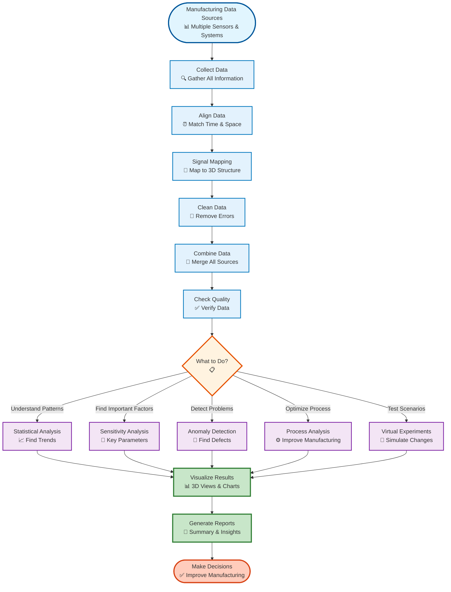

# AM-QADF Framework

**AM-QADF** (Additive Manufacturing Quality Assessment and Data Fusion) is a comprehensive Python framework for processing, analyzing, and visualizing multi-source additive manufacturing data. It provides a unified interface for querying diverse data sources, mapping signals to voxel domains, performing quality assessment, and conducting advanced analytics.

[](https://www.python.org/downloads/)
[](https://github.com/kanhaiya-gupta/AM-QADF)

## 🎯 Framework Overview



## ✨ Key Features

### 🔍 Multi-Source Data Integration
- **Unified Query Interface**: Access multiple data sources (hatching paths, laser parameters, CT scans, in-situ monitoring, thermal data)
- **Data Fusion**: Combine data from disparate sources into a coherent voxel domain
- **Synchronization**: Temporal and spatial alignment of multi-source data

### 🧊 Voxel Domain Processing
- **Voxelization**: Convert point cloud data to structured voxel grids
- **Signal Mapping**: Interpolate signals onto voxel grids using multiple methods (Nearest Neighbor, Linear, IDW, KDE)
- **Multi-Resolution**: Support for adaptive and multi-resolution grids

### ✅ Quality Assessment
- **Completeness**: Assess data coverage and identify gaps
- **Signal Quality**: Evaluate signal-to-noise ratios and data quality
- **Alignment Accuracy**: Validate coordinate system alignments

### 📊 Advanced Analytics
- **Statistical Analysis**: Descriptive statistics, correlation, trends, patterns
- **Sensitivity Analysis**: Sobol, Morris, and other sensitivity methods
- **Virtual Experiments**: Parameter optimization and design of experiments
- **Process Analysis**: Sensor analysis, parameter optimization

### 🚨 Anomaly Detection
- **Multiple Algorithms**: Statistical, clustering, ML-based, rule-based detectors
- **Ensemble Methods**: Combine multiple detectors for robust detection
- **Voxel-Level Analysis**: Detect anomalies in spatial data

### 🎨 Visualization
- **3D Rendering**: Interactive 3D visualization of voxel data using PyVista
- **Multi-Resolution Viewing**: Navigate different levels of detail
- **Jupyter Widgets**: Interactive widgets for notebooks

## 🚀 Quick Start

### Installation

```bash
# Clone the repository
git clone https://github.com/kanhaiya-gupta/AM-QADF.git
cd AM-QADF

# Install dependencies
pip install -r requirements.txt

# Install the package
pip install -e .
```

### Basic Usage

```python
from src.infrastructure.database import get_connection_manager
from am_qadf.query import UnifiedQueryClient
from am_qadf.voxel_domain import VoxelDomainClient

# Initialize connection manager
manager = get_connection_manager(env_name="development")
mongodb_client = manager.get_mongodb_client()

# Create query client
query_client = UnifiedQueryClient(mongo_client=mongodb_client)

# Create voxel domain client
voxel_client = VoxelDomainClient(
    unified_query_client=query_client,
    base_resolution=1.0
)

# Map signals to voxels
voxel_grid = voxel_client.map_signals_to_voxels(
    model_id="my_model",
    sources=['hatching', 'laser', 'ct'],
    interpolation_method='linear'
)

# Visualize
from am_qadf.visualization import VoxelRenderer
renderer = VoxelRenderer()
renderer.render(voxel_grid, signal_name='power')
```

## 🐳 Docker Setup

AM-QADF includes Docker Compose configuration for easy development:

```bash
# Start MongoDB and Spark services
cd docker
docker-compose -f docker-compose.dev.yml up -d

# Check services
docker-compose -f docker-compose.dev.yml ps
```

See [Infrastructure Documentation](docs/Infrastructure/README.md) for details.

## 📚 Documentation

- **[Overview](docs/AM_QADF/01-overview.md)** - Framework overview and architecture
- **[Installation](docs/AM_QADF/03-installation.md)** - Detailed installation guide
- **[Quick Start](docs/AM_QADF/04-quick-start.md)** - Get started with examples
- **[Modules](docs/AM_QADF/05-modules/README.md)** - Detailed module documentation
- **[API Reference](docs/AM_QADF/06-api-reference/README.md)** - Complete API documentation
- **[📓 Interactive Notebooks](docs/Notebook/README.md)** - 23 interactive Jupyter notebooks with widget-based interfaces for exploring framework capabilities
- **[Examples](examples/README.md)** - Example scripts and workflows
- **[Testing](docs/Tests/README.md)** - Testing documentation and guides

## 🏗️ Project Structure

```
AM-QADF/
├── src/
│   ├── am_qadf/              # Core framework (database-agnostic)
│   │   ├── core/              # Core domain entities
│   │   ├── query/             # Query clients
│   │   ├── voxelization/      # Voxel grid creation
│   │   ├── signal_mapping/    # Signal interpolation
│   │   ├── synchronization/   # Temporal/spatial alignment
│   │   ├── correction/        # Geometric distortion correction
│   │   ├── processing/        # Signal processing & noise reduction
│   │   ├── fusion/            # Multi-modal data fusion
│   │   ├── quality/           # Quality assessment
│   │   ├── analytics/         # Advanced analytics
│   │   ├── anomaly_detection/ # Anomaly detection
│   │   ├── visualization/     # 3D visualization
│   │   └── voxel_domain/      # Voxel domain orchestrator
│   │
│   └── infrastructure/        # Infrastructure layer (database connections)
│       ├── config/            # Configuration management
│       └── database/         # Database connection management
│
├── docs/
│   ├── AM_QADF/              # Framework documentation
│   ├── Infrastructure/       # Infrastructure documentation
│   └── Tests/                # Testing documentation
│
├── examples/                 # Example scripts
├── tests/                    # Test suite
├── docker/                   # Docker configuration
└── data_generation/          # Data generation utilities
```

## 🔧 Requirements

- **Python**: 3.9 or higher
- **MongoDB**: 7.0+ (for data storage)
- **Optional**: Apache Spark (for distributed processing)

### Core Dependencies
- `numpy` - Numerical computing
- `scipy` - Scientific computing
- `pandas` - Data manipulation
- `pymongo` - MongoDB client

### Optional Dependencies
- `pyspark` - Apache Spark
- `scikit-learn` - Machine learning algorithms
- `pyvista` - 3D visualization
- `matplotlib` - Plotting

## 🧪 Testing

```bash
# Run all tests
pytest

# Run specific test category
pytest tests/unit/
pytest tests/integration/
pytest tests/performance/

# Run with coverage
pytest --cov=src/am_qadf --cov-report=html
```

See [Testing Documentation](docs/Tests/README.md) for detailed testing guides.

## 🤝 Contributing

Contributions are welcome! We appreciate your interest in improving AM-QADF. Here's how you can contribute:

### Getting Started

1. **Fork the Repository** - Create your own fork of [AM-QADF](https://github.com/kanhaiya-gupta/AM-QADF)
2. **Create a Feature Branch** - Create a branch for your feature or bug fix
3. **Make Your Changes** - Follow our coding standards and guidelines
4. **Write Tests** - Add tests for new features and ensure existing tests pass
5. **Submit a Pull Request** - Open a PR with a clear description of your changes

### Contribution Guidelines

- **Code Style**: Follow PEP 8, use type hints, and write comprehensive docstrings
- **Testing**: Write tests for new features and maintain test coverage
- **Documentation**: Update relevant documentation and add examples for new features
- **Commit Messages**: Use clear, descriptive commit messages

### Areas for Contribution

- 🐛 Bug fixes and improvements
- ✨ New features and modules
- 📚 Documentation improvements
- 🧪 Test coverage enhancements
- 🎨 Code quality and refactoring
- 🚀 Performance optimizations

For detailed guidelines, please see the [Contributing Guide](docs/AM_QADF/11-contributing.md).

## 📄 License


## 🔗 Related Resources

- [Infrastructure Setup](docs/Infrastructure/README.md) - Database connection management
- [Configuration Guide](docs/AM_QADF/08-configuration.md) - Framework configuration
- [Performance Guide](docs/AM_QADF/09-performance.md) - Performance optimization
- [Troubleshooting](docs/AM_QADF/10-troubleshooting.md) - Common issues and solutions

## 📧 Contact

For questions, issues, or contributions, please open an issue on the [GitHub repository](https://github.com/kanhaiya-gupta/AM-QADF/issues).

---

**AM-QADF** - Empowering Additive Manufacturing through Quality Assessment and Data Fusion

