# AM-QADF Framework

**AM-QADF** (Additive Manufacturing Quality Assessment and Data Fusion) is a comprehensive Python framework for processing, analyzing, and visualizing multi-source additive manufacturing data. It provides a unified interface for querying diverse data sources, mapping signals to voxel domains, performing quality assessment, conducting advanced analytics, and deploying production-ready monitoring and control systems.

[](https://www.python.org/downloads/)
[](https://github.com/kanhaiya-gupta/AM-QADF)

## 🎯 Framework Overview

```mermaid
flowchart TD
    Hatching["🛤️ Hatching Paths<br/>Path Coordinates"] --> Query["Unified Query<br/>🔍 Query Interface"]
    Laser["⚡ Laser Parameters<br/>Power & Speed"] --> Query
    CT["🔬 CT Scans<br/>Defect Detection"] --> Query
    ISPM["🌡️ In-Situ Monitoring<br/>Sensor Data"] --> Query
    Thermal["🔥 Thermal Data<br/>Heat Distribution"] --> Query
    Metadata["📋 Build Metadata<br/>Process Parameters"] --> Query
    
    Query --> MetadataExtract["Metadata Extraction<br/>📊 Min, Max, Union, Statistics"]
    
    MetadataExtract --> Grid1["Grid Creation<br/>🧊 Source 1<br/>STL/Union/Bounds"]
    MetadataExtract --> Grid2["Grid Creation<br/>🧊 Source 2<br/>STL/Union/Bounds"]
    MetadataExtract --> Grid3["Grid Creation<br/>🧊 Source N<br/>STL/Union/Bounds"]
    
    Grid1 --> Map1["Signal Mapping<br/>🎯 Map to Grid 1"]
    Grid2 --> Map2["Signal Mapping<br/>🎯 Map to Grid 2"]
    Grid3 --> Map3["Signal Mapping<br/>🎯 Map to Grid N"]
    
    Map1 --> Sync1["Synchronization<br/>⏰ Temporal & Spatial<br/>Relative to Ground Truth"]
    Map2 --> Sync2["Synchronization<br/>⏰ Temporal & Spatial<br/>Relative to Ground Truth"]
    Map3 --> Sync3["Synchronization<br/>⏰ Temporal & Spatial<br/>Relative to Ground Truth"]
    
    Sync1 --> Correct1["Correction & Calibration<br/>📐 Grid 1"]
    Sync2 --> Correct2["Correction & Calibration<br/>📐 Grid 2"]
    Sync3 --> Correct3["Correction & Calibration<br/>📐 Grid N"]
    
    Correct1 --> Process1["Signal Processing<br/>🔧 Grid 1"]
    Correct2 --> Process2["Signal Processing<br/>🔧 Grid 2"]
    Correct3 --> Process3["Signal Processing<br/>🔧 Grid N"]
    
    Process1 --> Fusion["Data Fusion<br/>🔀 Multi-Source Fusion"]
    Process2 --> Fusion
    Process3 --> Fusion
    
    Fusion --> Quality["Quality Assessment<br/>✅ Quality Evaluation"]
    
    Quality --> Validate["Validation & Benchmarking<br/>🔬 Verify Results"]
    Quality --> Analyze{"What to Do?<br/>📋"}
    
    Validate --> Analyze
    
    Analyze -->|Understand Patterns| Stats["Statistical Analysis<br/>📈 Find Trends"]
    Analyze -->|Find Important Factors| Sensitivity["Sensitivity Analysis<br/>🔬 Key Parameters"]
    Analyze -->|Detect Problems| Anomaly["Anomaly Detection<br/>🚨 Find Defects"]
    Analyze -->|Control Process| SPC["Statistical Process Control<br/>📊 Control Charts"]
    Analyze -->|Optimize & Predict| Process["Process Optimization<br/>⚙️ Predict & Improve"]
    Analyze -->|Test Scenarios| Virtual["Virtual Experiments<br/>🧪 Simulate Changes"]
    
    Stats --> Visualize["Visualize Results<br/>📊 3D Views & Charts"]
    Sensitivity --> Visualize
    Anomaly --> Visualize
    SPC --> Visualize
    Process --> Visualize
    Virtual --> Visualize
    
    Visualize --> Report["Generate Reports<br/>📄 Summary & Insights"]
    
    Report --> Decision([Make Decisions<br/>✅ Improve Manufacturing])
    
    %% Styling
    classDef input fill:#f5f5f5,stroke:#424242,stroke-width:3px
    classDef process fill:#e3f2fd,stroke:#0277bd,stroke-width:2px
    classDef parallel fill:#fff9c4,stroke:#f57f17,stroke-width:2px
    classDef decision fill:#fff3e0,stroke:#e65100,stroke-width:3px
    classDef analysis fill:#f3e5f5,stroke:#7b1fa2,stroke-width:2px
    classDef output fill:#c8e6c9,stroke:#2e7d32,stroke-width:2px
    classDef action fill:#ffccbc,stroke:#d84315,stroke-width:3px
    
    class Hatching,Laser,CT,ISPM,Thermal,Metadata input
    class Query,MetadataExtract,Fusion,Quality,Validate process
    class Grid1,Grid2,Grid3,Map1,Map2,Map3,Sync1,Sync2,Sync3,Correct1,Correct2,Correct3,Process1,Process2,Process3 parallel
    class Analyze decision
    class Stats,Sensitivity,Anomaly,SPC,Process,Virtual analysis
    class Visualize,Report output
    class Decision action
```



### Workflow Overview

The AM-QADF framework follows a parallel processing workflow where each data source is processed independently before fusion:

1. **Query & Metadata Extraction**: Query data from multiple sources (hatching paths, laser parameters, CT scans, in-situ monitoring, thermal data) and extract metadata including min/max values, union bounds, and statistical summaries for each source.

2. **Per-Source Grid Creation**: Create separate voxel grids for each data source. Grid bounds can be derived from:
   - STL file bounding box
   - Union of data source coordinates
   - Source-specific bounds

3. **Per-Source Signal Mapping**: Map signals separately to their respective grids using interpolation methods (Nearest Neighbor, Linear, IDW, KDE, RBF).

4. **Per-Source Synchronization**: Temporally and spatially align each grid relative to the Ground Truth (Build System coordinate system).

5. **Per-Source Correction & Calibration**: Apply geometric distortion correction and calibration to each grid independently.

6. **Per-Source Signal Processing**: Process signals and reduce noise for each grid independently.

7. **Data Fusion**: Fuse all processed grids into a unified voxel domain.

8. **Quality Assessment & Analysis**: Assess quality, perform analytics, detect anomalies, and visualize results.

## ✨ Key Features

### 🔍 Multi-Source Data Integration
- **Unified Query Interface**: Access multiple data sources (hatching paths, laser parameters, CT scans, in-situ monitoring, thermal data)
- **Metadata Extraction**: Compute and store metadata (min, max, union bounds, statistical summaries) for each data source
- **Per-Source Processing**: Process each data source independently through its own pipeline before fusion
- **Data Fusion**: Combine processed data from disparate sources into a coherent voxel domain
- **Synchronization**: Temporal and spatial alignment of each grid relative to Ground Truth (Build System)

### 🧊 Voxel Domain Processing
- **Per-Source Voxelization**: Create separate voxel grids for each data source with bounds from STL, union, or source-specific coordinates
- **Signal Mapping**: Interpolate signals onto their respective grids using multiple methods (Nearest Neighbor, Linear, IDW, KDE, RBF)
- **Multi-Resolution**: Support for adaptive and multi-resolution grids
- **Per-Source Correction**: Apply geometric distortion correction and calibration to each grid independently
- **Per-Source Signal Processing**: Process signals and reduce noise for each grid independently

### ✅ Quality Assessment & Validation
- **Completeness**: Assess data coverage and identify gaps
- **Signal Quality**: Evaluate signal-to-noise ratios and data quality
- **Alignment Accuracy**: Validate coordinate system alignments
- **Validation & Benchmarking**: Compare framework results with MPM systems, validate against ground truth
- **Performance Benchmarking**: Measure processing time, memory usage, and data volume reduction

### 📊 Advanced Analytics
- **Statistical Analysis**: Descriptive statistics, correlation, trends, patterns
- **Sensitivity Analysis**: Sobol, Morris, and other sensitivity methods
- **Virtual Experiments**: Parameter optimization and design of experiments
- **Process Analysis**: Sensor analysis, parameter optimization
- **Process Optimization & Prediction**: Early defect prediction, time-series forecasting, multi-objective optimization
- **Model Tracking**: Model registry, performance tracking, drift detection

### 📈 Statistical Process Control (SPC)
- **Control Charts**: X-bar, R, S, Individual, Moving Range charts with adaptive limits
- **Process Capability**: Cp, Cpk, Pp, Ppk indices and rating
- **Multivariate SPC**: Hotelling T², PCA-based monitoring
- **Control Rules**: Western Electric and Nelson rules for out-of-control detection
- **Baseline Management**: Calculate and update control limits from historical data

### 🚨 Anomaly Detection
- **Multiple Algorithms**: Statistical, clustering, ML-based, rule-based detectors
- **Ensemble Methods**: Combine multiple detectors for robust detection
- **Voxel-Level Analysis**: Detect anomalies in spatial data

### 📡 Real-Time Monitoring & Streaming
- **Data Streaming**: Kafka integration for real-time data consumption
- **Incremental Processing**: Process streaming data incrementally to update voxel grids
- **Buffer Management**: Temporal windows and buffer management for streaming data
- **Live Dashboards**: Real-time quality dashboards with WebSocket updates
- **Alert System**: Multi-channel alert generation and management (Email, SMS, Dashboard)
- **Threshold Management**: Dynamic threshold checking (absolute, relative, rate-of-change, SPC-based)
- **Health Monitoring**: System and process health monitoring with health scores

### 🏭 Production Deployment & Industrial Integration
- **Production Configuration**: Environment-based configuration management with secrets management
- **Scalability**: Horizontal and vertical scaling with load balancing and auto-scaling
- **Fault Tolerance**: Retry policies, circuit breakers, and graceful degradation
- **Resource Monitoring**: System and process resource monitoring (CPU, memory, disk, network)
- **Performance Tuning**: Profiling, optimization, and tuning recommendations
- **MPM Integration**: Integration with Manufacturing Process Management systems
- **Equipment Integration**: Connection to manufacturing equipment (3D printers, sensors, PLCs)
- **API Gateway**: REST API for industrial access with versioning and middleware
- **Authentication & Authorization**: JWT, OAuth2, API key authentication with RBAC

### 🎨 Visualization
- **3D Rendering**: Interactive 3D visualization of voxel data using PyVista
- **Multi-Resolution Viewing**: Navigate different levels of detail
- **Jupyter Widgets**: Interactive widgets for notebooks

## 🚀 Quick Start

### Installation

```bash
# Clone the repository
git clone https://github.com/kanhaiya-gupta/AM-QADF.git
cd AM-QADF

# Install dependencies
pip install -r requirements.txt

# Install the package
pip install -e .
```

### Basic Usage

The framework processes each data source independently through the complete pipeline:

```python
from src.infrastructure.database import get_connection_manager
from am_qadf.query import UnifiedQueryClient
from am_qadf.voxel_domain import VoxelDomainClient

# Initialize connection manager
manager = get_connection_manager(env_name="development")
mongodb_client = manager.get_mongodb_client()

# Create query client
query_client = UnifiedQueryClient(mongo_client=mongodb_client)

# Create voxel domain client (orchestrates the workflow)
voxel_client = VoxelDomainClient(
    unified_query_client=query_client,
    base_resolution=1.0
)

# The framework automatically:
# 1. Queries data from multiple sources
# 2. Extracts metadata (min, max, union, statistics) for each source
# 3. Creates separate grids for each source
# 4. Maps signals to their respective grids
# 5. Synchronizes each grid relative to Ground Truth
# 6. Corrects and calibrates each grid
# 7. Processes signals for each grid
# 8. Fuses all grids into unified voxel domain

# Execute complete workflow
fused_grid = voxel_client.execute_complete_workflow(
    model_id="my_model",
    sources=['hatching', 'laser', 'ct'],
    interpolation_method='linear'
)

# Visualize
from am_qadf.visualization import VoxelRenderer
renderer = VoxelRenderer()
renderer.render(fused_grid, signal_name='power')
```

## 🐳 Docker Setup

AM-QADF includes Docker Compose configuration for easy development:

```bash
# Start MongoDB and Spark services
cd docker
docker-compose -f docker-compose.dev.yml up -d

# Check services
docker-compose -f docker-compose.dev.yml ps
```

See [Infrastructure Documentation](docs/Infrastructure/README.md) for details.

## 📚 Documentation

- **[Overview](docs/AM_QADF/01-overview.md)** - Framework overview and architecture
- **[Installation](docs/AM_QADF/03-installation.md)** - Detailed installation guide
- **[Quick Start](docs/AM_QADF/04-quick-start.md)** - Get started with examples
- **[Modules](docs/AM_QADF/05-modules/README.md)** - Detailed module documentation
- **[API Reference](docs/AM_QADF/06-api-reference/README.md)** - Complete API documentation
- **[📓 Interactive Notebooks](docs/Notebook/README.md)** - 28 interactive Jupyter notebooks with widget-based interfaces for exploring framework capabilities
- **[Examples](examples/README.md)** - Example scripts and workflows
- **[Testing](docs/Tests/README.md)** - Testing documentation and guides

## 🏗️ Project Structure

```
AM-QADF/
├── src/
│   ├── am_qadf/              # Core framework (database-agnostic)
│   │   ├── core/              # Core domain entities
│   │   ├── query/             # Query clients
│   │   ├── voxelization/      # Voxel grid creation
│   │   ├── signal_mapping/    # Signal interpolation
│   │   ├── synchronization/   # Temporal/spatial alignment
│   │   ├── correction/        # Geometric distortion correction
│   │   ├── processing/        # Signal processing & noise reduction
│   │   ├── fusion/            # Multi-modal data fusion
│   │   ├── quality/           # Quality assessment
│   │   ├── analytics/         # Advanced analytics
│   │   │   ├── spc/           # Statistical Process Control
│   │   │   ├── process_analysis/  # Process analysis & optimization
│   │   │   │   ├── prediction/    # Early defect prediction, forecasting
│   │   │   │   └── model_tracking/ # Model registry & performance tracking
│   │   │   └── ...
│   │   ├── validation/        # Validation & benchmarking
│   │   ├── anomaly_detection/ # Anomaly detection
│   │   ├── streaming/         # Real-time data streaming
│   │   ├── monitoring/        # Real-time monitoring & alerts
│   │   ├── deployment/        # Production deployment utilities
│   │   ├── integration/       # Industrial system integration
│   │   ├── visualization/     # 3D visualization
│   │   └── voxel_domain/      # Voxel domain orchestrator
│   │
│   └── infrastructure/        # Infrastructure layer (database connections)
│       ├── config/            # Configuration management
│       └── database/         # Database connection management
│
├── docs/
│   ├── AM_QADF/              # Framework documentation
│   ├── Infrastructure/       # Infrastructure documentation
│   ├── Notebook/             # Interactive notebooks documentation
│   └── Tests/                # Testing documentation
│
├── notebooks/                # Interactive Jupyter notebooks (28 notebooks)
├── examples/                 # Example scripts
├── tests/                    # Test suite (unit, integration, performance, e2e)
├── docker/                   # Docker configuration
└── data_generation/          # Data generation utilities
```

## 🔧 Requirements

- **Python**: 3.9 or higher
- **MongoDB**: 7.0+ (for data storage)
- **Optional**: Apache Spark (for distributed processing)
- **Optional**: Kafka (for real-time streaming)
- **Optional**: Redis (for caching and queue management)

### Core Dependencies
- `numpy` - Numerical computing
- `scipy` - Scientific computing
- `pandas` - Data manipulation
- `pymongo` - MongoDB client

### Optional Dependencies
- `pyspark` - Apache Spark (distributed processing)
- `scikit-learn` - Machine learning algorithms
- `pyvista` - 3D visualization
- `matplotlib` - Plotting
- `seaborn` - Statistical visualization
- `kafka-python` or `confluent-kafka` - Kafka integration (for streaming)
- `redis` - Redis client (for caching)
- `websockets` - WebSocket support (for live dashboards)
- `psutil` - System resource monitoring
- `requests` - HTTP client (for API integration)
- `PyJWT` - JWT authentication support

## 🧪 Testing

```bash
# Run all tests
pytest

# Run specific test category
pytest tests/unit/
pytest tests/integration/
pytest tests/performance/

# Run with coverage
pytest --cov=src/am_qadf --cov-report=html
```

See [Testing Documentation](docs/Tests/README.md) for detailed testing guides.

## 🤝 Contributing

Contributions are welcome! We appreciate your interest in improving AM-QADF. Here's how you can contribute:

### Getting Started

1. **Fork the Repository** - Create your own fork of [AM-QADF](https://github.com/kanhaiya-gupta/AM-QADF)
2. **Create a Feature Branch** - Create a branch for your feature or bug fix
3. **Make Your Changes** - Follow our coding standards and guidelines
4. **Write Tests** - Add tests for new features and ensure existing tests pass
5. **Submit a Pull Request** - Open a PR with a clear description of your changes

### Contribution Guidelines

- **Code Style**: Follow PEP 8, use type hints, and write comprehensive docstrings
- **Testing**: Write tests for new features and maintain test coverage
- **Documentation**: Update relevant documentation and add examples for new features
- **Commit Messages**: Use clear, descriptive commit messages

### Areas for Contribution

- 🐛 Bug fixes and improvements
- ✨ New features and modules
- 📚 Documentation improvements
- 🧪 Test coverage enhancements
- 🎨 Code quality and refactoring
- 🚀 Performance optimizations

For detailed guidelines, please see the [Contributing Guide](docs/AM_QADF/11-contributing.md).

## 📄 License

This project is licensed under the **GNU Affero General Public License v3.0 (AGPL-3.0)**.

This is a strong copyleft license that ensures:
- ✅ Anyone can use, modify, and distribute the framework
- ✅ **All modifications and extensions must also be open source** under AGPL-3.0
- ✅ If used in a network/web service, the source code must be made available
- ✅ The framework and all derivatives remain free and open

**Why AGPL-3.0?** This license ensures that improvements and extensions to the AM-QADF framework remain open and accessible to the research and manufacturing community, promoting collaborative development and preventing proprietary forks.

For the full license text, see [LICENSE](LICENSE) file.

## 🔗 Related Resources

- [Infrastructure Setup](docs/Infrastructure/README.md) - Database connection management
- [Configuration Guide](docs/AM_QADF/08-configuration.md) - Framework configuration
- [Performance Guide](docs/AM_QADF/09-performance.md) - Performance optimization
- [Troubleshooting](docs/AM_QADF/10-troubleshooting.md) - Common issues and solutions

## 📧 Contact

For questions, issues, or contributions, please open an issue on the [GitHub repository](https://github.com/kanhaiya-gupta/AM-QADF/issues).

---

**AM-QADF** - Empowering Additive Manufacturing through Quality Assessment and Data Fusion

