# AM-QADF Framework Overview

## What is AM-QADF?

**AM-QADF** (Additive Manufacturing Quality Assessment and Data Fusion) is a comprehensive Python framework for processing, analyzing, and visualizing multi-source additive manufacturing data. It provides a unified interface for querying diverse data sources, mapping signals to voxel domains, performing quality assessment, and conducting advanced analytics.

## Framework Overview (Non-Technical)

```mermaid
flowchart TD
    Start([Manufacturing Data Sources<br/>📊 Multiple Sensors & Systems]) --> Collect["Collect Data<br/>🔍 Gather All Information"]
    
    Collect --> Align["Align Data<br/>⏰ Match Time & Space"]
    
    Align --> SignalMap["Signal Mapping<br/>🧊 Map to 3D Structure"]
    
    SignalMap --> Clean["Clean Data<br/>🔧 Remove Errors"]
    
    Clean --> Combine["Combine Data<br/>🔀 Merge All Sources"]
    
    Combine --> Check["Check Quality<br/>✅ Verify Data"]
    
    Check --> Analyze{"What to Do?<br/>📋"}
    
    Analyze -->|Understand Patterns| Stats["Statistical Analysis<br/>📈 Find Trends"]
    Analyze -->|Find Important Factors| Sensitivity["Sensitivity Analysis<br/>🔬 Key Parameters"]
    Analyze -->|Detect Problems| Anomaly["Anomaly Detection<br/>🚨 Find Defects"]
    Analyze -->|Optimize Process| Process["Process Analysis<br/>⚙️ Improve Manufacturing"]
    Analyze -->|Test Scenarios| Virtual["Virtual Experiments<br/>🧪 Simulate Changes"]
    
    Stats --> Visualize["Visualize Results<br/>📊 3D Views & Charts"]
    Sensitivity --> Visualize
    Anomaly --> Visualize
    Process --> Visualize
    Virtual --> Visualize
    
    Visualize --> Report["Generate Reports<br/>📄 Summary & Insights"]
    
    Report --> Decision([Make Decisions<br/>✅ Improve Manufacturing])
    
    %% Styling
    classDef input fill:#e1f5fe,stroke:#01579b,stroke-width:3px
    classDef process fill:#e3f2fd,stroke:#0277bd,stroke-width:2px
    classDef decision fill:#fff3e0,stroke:#e65100,stroke-width:3px
    classDef analysis fill:#f3e5f5,stroke:#7b1fa2,stroke-width:2px
    classDef output fill:#c8e6c9,stroke:#2e7d32,stroke-width:2px
    classDef action fill:#ffccbc,stroke:#d84315,stroke-width:3px

    class Start input
    class Collect,Align,SignalMap,Clean,Combine,Check process
    class Analyze decision
    class Stats,Sensitivity,Anomaly,Process,Virtual analysis
    class Visualize,Report output
    class Decision action
```

## Key Capabilities

### 1. Multi-Source Data Integration
- **Query Interface**: Unified access to multiple data sources (hatching, laser parameters, CT scans, in-situ monitoring, thermal data)
- **Data Fusion**: Combine data from disparate sources into a coherent voxel domain
- **Synchronization**: Temporal and spatial alignment of multi-source data

### 2. Voxel Domain Processing
- **Voxelization**: Convert point cloud data to structured voxel grids
- **Signal Mapping**: Interpolate signals onto voxel grids using multiple methods
- **Multi-Resolution**: Support for adaptive and multi-resolution grids

### 3. Quality Assessment
- **Completeness**: Assess data coverage and identify gaps
- **Signal Quality**: Evaluate signal-to-noise ratios and data quality
- **Alignment Accuracy**: Validate coordinate system alignments

### 4. Advanced Analytics
- **Statistical Analysis**: Descriptive statistics, correlation, trends, patterns
- **Sensitivity Analysis**: Sobol, Morris, and other sensitivity methods
- **Virtual Experiments**: Parameter optimization and design of experiments
- **Process Analysis**: Sensor analysis, parameter optimization

### 5. Anomaly Detection
- **Multiple Algorithms**: Statistical, clustering, ML-based, rule-based detectors
- **Ensemble Methods**: Combine multiple detectors for robust detection
- **Voxel-Level Analysis**: Detect anomalies in spatial data

### 6. Visualization
- **3D Rendering**: Interactive 3D visualization of voxel data
- **Multi-Resolution Viewing**: Navigate different levels of detail
- **Jupyter Widgets**: Interactive widgets for notebooks

## Framework Architecture

```mermaid
graph TB
    %% Data Sources
    subgraph Sources["📊 Multi-Source Data"]
        Hatching["🛤️ Hatching Paths<br/>Point coordinates + path data"]
        Laser["⚡ Laser Parameters<br/>Power, speed, energy density"]
        CT["🔬 CT Scans<br/>Defect locations + density"]
        ISPM["🌡️ ISPM Monitoring<br/>Temperature measurements"]
        Thermal["🔥 Thermal Data<br/>Heat distribution"]
        BuildMeta["📋 Build Metadata<br/>Process parameters"]
    end

    %% Query Layer
    subgraph QueryLayer["🔍 Query Layer"]
        UnifiedQuery["Unified Query Client<br/>🔗 Single interface"]
        HatchingClient["Hatching Client<br/>🛤️ Path queries"]
        LaserClient["Laser Client<br/>⚡ Parameter queries"]
        CTClient["CT Client<br/>🔬 Scan queries"]
        ISPMClient["ISPM Client<br/>🌡️ Sensor queries"]
    end

    %% Core Processing
    subgraph Core["⚙️ Core Processing"]
        Voxelization["Voxelization<br/>🧊 3D Grid Creation"]
        SignalMapping["Signal Mapping<br/>🎯 Interpolation"]
        Synchronization["Synchronization<br/>⏰ Temporal/Spatial"]
        Correction["Correction<br/>📐 Geometric Distortion"]
        Processing["Processing<br/>🔧 Noise Reduction"]
    end

    %% Fusion Layer
    subgraph Fusion["🔀 Data Fusion"]
        MultiFusion["Multi-Source Fusion<br/>🔗 Combine signals"]
        FusionMethods["Fusion Methods<br/>Weighted/Median/Max"]
    end

    %% Analysis Layer
    subgraph Analysis["📊 Analysis Layer"]
        Quality["Quality Assessment<br/>✅ Completeness & Quality"]
        Analytics["Analytics<br/>📈 Statistical & Sensitivity"]
        Anomaly["Anomaly Detection<br/>⚠️ Defect Identification"]
    end

    %% Output Layer
    subgraph Output["🎯 Output & Visualization"]
        Visualization["3D Visualization<br/>🧊 Voxel Rendering"]
        Storage["Storage<br/>🗄️ MongoDB/GridFS"]
        Reports["Reports<br/>📄 Analysis Reports"]
    end

    %% Data Flow
    Hatching --> UnifiedQuery
    Laser --> UnifiedQuery
    CT --> UnifiedQuery
    ISPM --> UnifiedQuery
    Thermal --> UnifiedQuery
    BuildMeta --> UnifiedQuery

    UnifiedQuery --> HatchingClient
    UnifiedQuery --> LaserClient
    UnifiedQuery --> CTClient
    UnifiedQuery --> ISPMClient

    HatchingClient --> Voxelization
    LaserClient --> Voxelization
    CTClient --> Voxelization
    ISPMClient --> Voxelization

    Voxelization --> SignalMapping
    SignalMapping --> Synchronization
    Synchronization --> Correction
    Synchronization --> Processing

    Correction --> MultiFusion
    Processing --> MultiFusion
    SignalMapping --> MultiFusion

    MultiFusion --> FusionMethods
    FusionMethods --> Quality
    FusionMethods --> Analytics
    FusionMethods --> Anomaly

    Quality --> Visualization
    Analytics --> Visualization
    Anomaly --> Visualization

    Quality --> Storage
    Analytics --> Storage
    Anomaly --> Storage

    Visualization --> Reports
    Storage --> Reports

    %% Styling
    classDef dataSource fill:#e1f5fe,stroke:#01579b,stroke-width:2px
    classDef query fill:#f3e5f5,stroke:#4a148c,stroke-width:2px
    classDef processing fill:#fff3e0,stroke:#e65100,stroke-width:2px
    classDef fusion fill:#e8f5e8,stroke:#2e7d32,stroke-width:2px
    classDef analysis fill:#fce4ec,stroke:#880e4f,stroke-width:2px
    classDef output fill:#e0f2f1,stroke:#00695c,stroke-width:2px

    class Hatching,Laser,CT,ISPM,Thermal,BuildMeta dataSource
    class UnifiedQuery,HatchingClient,LaserClient,CTClient,ISPMClient query
    class Voxelization,SignalMapping,Synchronization,Correction,Processing processing
    class MultiFusion,FusionMethods fusion
    class Quality,Analytics,Anomaly analysis
    class Visualization,Storage,Reports output
```

## Core Principles

1. **Modularity**: Well-separated modules with clear interfaces
2. **Extensibility**: Easy to add new data sources, methods, and algorithms
3. **Performance**: Optimized for large-scale data processing
4. **Quality**: Comprehensive testing and validation
5. **Documentation**: Extensive documentation and examples

## Use Cases

- **Process Optimization**: Analyze manufacturing parameters for quality improvement
- **Quality Control**: Assess data quality and completeness
- **Anomaly Detection**: Identify manufacturing defects and anomalies
- **Research**: Conduct sensitivity analysis and virtual experiments
- **Visualization**: Explore 3D manufacturing data interactively

## Next Steps

- **[Installation](03-installation.md)** - Install the framework
- **[Quick Start](04-quick-start.md)** - Get started with examples
- **[Architecture](02-architecture.md)** - Understand the design
- **[Modules](05-modules/README.md)** - Explore individual modules

---

**Related**: [Architecture](02-architecture.md) | [Quick Start](04-quick-start.md)

