# System Architecture

## Architecture Overview

AM-QADF follows a modular, layered architecture with clear separation of concerns.

## Layer Structure

```mermaid
graph TB
    %% Application Layer
    subgraph AppLayer["🎯 Application Layer"]
        VoxelDomain["Voxel Domain Client<br/>🎛️ Main Orchestrator"]
        AnalyticsApp["Analytics Applications<br/>📊 Analysis Tools"]
        VisualizationApp["Visualization<br/>🧊 3D Rendering"]
    end

    %% Processing Layer
    subgraph ProcLayer["⚙️ Processing Layer"]
        SignalMapping["Signal Mapping<br/>🎯 Interpolation"]
        Fusion["Data Fusion<br/>🔀 Multi-Source"]
        Synchronization["Synchronization<br/>⏰ Temporal/Spatial"]
    end

    %% Data Layer
    subgraph DataLayer["📦 Data Layer"]
        Query["Query Module<br/>🔍 Data Access"]
        Voxelization["Voxelization<br/>🧊 Grid Creation"]
        Storage["Storage<br/>🗄️ MongoDB/GridFS"]
    end

    %% Core Layer
    subgraph CoreLayer["🏗️ Core Layer"]
        Entities["Entities<br/>📋 Domain Objects"]
        ValueObjects["Value Objects<br/>💎 Immutable Values"]
        Exceptions["Exceptions<br/>⚠️ Error Handling"]
    end

    %% Connections
    AppLayer --> ProcLayer
    ProcLayer --> DataLayer
    DataLayer --> CoreLayer

    VoxelDomain --> SignalMapping
    VoxelDomain --> Fusion
    AnalyticsApp --> Fusion
    VisualizationApp --> Fusion

    SignalMapping --> Voxelization
    Fusion --> Storage
    Synchronization --> Query

    Query --> Entities
    Voxelization --> ValueObjects
    Storage --> Exceptions

    %% Styling
    classDef appLayer fill:#e3f2fd,stroke:#0277bd,stroke-width:3px
    classDef procLayer fill:#f3e5f5,stroke:#7b1fa2,stroke-width:3px
    classDef dataLayer fill:#e8f5e8,stroke:#388e3c,stroke-width:3px
    classDef coreLayer fill:#fff3e0,stroke:#f57c00,stroke-width:3px

    class VoxelDomain,AnalyticsApp,VisualizationApp appLayer
    class SignalMapping,Fusion,Synchronization procLayer
    class Query,Voxelization,Storage dataLayer
    class Entities,ValueObjects,Exceptions coreLayer
```



## Design Patterns

### 1. Client Pattern
Each major module exposes a client class that provides a high-level interface:
- `UnifiedQueryClient` - Unified data access
- `VoxelDomainClient` - Main orchestrator
- `QualityAssessmentClient` - Quality assessment
- `SensitivityAnalysisClient` - Sensitivity analysis

### 2. Strategy Pattern
Interchangeable algorithms:
- Interpolation methods (Nearest, Linear, IDW, KDE)
- Fusion strategies (Average, Weighted, Median)
- Execution strategies (Sequential, Parallel, Spark)

### 3. Factory Pattern
Creation of complex objects:
- Voxel grid creation
- Detector instantiation
- Analysis configuration

## Module Dependencies

```
Core (no dependencies)
  │
  ├── Query (depends on Core)
  │
  ├── Voxelization (depends on Core)
  │   │
  │   └── Signal Mapping (depends on Voxelization, Core)
  │       │
  │       └── Synchronization (depends on Signal Mapping)
  │           │
  │           ├── Correction (depends on Synchronization)
  │           ├── Processing (depends on Synchronization)
  │           │
  │           └── Fusion (depends on Synchronization)
  │               │
  │               ├── Quality (depends on Fusion)
  │               ├── Analytics (depends on Fusion)
  │               ├── Anomaly Detection (depends on Fusion)
  │               │
  │               └── Visualization (depends on Fusion)
  │
  └── Voxel Domain (orchestrates all modules)
```

## Data Flow

```mermaid
flowchart TB
    Start([📊 Data Sources<br/>MongoDB]) --> Query["🔍 Query Module<br/>Unified Query Client"]
    
    Query --> Voxelization["🧊 Voxelization Module<br/>Voxel Grid Creation"]
    
    Voxelization --> SignalMapping["🎯 Signal Mapping Module<br/>Interpolation Methods"]
    
    SignalMapping --> Synchronization["⏰ Synchronization Module<br/>Temporal/Spatial Alignment"]
    
    Synchronization --> Fusion["🔀 Fusion Module<br/>Multi-Source Fusion"]
    
    Fusion --> Quality["✅ Quality Module<br/>Quality Assessment"]
    Fusion --> Analytics["📊 Analytics Module<br/>Statistical Analysis"]
    Fusion --> Anomaly["⚠️ Anomaly Detection<br/>Defect Identification"]
    Fusion --> Visualization["🧊 Visualization Module<br/>3D Rendering"]
    
    Quality --> Storage[(🗄️ Storage<br/>MongoDB/GridFS)]
    Analytics --> Storage
    Anomaly --> Storage
    Visualization --> Storage
    
    Storage --> Reports["📄 Reports<br/>Analysis Results"]
    
    %% Styling
    classDef source fill:#e1f5fe,stroke:#01579b,stroke-width:2px
    classDef processing fill:#f3e5f5,stroke:#4a148c,stroke-width:2px
    classDef fusion fill:#e8f5e8,stroke:#2e7d32,stroke-width:2px
    classDef analysis fill:#fff3e0,stroke:#e65100,stroke-width:2px
    classDef storage fill:#e0f2f1,stroke:#00695c,stroke-width:2px
    classDef output fill:#fce4ec,stroke:#880e4f,stroke-width:2px

    class Start source
    class Query,Voxelization,SignalMapping,Synchronization processing
    class Fusion fusion
    class Quality,Analytics,Anomaly,Visualization analysis
    class Storage storage
    class Reports output
```



## Key Design Decisions

1. **Voxel-Centric**: All data is unified in voxel domain
2. **Modular**: Clear module boundaries with well-defined interfaces
3. **Extensible**: Easy to add new methods, algorithms, data sources
4. **Performance**: Optimized for large-scale data processing
5. **Testable**: Comprehensive test coverage

## Related

- [Modules](05-modules/README.md) - Detailed module documentation
- [Overview](01-overview.md) - Framework overview

---

**Parent**: [Framework Documentation](README.md)

