# AM-QADF Module Documentation

This directory contains detailed documentation for each module in the AM-QADF framework.

## Modules

1. **[Core](core.md)** - Domain entities, value objects, exceptions
2. **[Query](query.md)** - Data warehouse query clients
3. **[Voxelization](voxelization.md)** - Voxel grid operations
4. **[Signal Mapping](signal-mapping.md)** - ⭐ **CRITICAL** - Interpolation methods
5. **[Synchronization](synchronization.md)** - Temporal/spatial alignment
6. **[Correction](correction.md)** - Geometric distortion correction
7. **[Processing](processing.md)** - Signal processing
8. **[Fusion](fusion.md)** - Multi-source data fusion
9. **[Quality](quality.md)** - Quality assessment
10. **[Analytics](analytics.md)** - Statistical and sensitivity analysis
11. **[Anomaly Detection](anomaly-detection.md)** - Anomaly detection
12. **[Visualization](visualization.md)** - 3D visualization
13. **[Voxel Domain](voxel-domain.md)** - Main orchestrator

## Module Dependencies

```mermaid
graph TB
    Core["🏗️ Core<br/>Entities, Value Objects"]
    
    Core --> Query["🔍 Query<br/>Data Access"]
    Core --> Voxelization["🧊 Voxelization<br/>Grid Creation"]
    
    Voxelization --> SignalMapping["🎯 Signal Mapping<br/>Interpolation"]
    
    SignalMapping --> Synchronization["⏰ Synchronization<br/>Alignment"]
    
    Synchronization --> Correction["📐 Correction<br/>Distortion"]
    Synchronization --> Processing["🔧 Processing<br/>Noise Reduction"]
    Synchronization --> Fusion["🔀 Fusion<br/>Multi-Source"]
    
    Fusion --> Quality["✅ Quality<br/>Assessment"]
    Fusion --> Analytics["📊 Analytics<br/>Analysis"]
    Fusion --> Anomaly["⚠️ Anomaly Detection<br/>Defect Detection"]
    Fusion --> Visualization["🧊 Visualization<br/>3D Rendering"]
    
    Core --> VoxelDomain["🎛️ Voxel Domain<br/>Orchestrator"]
    Query --> VoxelDomain
    Voxelization --> VoxelDomain
    SignalMapping --> VoxelDomain
    Synchronization --> VoxelDomain
    Fusion --> VoxelDomain
    Quality --> VoxelDomain
    Analytics --> VoxelDomain
    Anomaly --> VoxelDomain
    Visualization --> VoxelDomain

    %% Styling
    classDef core fill:#fff3e0,stroke:#f57c00,stroke-width:3px
    classDef data fill:#e1f5fe,stroke:#01579b,stroke-width:2px
    classDef processing fill:#f3e5f5,stroke:#4a148c,stroke-width:2px
    classDef fusion fill:#e8f5e8,stroke:#2e7d32,stroke-width:2px
    classDef analysis fill:#fce4ec,stroke:#880e4f,stroke-width:2px
    classDef orchestrator fill:#e0f2f1,stroke:#00695c,stroke-width:3px

    class Core core
    class Query,Voxelization data
    class SignalMapping,Synchronization,Correction,Processing processing
    class Fusion fusion
    class Quality,Analytics,Anomaly,Visualization analysis
    class VoxelDomain orchestrator
```

## Quick Reference

| Module | Purpose | Key Classes |
|--------|---------|-------------|
| **Core** | Foundation | `VoxelData`, `VoxelCoordinates`, `QualityMetric` |
| **Query** | Data access | `UnifiedQueryClient`, `HatchingClient`, `LaserClient` |
| **Voxelization** | Spatial grid | `VoxelGrid`, `CoordinateSystem` |
| **Signal Mapping** | Interpolation | `NearestNeighbor`, `LinearInterpolation`, `IDWInterpolation` |
| **Synchronization** | Alignment | `TemporalAlignment`, `SpatialTransformation` |
| **Correction** | Calibration | `GeometricDistortion`, `Calibration` |
| **Processing** | Signal processing | `NoiseReduction`, `SignalGeneration` |
| **Fusion** | Data fusion | `MultiVoxelGridFusion`, `WeightedAverageFusion` |
| **Quality** | Quality metrics | `QualityAssessmentClient`, `CompletenessAnalyzer` |
| **Analytics** | Analysis | `StatisticalAnalysisClient`, `SensitivityAnalysisClient` |
| **Anomaly Detection** | Detection | `AnomalyDetectionClient`, various detectors |
| **Visualization** | 3D rendering | `VoxelRenderer`, `MultiResolutionViewer` |
| **Voxel Domain** | Orchestration | `VoxelDomainClient`, `VoxelStorage` |

## Navigation

Select a module above to view its detailed documentation.

---

**Parent**: [Framework Documentation](../README.md)

