# Analytics Module

## Overview

The Analytics module provides comprehensive analysis capabilities for voxel domain data, including statistical analysis, sensitivity analysis, process analysis, virtual experiments, and reporting.

## System Overview (Non-Technical)

```mermaid
flowchart TD
    Start([Manufacturing Data<br/>📊 Process Data, Sensor Readings]) --> Choose{"What to Analyze?<br/>📋"}
    
    Choose -->|Understand Data| Stats["Statistical Analysis<br/>📈 Trends & Patterns"]
    Choose -->|Find Key Factors| Sensitivity["Sensitivity Analysis<br/>🔬 Important Parameters"]
    Choose -->|Check Quality| Quality["Quality Assessment<br/>✅ Data Quality Check"]
    Choose -->|Optimize Process| Process["Process Analysis<br/>⚙️ Improve Manufacturing"]
    Choose -->|Test Scenarios| Virtual["Virtual Experiments<br/>🧪 Simulate Changes"]
    
    Stats --> Insights["Generate Insights<br/>💡 Discover Patterns"]
    Sensitivity --> Insights
    Quality --> Insights
    Process --> Insights
    Virtual --> Insights
    
    Insights --> Visualize["Visualize Results<br/>📊 Charts & Graphs"]
    
    Visualize --> Report["Generate Report<br/>📄 Analysis Summary"]
    
    Report --> Decision([Make Decisions<br/>✅ Improve Manufacturing])
    
    %% Styling
    classDef input fill:#e1f5fe,stroke:#01579b,stroke-width:3px
    classDef decision fill:#fff3e0,stroke:#e65100,stroke-width:3px
    classDef analysis fill:#e3f2fd,stroke:#0277bd,stroke-width:2px
    classDef process fill:#c8e6c9,stroke:#2e7d32,stroke-width:2px
    classDef output fill:#f3e5f5,stroke:#7b1fa2,stroke-width:2px
    classDef action fill:#ffccbc,stroke:#d84315,stroke-width:3px

    class Start input
    class Choose decision
    class Stats,Sensitivity,Quality,Process,Virtual analysis
    class Insights,Visualize process
    class Report output
    class Decision action
```



## Architecture

```mermaid
graph TB
    subgraph Statistical["📊 Statistical Analysis"]
        StatsClient["Statistical Analysis Client<br/>🔗 Main Interface"]
        Descriptive["Descriptive Statistics<br/>📈 Mean, Median, Std"]
        Correlation["Correlation Analysis<br/>🔗 Signal Correlations"]
        Trends["Trend Analysis<br/>📈 Temporal/Spatial"]
        Patterns["Pattern Recognition<br/>🔍 Clusters, Periods"]
        Multivariate["Multivariate Analysis<br/>📊 PCA, Clustering"]
        TimeSeries["Time Series Analysis<br/>⏰ Temporal Patterns"]
        Regression["Regression Analysis<br/>📉 Linear/Polynomial"]
        NonParametric["Non-Parametric<br/>📊 Distribution-Free"]
    end

    subgraph Sensitivity["🔬 Sensitivity Analysis"]
        SensitivityClient["Sensitivity Analysis Client<br/>🔗 Main Interface"]
        Sobol["Sobol Analysis<br/>📊 Global Sensitivity"]
        Morris["Morris Analysis<br/>📈 Screening"]
        Global["Global Analysis<br/>🌐 Comprehensive"]
        Local["Local Analysis<br/>📍 Point-Based"]
        DOE["Design of Experiments<br/>🧪 Experimental Design"]
        Uncertainty["Uncertainty Quantification<br/>📊 Uncertainty"]
    end

    subgraph Quality["✅ Quality Assessment"]
        QAClient["Quality Assessment Client<br/>🔗 Main Interface"]
        DataQuality["Data Quality Analyzer<br/>📦 Overall Quality"]
        SignalQuality["Signal Quality Analyzer<br/>📈 Signal Metrics"]
        Alignment["Alignment Accuracy Analyzer<br/>📍 Coordinate Accuracy"]
        Completeness["Completeness Analyzer<br/>✅ Coverage & Gaps"]
    end

    subgraph Process["⚙️ Process Analysis"]
        ProcessAnalyzer["Process Analyzer<br/>🔧 Parameter Analysis"]
        SensorAnalyzer["Sensor Analyzer<br/>📡 Sensor Data"]
        QualityAnalyzer["Quality Analyzer<br/>✅ Quality Analysis"]
        Optimizer["Process Optimizer<br/>🎯 Optimization"]
    end

    subgraph Virtual["🧪 Virtual Experiments"]
        VEClient["Virtual Experiment Client<br/>🔗 Main Interface"]
        ParamOptimizer["Parameter Optimizer<br/>🎯 Optimization"]
        ResultAnalyzer["Result Analyzer<br/>📊 Analysis"]
        Comparison["Comparison Analyzer<br/>🔍 Compare Results"]
    end

    subgraph Reporting["📄 Reporting"]
        ReportGen["Report Generator<br/>📄 Generate Reports"]
        Visualizer["Visualizer<br/>📊 Visualizations"]
        Documentation["Documentation<br/>📚 Auto-Documentation"]
    end

    StatsClient --> Descriptive
    StatsClient --> Correlation
    StatsClient --> Trends
    StatsClient --> Patterns
    StatsClient --> Multivariate
    StatsClient --> TimeSeries
    StatsClient --> Regression
    StatsClient --> NonParametric

    SensitivityClient --> Sobol
    SensitivityClient --> Morris
    SensitivityClient --> Global
    SensitivityClient --> Local
    SensitivityClient --> DOE
    SensitivityClient --> Uncertainty

    QAClient --> DataQuality
    QAClient --> SignalQuality
    QAClient --> Alignment
    QAClient --> Completeness

    ProcessAnalyzer --> SensorAnalyzer
    ProcessAnalyzer --> QualityAnalyzer
    ProcessAnalyzer --> Optimizer

    VEClient --> ParamOptimizer
    VEClient --> ResultAnalyzer
    VEClient --> Comparison

    Descriptive --> ReportGen
    SensitivityClient --> ReportGen
    QAClient --> ReportGen
    ProcessAnalyzer --> ReportGen
    VEClient --> ReportGen

    ReportGen --> Visualizer
    ReportGen --> Documentation

    %% Styling
    classDef statistical fill:#e3f2fd,stroke:#0277bd,stroke-width:2px
    classDef sensitivity fill:#f3e5f5,stroke:#7b1fa2,stroke-width:2px
    classDef quality fill:#e8f5e9,stroke:#2e7d32,stroke-width:2px
    classDef process fill:#fff3e0,stroke:#f57c00,stroke-width:2px
    classDef virtual fill:#e1f5fe,stroke:#01579b,stroke-width:2px
    classDef reporting fill:#fce4ec,stroke:#880e4f,stroke-width:2px

    class StatsClient,Descriptive,Correlation,Trends,Patterns,Multivariate,TimeSeries,Regression,NonParametric statistical
    class SensitivityClient,Sobol,Morris,Global,Local,DOE,Uncertainty sensitivity
    class QAClient,DataQuality,SignalQuality,Alignment,Completeness quality
    class ProcessAnalyzer,SensorAnalyzer,QualityAnalyzer,Optimizer process
    class VEClient,ParamOptimizer,ResultAnalyzer,Comparison virtual
    class ReportGen,Visualizer,Documentation reporting
```



## Analytics Workflow

```mermaid
flowchart TB
    Start([Voxel Grid Data]) --> ChooseAnalysis{"Choose Analysis Type<br/>📊"}
    
    ChooseAnalysis -->|Statistical| Statistical["Statistical Analysis<br/>📈 Descriptive, Correlation"]
    ChooseAnalysis -->|Sensitivity| Sensitivity["Sensitivity Analysis<br/>🔬 Sobol, Morris"]
    ChooseAnalysis -->|Quality| Quality["Quality Assessment<br/>✅ Data, Signal, Alignment"]
    ChooseAnalysis -->|Process| Process["Process Analysis<br/>⚙️ Parameter, Quality"]
    ChooseAnalysis -->|Virtual| Virtual["Virtual Experiments<br/>🧪 Design, Optimize"]
    
    Statistical --> Analyze["Perform Analysis<br/>🔍 Execute"]
    Sensitivity --> Analyze
    Quality --> Analyze
    Process --> Analyze
    Virtual --> Analyze
    
    Analyze --> Store["Store Results<br/>🗄️ MongoDB"]
    
    Store --> Generate["Generate Report<br/>📄 Report"]
    
    Generate --> Visualize["Visualize Results<br/>📊 Charts, Plots"]
    
    Visualize --> Use([Use Analysis Results])
    
    %% Styling
    classDef step fill:#e3f2fd,stroke:#0277bd,stroke-width:2px
    classDef decision fill:#fff3e0,stroke:#e65100,stroke-width:2px
    classDef analysis fill:#f3e5f5,stroke:#7b1fa2,stroke-width:2px
    classDef start fill:#c8e6c9,stroke:#2e7d32,stroke-width:3px
    classDef end fill:#ffccbc,stroke:#d84315,stroke-width:3px

    class Analyze,Store,Generate,Visualize step
    class ChooseAnalysis decision
    class Statistical,Sensitivity,Quality,Process,Virtual analysis
    class Start start
    class Use end
```

## Module Dependencies

```mermaid
graph LR
    subgraph Input["📥 Input Sources"]
        Voxel["Voxel Domain<br/>🧊 Voxel Grid"]
        Warehouse["Data Warehouse<br/>🗄️ Multi-Source"]
    end

    subgraph Analytics["📊 Analytics Modules"]
        Stats["Statistical<br/>📈 Analysis"]
        Sensitivity["Sensitivity<br/>🔬 Analysis"]
        Quality["Quality<br/>✅ Assessment"]
        Process["Process<br/>⚙️ Analysis"]
        Virtual["Virtual<br/>🧪 Experiments"]
    end

    subgraph Output["📤 Output"]
        Reports["Reports<br/>📄 Generated"]
        Visuals["Visualizations<br/>📊 Charts"]
        Docs["Documentation<br/>📚 Auto-Generated"]
    end

    Voxel --> Stats
    Voxel --> Sensitivity
    Voxel --> Quality
    Voxel --> Process
    Voxel --> Virtual

    Warehouse --> Stats
    Warehouse --> Sensitivity
    Warehouse --> Quality
    Warehouse --> Process
    Warehouse --> Virtual

    Stats --> Reports
    Sensitivity --> Reports
    Quality --> Reports
    Process --> Reports
    Virtual --> Reports

    Reports --> Visuals
    Reports --> Docs

    %% Styling
    classDef input fill:#e1f5fe,stroke:#01579b,stroke-width:2px
    classDef analytics fill:#f3e5f5,stroke:#4a148c,stroke-width:2px
    classDef output fill:#fff3e0,stroke:#e65100,stroke-width:2px

    class Voxel,Warehouse input
    class Stats,Sensitivity,Quality,Process,Virtual analytics
    class Reports,Visuals,Docs output
```



## Sub-Domain Workflows

### Statistical Analysis Workflow


### Sensitivity Analysis Workflow


### Quality Assessment Workflow

```mermaid
flowchart TD
    Start([Voxel Data]) --> Assess["Assess Quality<br/>✅"]
    
    Assess --> DataQ["Data Quality<br/>Completeness, Coverage"]
    Assess --> SignalQ["Signal Quality<br/>SNR, Uncertainty"]
    Assess --> Align["Alignment Accuracy<br/>Coordinate, Temporal"]
    Assess --> Complete["Completeness<br/>Coverage, Gaps"]
    
    DataQ --> Metrics1["Quality Metrics<br/>📊 Scores"]
    SignalQ --> Metrics2["Signal Metrics<br/>📈 SNR, Confidence"]
    Align --> Metrics3["Alignment Metrics<br/>📍 Accuracy"]
    Complete --> Metrics4["Completeness Metrics<br/>✅ Coverage"]
    
    Metrics1 --> Report["Quality Report<br/>📄"]
    Metrics2 --> Report
    Metrics3 --> Report
    Metrics4 --> Report
    
    %% Styling
    classDef assess fill:#e8f5e9,stroke:#2e7d32,stroke-width:2px
    classDef metrics fill:#c8e6c9,stroke:#388e3c,stroke-width:2px
    classDef result fill:#fff3e0,stroke:#e65100,stroke-width:2px

    class DataQ,SignalQ,Align,Complete assess
    class Metrics1,Metrics2,Metrics3,Metrics4 metrics
    class Report result
    class Start,Assess start
```



### Process Analysis Workflow

```mermaid
flowchart TD
    Start([Process Data]) --> Select["Select Analysis<br/>⚙️"]
    
    Select -->|Parameters| Param["Parameter Analysis<br/>Optimization, Interactions"]
    Select -->|Quality| Quality["Quality Analysis<br/>Prediction, Classification"]
    Select -->|Sensors| Sensor["Sensor Analysis<br/>ISPM, CT"]
    Select -->|Optimization| Opt["Process Optimization<br/>Single/Multi-Objective"]
    
    Param --> ParamRes["Parameter Results<br/>📊 Optimal Values"]
    Quality --> QualityRes["Quality Results<br/>✅ Predictions"]
    Sensor --> SensorRes["Sensor Results<br/>📡 Processed Signals"]
    Opt --> OptRes["Optimization Results<br/>🎯 Optimal Parameters"]
    
    ParamRes --> Report["Process Report<br/>📄"]
    QualityRes --> Report
    SensorRes --> Report
    OptRes --> Report
    
    %% Styling
    classDef analysis fill:#fff3e0,stroke:#f57c00,stroke-width:2px
    classDef result fill:#c8e6c9,stroke:#2e7d32,stroke-width:2px
    classDef output fill:#ffccbc,stroke:#d84315,stroke-width:2px

    class Param,Quality,Sensor,Opt analysis
    class ParamRes,QualityRes,SensorRes,OptRes result
    class Report output
    class Start,Select start
```



### Virtual Experiments Workflow

```mermaid
flowchart TD
    Start([Base Model]) --> Design["Design Experiment<br/>🧪"]
    
    Design --> GetParams["Get Parameter Ranges<br/>📊 From Warehouse"]
    GetParams --> Generate["Generate Design Points<br/>LHS, Factorial, Random"]
    
    Generate --> Execute["Execute Experiments<br/>⚙️ Run Model"]
    
    Execute --> Analyze["Analyze Results<br/>📊 Statistics, Correlations"]
    Analyze --> Compare["Compare with Warehouse<br/>🔍 Validation"]
    Analyze --> Optimize["Optimize Parameters<br/>🎯 Single/Multi-Objective"]
    
    Compare --> Report["Experiment Report<br/>📄"]
    Optimize --> Report
    
    Report --> Visualize["Visualize Results<br/>📊 Charts, Plots"]
    
    %% Styling
    classDef step fill:#e1f5fe,stroke:#01579b,stroke-width:2px
    classDef analysis fill:#e8f5e9,stroke:#2e7d32,stroke-width:2px
    classDef output fill:#fff3e0,stroke:#e65100,stroke-width:2px

    class Design,GetParams,Generate,Execute step
    class Analyze,Compare,Optimize analysis
    class Report,Visualize output
    class Start start
```



## Key Components

### Statistical Analysis

- **Descriptive Statistics**: Mean, median, std, min, max, percentiles
- **Correlation Analysis**: Signal correlations, autocorrelations
- **Trend Analysis**: Temporal and spatial trends
- **Pattern Recognition**: Clusters, periodic patterns, anomalies
- **Multivariate Analysis**: PCA, clustering, dimensionality reduction
- **Time Series Analysis**: Temporal patterns, seasonality
- **Regression Analysis**: Linear, polynomial regression
- **Non-Parametric**: Distribution-free methods

### Sensitivity Analysis

- **Sobol Analysis**: Global sensitivity indices (S1, ST, S2)
- **Morris Analysis**: Screening method (μ, μ*, σ)
- **Global Analysis**: Comprehensive global sensitivity
- **Local Analysis**: Point-based sensitivity (derivatives, elasticities)
- **Design of Experiments**: LHS, factorial, CCD, BBD designs
- **Uncertainty Quantification**: Monte Carlo, Bayesian, Taylor propagation

### Quality Assessment

- **Data Quality Analyzer**: Overall data quality metrics (completeness, coverage, consistency)
- **Signal Quality Analyzer**: Signal quality metrics (SNR, uncertainty, confidence)
- **Alignment Accuracy Analyzer**: Coordinate, temporal, and spatial alignment accuracy
- **Completeness Analyzer**: Coverage analysis, gap detection, and gap filling strategies

### Process Analysis

- **Parameter Analysis**: Process parameter optimization, interactions, sensitivity
- **Sensor Analysis**: ISPM and CT sensor data analysis, signal processing, anomaly detection
- **Quality Analysis**: Quality prediction using machine learning, quality classification
- **Process Optimization**: Single-objective and multi-objective parameter optimization

### Virtual Experiments

- **Experiment Design**: Design experiments with warehouse data integration (LHS, factorial, random, grid)
- **Parameter Optimization**: Optimize process parameters from experiment results
- **Result Analysis**: Comprehensive statistical analysis of experiment results
- **Comparison**: Compare experiments with warehouse data and sensitivity analysis

## Usage Examples

### Statistical Analysis

```python
from am_qadf.analytics.statistical_analysis import AdvancedAnalyticsClient

# Initialize client
stats_client = AdvancedAnalyticsClient()

# Descriptive statistics
stats = stats_client.calculate_descriptive_statistics(
    voxel_data=grid,
    signals=['power', 'temperature']
)

print(f"Power - Mean: {stats['power'].mean}, Std: {stats['power'].std}")

# Correlation analysis
correlations = stats_client.analyze_correlations(
    voxel_data=grid,
    signals=['power', 'temperature', 'density']
)

print(f"Power-Temperature correlation: {correlations.correlation_matrix['power']['temperature']}")
```

### Sensitivity Analysis

```python
from am_qadf.analytics.sensitivity_analysis import SensitivityAnalysisClient

# Initialize client
sensitivity_client = SensitivityAnalysisClient(mongodb_client)

# Define problem
problem = {
    'num_vars': 3,
    'names': ['laser_power', 'scan_speed', 'layer_thickness'],
    'bounds': [[100, 300], [500, 1500], [0.02, 0.05]]
}

# Perform Sobol analysis
sobol_results = sensitivity_client.perform_sobol_analysis(
    model_id="my_model",
    problem=problem,
    Y=output_values,
    n_samples=1000
)

print(f"S1 indices: {sobol_results['S1']}")
print(f"ST indices: {sobol_results['ST']}")
```

### Virtual Experiments

```python
from am_qadf.analytics.virtual_experiments import VirtualExperimentClient

# Initialize client
ve_client = VirtualExperimentClient(mongodb_client)

# Design experiment
experiment = ve_client.design_experiment(
    parameters=['laser_power', 'scan_speed'],
    bounds=[[100, 300], [500, 1500]],
    method='lhs',
    n_samples=50
)

# Run experiments
results = ve_client.run_experiments(
    experiment_id=experiment.id,
    model_function=my_model
)

# Analyze results
analysis = ve_client.analyze_results(
    experiment_id=experiment.id
)
```

## Analysis Types Comparison

```mermaid
graph TB
    subgraph Types["📊 Analysis Types"]
        Statistical["Statistical<br/>📈 Descriptive, Trends"]
        Sensitivity["Sensitivity<br/>🔬 Parameter Impact"]
        Quality["Quality Assessment<br/>✅ Data Quality"]
        Process["Process<br/>⚙️ Parameter Optimization"]
        Virtual["Virtual Experiments<br/>🧪 Design & Test"]
    end

    subgraph UseCase["📋 Use Cases"]
        Understand["Understand Data<br/>→ Statistical"]
        Identify["Identify Key Parameters<br/>→ Sensitivity"]
        Assess["Assess Data Quality<br/>→ Quality"]
        Optimize["Optimize Process<br/>→ Process"]
        Design["Design Experiments<br/>→ Virtual"]
    end

    Statistical -.->|When| Understand
    Sensitivity -.->|When| Identify
    Quality -.->|When| Assess
    Process -.->|When| Optimize
    Virtual -.->|When| Design

    %% Styling
    classDef type fill:#e3f2fd,stroke:#0277bd,stroke-width:2px
    classDef usecase fill:#fff3e0,stroke:#e65100,stroke-width:2px

    class Statistical,Sensitivity,Quality,Process,Virtual type
    class Understand,Identify,Assess,Optimize,Design usecase
```



## Data Flow

```mermaid
flowchart LR
    subgraph Sources["📥 Data Sources"]
        Voxel["Voxel Grid<br/>🧊"]
        Warehouse["Warehouse<br/>🗄️"]
    end

    subgraph Analytics["📊 Analytics Processing"]
        Stats["Statistical<br/>Analysis"]
        Sensitivity["Sensitivity<br/>Analysis"]
        Quality["Quality<br/>Assessment"]
        Process["Process<br/>Analysis"]
        Virtual["Virtual<br/>Experiments"]
    end

    subgraph Storage["💾 Storage"]
        MongoDB["MongoDB<br/>Results"]
        Cache["Cache<br/>Temporary"]
    end

    subgraph Output["📤 Output"]
        Reports["Reports<br/>📄"]
        Visuals["Visualizations<br/>📊"]
        Docs["Documentation<br/>📚"]
    end

    Voxel --> Stats
    Voxel --> Sensitivity
    Voxel --> Quality
    Voxel --> Process
    Voxel --> Virtual

    Warehouse --> Stats
    Warehouse --> Sensitivity
    Warehouse --> Quality
    Warehouse --> Process
    Warehouse --> Virtual

    Stats --> MongoDB
    Sensitivity --> MongoDB
    Quality --> MongoDB
    Process --> MongoDB
    Virtual --> MongoDB

    Stats --> Cache
    Sensitivity --> Cache
    Quality --> Cache
    Process --> Cache
    Virtual --> Cache

    MongoDB --> Reports
    Cache --> Reports

    Reports --> Visuals
    Reports --> Docs

    %% Styling
    classDef source fill:#e1f5fe,stroke:#01579b,stroke-width:2px
    classDef analytics fill:#f3e5f5,stroke:#4a148c,stroke-width:2px
    classDef storage fill:#fff9c4,stroke:#f57f17,stroke-width:2px
    classDef output fill:#fce4ec,stroke:#880e4f,stroke-width:2px

    class Voxel,Warehouse source
    class Stats,Sensitivity,Quality,Process,Virtual analytics
    class MongoDB,Cache storage
    class Reports,Visuals,Docs output
```



## Related

- [Quality Module](quality.md) - Quality metrics for analysis
- [Fusion Module](fusion.md) - Fused data for analysis
- [Voxel Domain Module](voxel-domain.md) - Main orchestrator

---

**Parent**: [Module Documentation](README.md)

