# Anomaly Detection Module

## Overview

The Anomaly Detection module provides comprehensive anomaly detection capabilities for identifying defects, outliers, and anomalies in voxel domain data using multiple detection algorithms and ensemble methods.

## System Overview (Non-Technical)

```mermaid
flowchart TD
    Start([Manufacturing Data<br/>📊 3D Models, Sensor Data]) --> Prepare["Prepare Data<br/>🔧 Clean & Organize"]
    
    Prepare --> Analyze["Analyze Data<br/>🔍 Find Anomalies"]
    
    Analyze --> Results["Anomaly Results<br/>🚨 Defects Found"]
    
    Results --> Visualize["Visualize Results<br/>📊 3D Maps & Charts"]
    
    Visualize --> Report["Generate Report<br/>📄 Summary & Insights"]
    
    Report --> Action([Take Action<br/>✅ Fix Issues])
    
    %% Styling
    classDef input fill:#e1f5fe,stroke:#01579b,stroke-width:3px
    classDef process fill:#e3f2fd,stroke:#0277bd,stroke-width:2px
    classDef output fill:#c8e6c9,stroke:#2e7d32,stroke-width:3px
    classDef action fill:#fff3e0,stroke:#e65100,stroke-width:3px

    class Start input
    class Prepare,Analyze process
    class Results,Visualize,Report output
    class Action action
```



## Architecture

```mermaid
graph TB
    subgraph Core["🏗️ Core"]
        BaseDetector["Base Detector<br/>📋 Abstract Base"]
        AnomalyTypes["Anomaly Types<br/>📊 Type Enum"]
        DetectionResult["Detection Result<br/>📦 Result Container"]
        DetectionConfig["Detection Config<br/>⚙️ Configuration"]
    end

    subgraph Detectors["🔍 Detectors"]
        Statistical["Statistical<br/>📊 Z-Score, IQR, Mahalanobis<br/>Modified Z-Score, Grubbs"]
        Clustering["Clustering<br/>🔗 DBSCAN, Isolation Forest<br/>LOF, One-Class SVM, K-Means"]
        ML["Machine Learning<br/>🤖 Autoencoder, LSTM, VAE<br/>Random Forest"]
        RuleBased["Rule-Based<br/>📋 Threshold, Pattern<br/>Spatial, Temporal, Multi-Signal"]
        Ensemble["Ensemble<br/>🔀 Voting, Weighted"]
    end

    subgraph Utils["🛠️ Utilities"]
        Preprocessing["Data Preprocessor<br/>🔧 Feature Extraction"]
        Synthetic["Synthetic Anomalies<br/>🧪 Generate Test Data"]
        VoxelDetector["Voxel Detector<br/>🧊 Voxel-Specific"]
    end

    subgraph Integration["🔗 Integration"]
        Client["Anomaly Detection Client<br/>🔗 Main Interface"]
        Query["Anomaly Query<br/>🔍 Query Detections"]
        Storage["Anomaly Storage<br/>🗄️ Store Results"]
    end

    subgraph Evaluation["📊 Evaluation"]
        Metrics["Detection Metrics<br/>📈 Accuracy, Precision, Recall"]
        Comparison["Detector Comparison<br/>🔍 Compare Methods"]
        CrossVal["Cross Validation<br/>✅ K-Fold, Time Series, Spatial"]
    end

    subgraph Visualization["📊 Visualization"]
        SpatialViz["Spatial Visualizer<br/>📍 3D Anomaly Maps"]
        TemporalViz["Temporal Visualizer<br/>⏰ Time Series Plots"]
        ComparisonViz["Comparison Visualizer<br/>🔍 Compare Detectors"]
    end

    subgraph Reporting["📄 Reporting"]
        ReportGen["Report Generator<br/>📄 Generate Reports"]
    end

    BaseDetector --> Statistical
    BaseDetector --> Clustering
    BaseDetector --> ML
    BaseDetector --> RuleBased
    Statistical --> Ensemble
    Clustering --> Ensemble
    ML --> Ensemble

    Preprocessing --> Statistical
    Preprocessing --> Clustering
    Preprocessing --> ML
    Preprocessing --> RuleBased

    Client --> Statistical
    Client --> Clustering
    Client --> ML
    Client --> RuleBased
    Client --> Ensemble
    Client --> VoxelDetector

    Client --> Query
    Client --> Storage

    Statistical --> Metrics
    Clustering --> Metrics
    ML --> Metrics
    RuleBased --> Metrics
    Ensemble --> Metrics

    Metrics --> Comparison
    Comparison --> CrossVal
    CrossVal --> ReportGen

    Statistical --> SpatialViz
    Clustering --> SpatialViz
    ML --> SpatialViz
    RuleBased --> TemporalViz
    ML --> TemporalViz

    Comparison --> ComparisonViz
    ReportGen --> SpatialViz
    ReportGen --> TemporalViz

    %% Styling
    classDef core fill:#fff3e0,stroke:#f57c00,stroke-width:2px
    classDef detector fill:#e3f2fd,stroke:#0277bd,stroke-width:2px
    classDef utils fill:#e0f7fa,stroke:#006064,stroke-width:2px
    classDef integration fill:#f3e5f5,stroke:#7b1fa2,stroke-width:2px
    classDef evaluation fill:#e8f5e8,stroke:#2e7d32,stroke-width:2px
    classDef visualization fill:#fff9c4,stroke:#f57f17,stroke-width:2px
    classDef reporting fill:#fce4ec,stroke:#880e4f,stroke-width:2px

    class BaseDetector,AnomalyTypes,DetectionResult,DetectionConfig core
    class Statistical,Clustering,ML,RuleBased,Ensemble detector
    class Preprocessing,Synthetic,VoxelDetector utils
    class Client,Query,Storage integration
    class Metrics,Comparison,CrossVal evaluation
    class SpatialViz,TemporalViz,ComparisonViz visualization
    class ReportGen reporting
```



## Detection Workflow

```mermaid
flowchart TB
    Start([Voxel Grid Data]) --> Preprocess["Preprocess Data<br/>🔧 Feature Extraction"]
    
    Preprocess --> SelectDetector{"Select Detector<br/>🔍"}
    
    SelectDetector -->|Statistical| Statistical["Statistical Detector<br/>📊 Z-Score, IQR"]
    SelectDetector -->|Clustering| Clustering["Clustering Detector<br/>🔗 DBSCAN, IF"]
    SelectDetector -->|ML| ML["ML Detector<br/>🤖 Autoencoder"]
    SelectDetector -->|Rule-Based| RuleBased["Rule-Based Detector<br/>📋 Threshold"]
    SelectDetector -->|Ensemble| Ensemble["Ensemble Detector<br/>🔀 Multiple"]
    
    Statistical --> Detect["Detect Anomalies<br/>🚨 Identify"]
    Clustering --> Detect
    ML --> Detect
    RuleBased --> Detect
    Ensemble --> Detect
    
    Detect --> Evaluate["Evaluate Detection<br/>📊 Metrics"]
    
    Evaluate --> Store["Store Results<br/>🗄️ MongoDB"]
    
    Store --> Visualize["Visualize Results<br/>📊 Spatial, Temporal"]
    
    Visualize --> Report["Generate Report<br/>📄 Report"]
    
    Report --> Use([Use Detection Results])
    
    %% Styling
    classDef step fill:#e3f2fd,stroke:#0277bd,stroke-width:2px
    classDef decision fill:#fff3e0,stroke:#e65100,stroke-width:2px
    classDef detector fill:#f3e5f5,stroke:#7b1fa2,stroke-width:2px
    classDef start fill:#c8e6c9,stroke:#2e7d32,stroke-width:3px
    classDef end fill:#ffccbc,stroke:#d84315,stroke-width:3px

    class Preprocess,Detect,Evaluate,Store,Visualize,Report step
    class SelectDetector decision
    class Statistical,Clustering,ML,RuleBased,Ensemble detector
    class Start start
    class Use end
```

## Module Dependencies

```mermaid
graph LR
    subgraph Input["📥 Input Sources"]
        Voxel["Voxel Domain<br/>🧊 Voxel Grid"]
        Warehouse["Data Warehouse<br/>🗄️ Multi-Source"]
        Fused["Fused Data<br/>🔗 Multi-Modal"]
    end

    subgraph Processing["🔧 Processing"]
        Preprocess["Preprocessing<br/>🔧 Feature Extraction"]
        Synthetic["Synthetic Data<br/>🧪 Test Generation"]
    end

    subgraph Detection["🔍 Detection"]
        Statistical["Statistical<br/>Detectors"]
        Clustering["Clustering<br/>Detectors"]
        ML["ML<br/>Detectors"]
        RuleBased["Rule-Based<br/>Detectors"]
        Ensemble["Ensemble<br/>Detectors"]
    end

    subgraph Output["📤 Output"]
        Results["Detection Results<br/>📊"]
        Visuals["Visualizations<br/>📊"]
        Reports["Reports<br/>📄"]
    end

    Voxel --> Preprocess
    Warehouse --> Preprocess
    Fused --> Preprocess

    Preprocess --> Statistical
    Preprocess --> Clustering
    Preprocess --> ML
    Preprocess --> RuleBased

    Statistical --> Ensemble
    Clustering --> Ensemble
    ML --> Ensemble
    RuleBased --> Ensemble

    Statistical --> Results
    Clustering --> Results
    ML --> Results
    RuleBased --> Results
    Ensemble --> Results

    Results --> Visuals
    Results --> Reports

    Synthetic --> Statistical
    Synthetic --> Clustering
    Synthetic --> ML

    %% Styling
    classDef input fill:#e1f5fe,stroke:#01579b,stroke-width:2px
    classDef processing fill:#fff3e0,stroke:#e65100,stroke-width:2px
    classDef detection fill:#e3f2fd,stroke:#0277bd,stroke-width:2px
    classDef output fill:#fce4ec,stroke:#880e4f,stroke-width:2px

    class Voxel,Warehouse,Fused input
    class Preprocess,Synthetic processing
    class Statistical,Clustering,ML,RuleBased,Ensemble detection
    class Results,Visuals,Reports output
```



## Detector Type Workflows

### Statistical Detection Workflow

```mermaid
flowchart TD
    Start([Input Data]) --> Select["Select Method<br/>📊"]
    
    Select -->|Z-Score| ZScore["Z-Score Detector<br/>Standard Deviation"]
    Select -->|IQR| IQR["IQR Detector<br/>Interquartile Range"]
    Select -->|Mahalanobis| Mahal["Mahalanobis Detector<br/>Multivariate Distance"]
    Select -->|Modified Z| ModZ["Modified Z-Score<br/>Robust Variant"]
    Select -->|Grubbs| Grubbs["Grubbs Detector<br/>Outlier Test"]
    
    ZScore --> Calculate["Calculate Scores<br/>📈"]
    IQR --> Calculate
    Mahal --> Calculate
    ModZ --> Calculate
    Grubbs --> Calculate
    
    Calculate --> Threshold["Apply Threshold<br/>🎯"]
    
    Threshold --> Results["Anomaly Results<br/>🚨"]
    
    %% Styling
    classDef method fill:#e3f2fd,stroke:#0277bd,stroke-width:2px
    classDef process fill:#c8e6c9,stroke:#2e7d32,stroke-width:2px
    classDef result fill:#ffccbc,stroke:#d84315,stroke-width:2px

    class ZScore,IQR,Mahal,ModZ,Grubbs method
    class Calculate,Threshold process
    class Results result
    class Start,Select start
```



### Clustering Detection Workflow

```mermaid
flowchart TD
    Start([Input Data]) --> Select["Select Method<br/>🔗"]
    
    Select -->|DBSCAN| DBSCAN["DBSCAN Detector<br/>Density-Based"]
    Select -->|Isolation Forest| IF["Isolation Forest<br/>Isolation-Based"]
    Select -->|LOF| LOF["LOF Detector<br/>Local Outlier Factor"]
    Select -->|One-Class SVM| OCSVM["One-Class SVM<br/>Support Vectors"]
    Select -->|K-Means| KMeans["K-Means Detector<br/>Clustering-Based"]
    
    DBSCAN --> Cluster["Perform Clustering<br/>🔗"]
    IF --> Cluster
    LOF --> Cluster
    OCSVM --> Cluster
    KMeans --> Cluster
    
    Cluster --> Identify["Identify Anomalies<br/>🚨 Outliers"]
    
    Identify --> Results["Anomaly Results<br/>📊"]
    
    %% Styling
    classDef method fill:#e3f2fd,stroke:#0277bd,stroke-width:2px
    classDef process fill:#c8e6c9,stroke:#2e7d32,stroke-width:2px
    classDef result fill:#ffccbc,stroke:#d84315,stroke-width:2px

    class DBSCAN,IF,LOF,OCSVM,KMeans method
    class Cluster,Identify process
    class Results result
    class Start,Select start
```



### Machine Learning Detection Workflow


### Rule-Based Detection Workflow

```mermaid
flowchart TD
    Start([Input Data]) --> Select["Select Method<br/>📋"]
    
    Select -->|Threshold| Threshold["Threshold Violations<br/>Rule-Based"]
    Select -->|Pattern| Pattern["Pattern Deviation<br/>Pattern Matching"]
    Select -->|Spatial| Spatial["Spatial Pattern<br/>Spatial Rules"]
    Select -->|Temporal| Temporal["Temporal Pattern<br/>Time Rules"]
    Select -->|Multi-Signal| Multi["Multi-Signal Correlation<br/>Correlation Rules"]
    
    Threshold --> Apply["Apply Rules<br/>📋"]
    Pattern --> Apply
    Spatial --> Apply
    Temporal --> Apply
    Multi --> Apply
    
    Apply --> Check["Check Violations<br/>✅"]
    
    Check --> Results["Anomaly Results<br/>🚨"]
    
    %% Styling
    classDef method fill:#e3f2fd,stroke:#0277bd,stroke-width:2px
    classDef process fill:#c8e6c9,stroke:#2e7d32,stroke-width:2px
    classDef result fill:#ffccbc,stroke:#d84315,stroke-width:2px

    class Threshold,Pattern,Spatial,Temporal,Multi method
    class Apply,Check process
    class Results result
    class Start,Select start
```



### Ensemble Detection Workflow

```mermaid
flowchart TD
    Start([Input Data]) --> Select["Select Ensemble<br/>🔀"]
    
    Select -->|Voting| Voting["Voting Ensemble<br/>Majority Vote"]
    Select -->|Weighted| Weighted["Weighted Ensemble<br/>Weighted Average"]
    
    Voting --> Detector1["Detector 1<br/>🔍"]
    Voting --> Detector2["Detector 2<br/>🔍"]
    Voting --> Detector3["Detector 3<br/>🔍"]
    
    Weighted --> Detector1
    Weighted --> Detector2
    Weighted --> Detector3
    
    Detector1 --> Combine["Combine Results<br/>🔀"]
    Detector2 --> Combine
    Detector3 --> Combine
    
    Combine --> Results["Ensemble Results<br/>📊"]
    
    %% Styling
    classDef method fill:#e3f2fd,stroke:#0277bd,stroke-width:2px
    classDef detector fill:#f3e5f5,stroke:#7b1fa2,stroke-width:2px
    classDef process fill:#c8e6c9,stroke:#2e7d32,stroke-width:2px
    classDef result fill:#ffccbc,stroke:#d84315,stroke-width:2px

    class Voting,Weighted method
    class Detector1,Detector2,Detector3 detector
    class Combine process
    class Results result
    class Start,Select start
```



## Key Components

### Detector Types

#### Statistical Detectors
- **Z-Score Detector**: Statistical outlier detection
- **IQR Detector**: Interquartile range method
- **Mahalanobis Detector**: Multivariate outlier detection
- **Modified Z-Score**: Robust z-score variant
- **Grubbs Detector**: Grubbs test for outliers

#### Clustering Detectors
- **DBSCAN Detector**: Density-based clustering
- **Isolation Forest**: Isolation-based detection
- **LOF (Local Outlier Factor)**: Local density-based
- **One-Class SVM**: Support vector machine
- **K-Means Detector**: Clustering-based

#### Machine Learning Detectors
- **Autoencoder**: Reconstruction error-based
- **LSTM Autoencoder**: Temporal pattern detection
- **VAE (Variational Autoencoder)**: Probabilistic detection
- **Random Forest**: Tree-based detection

#### Rule-Based Detectors
- **Threshold Violations**: Rule-based thresholds
- **Pattern Deviation**: Pattern-based detection
- **Spatial Pattern**: Spatial pattern detection
- **Temporal Pattern**: Temporal pattern detection
- **Multi-Signal Correlation**: Correlation-based

#### Ensemble Detectors
- **Voting Ensemble**: Majority voting
- **Weighted Ensemble**: Weighted combination

### Utilities

- **DataPreprocessor**: Feature extraction and data preprocessing
- **SyntheticAnomalyGenerator**: Generate synthetic anomalies for testing
- **VoxelAnomalyDetector**: Voxel-specific anomaly detection (spatial, temporal, multi-signal)

### Integration

- **AnomalyDetectionClient**: Main client interface with warehouse integration
- **AnomalyQuery**: Query detection results from warehouse
- **AnomalyStorage**: Store detection results in warehouse

### Evaluation

- **AnomalyDetectionMetrics**: Calculate detection metrics (accuracy, precision, recall, F1)
- **AnomalyDetectionComparison**: Compare different detectors
- **AnomalyDetectionCV**: Cross-validation (K-fold, time series, spatial)

### Visualization

- **SpatialAnomalyVisualizer**: 3D spatial visualization of anomalies
- **TemporalAnomalyVisualizer**: Time series visualization of anomalies
- **ComparisonVisualizer**: Compare detection results from multiple detectors

### Reporting

- **ReportGenerator**: Generate comprehensive anomaly detection reports

## Usage Examples

### Statistical Detection

```python
from am_qadf.anomaly_detection import ZScoreDetector, IQRDetector

# Z-Score detector
z_detector = ZScoreDetector(threshold=3.0)
z_result = z_detector.detect(voxel_grid, signal_name='power')

# IQR detector
iqr_detector = IQRDetector(factor=1.5)
iqr_result = iqr_detector.detect(voxel_grid, signal_name='power')
```

### Clustering Detection

```python
from am_qadf.anomaly_detection import (
    IsolationForestDetector,
    DBSCANDetector
)

# Isolation Forest
if_detector = IsolationForestDetector(contamination=0.1)
if_result = if_detector.detect(voxel_grid, signal_name='power')

# DBSCAN
dbscan_detector = DBSCANDetector(eps=0.5, min_samples=5)
dbscan_result = dbscan_detector.detect(voxel_grid, signal_name='power')
```

### Ensemble Detection

```python
from am_qadf.anomaly_detection import (
    VotingEnsembleDetector,
    WeightedEnsembleDetector
)

# Voting ensemble
voting_ensemble = VotingEnsembleDetector(
    detectors=[z_detector, if_detector, dbscan_detector],
    voting='majority'
)
voting_result = voting_ensemble.detect(voxel_grid, signal_name='power')

# Weighted ensemble
weighted_ensemble = WeightedEnsembleDetector(
    detectors=[z_detector, if_detector],
    weights=[0.6, 0.4]
)
weighted_result = weighted_ensemble.detect(voxel_grid, signal_name='power')
```

### Using the Client

```python
from am_qadf.anomaly_detection import AnomalyDetectionClient

# Initialize client
anomaly_client = AnomalyDetectionClient(mongodb_client)

# Detect anomalies
detection_result = anomaly_client.detect_anomalies(
    model_id="my_model",
    voxel_grid=grid,
    signal_name='power',
    detector_type='isolation_forest',
    config={'contamination': 0.1}
)

# Query detections
detections = anomaly_client.query_detections(
    model_id="my_model",
    spatial_bbox=((-50, -50, -50), (50, 50, 50))
)
```

## Detector Selection Guide

```mermaid
graph TB
    subgraph Selection["🤔 Detector Selection"]
        HasLabels{"Has Labels?<br/>📋"}
        Multivariate{"Multivariate?<br/>📊"}
        Temporal{"Temporal?<br/>⏰"}
        Density{"Density-Based?<br/>🔗"}
        Rules{"Rule-Based?<br/>📋"}
    end

    subgraph Detectors["🔍 Detectors"]
        Supervised["Supervised ML<br/>🤖 Random Forest"]
        Statistical["Statistical<br/>📊 Z-Score, IQR"]
        ML["ML-Based<br/>🤖 Autoencoder, VAE"]
        Clustering["Clustering<br/>🔗 DBSCAN, IF"]
        RuleBased["Rule-Based<br/>📋 Threshold, Pattern"]
        Ensemble["Ensemble<br/>🔀 Voting, Weighted"]
    end

    HasLabels -->|Yes| Supervised
    HasLabels -->|No| Multivariate
    
    Multivariate -->|Yes| ML
    Multivariate -->|No| Temporal
    
    Temporal -->|Yes| ML
    Temporal -->|No| Density
    
    Density -->|Yes| Clustering
    Density -->|No| Rules
    
    Rules -->|Yes| RuleBased
    Rules -->|No| Statistical

    Supervised --> Ensemble
    Statistical --> Ensemble
    ML --> Ensemble
    Clustering --> Ensemble
    RuleBased --> Ensemble

    %% Styling
    classDef decision fill:#fff3e0,stroke:#e65100,stroke-width:2px
    classDef detector fill:#e3f2fd,stroke:#0277bd,stroke-width:2px

    class HasLabels,Multivariate,Temporal,Density,Rules decision
    class Supervised,Statistical,ML,Clustering,RuleBased,Ensemble detector
```



## Data Flow

```mermaid
flowchart LR
    subgraph Sources["📥 Data Sources"]
        Voxel["Voxel Grid<br/>🧊"]
        Warehouse["Warehouse<br/>🗄️"]
        Fused["Fused Data<br/>🔗"]
    end

    subgraph Processing["🔧 Processing"]
        Preprocess["Preprocessing<br/>Feature Extraction"]
        Synthetic["Synthetic Data<br/>Test Generation"]
    end

    subgraph Detection["🔍 Detection"]
        Detectors["All Detectors<br/>Statistical, ML, etc."]
        Ensemble["Ensemble<br/>Combination"]
    end

    subgraph Evaluation["📊 Evaluation"]
        Metrics["Metrics<br/>Accuracy, Precision"]
        Comparison["Comparison<br/>Detector Comparison"]
    end

    subgraph Output["📤 Output"]
        Results["Results<br/>📊"]
        Visuals["Visualizations<br/>📊"]
        Reports["Reports<br/>📄"]
    end

    Voxel --> Preprocess
    Warehouse --> Preprocess
    Fused --> Preprocess

    Preprocess --> Detectors
    Synthetic --> Detectors

    Detectors --> Ensemble
    Ensemble --> Metrics

    Metrics --> Comparison
    Comparison --> Results

    Results --> Visuals
    Results --> Reports

    %% Styling
    classDef source fill:#e1f5fe,stroke:#01579b,stroke-width:2px
    classDef processing fill:#fff3e0,stroke:#e65100,stroke-width:2px
    classDef detection fill:#e3f2fd,stroke:#0277bd,stroke-width:2px
    classDef evaluation fill:#e8f5e8,stroke:#2e7d32,stroke-width:2px
    classDef output fill:#fce4ec,stroke:#880e4f,stroke-width:2px

    class Voxel,Warehouse,Fused source
    class Preprocess,Synthetic processing
    class Detectors,Ensemble detection
    class Metrics,Comparison evaluation
    class Results,Visuals,Reports output
```



## Voxel-Specific Detection

```mermaid
flowchart TD
    Start([Voxel Grid]) --> Select["Select Detection Type<br/>🧊"]
    
    Select -->|Spatial| Spatial["Spatial Detection<br/>📍 3D Space"]
    Select -->|Temporal| Temporal["Temporal Detection<br/>⏰ Time/Layers"]
    Select -->|Multi-Signal| Multi["Multi-Signal Detection<br/>📊 Multiple Signals"]
    
    Spatial --> Extract["Extract Features<br/>🔧"]
    Temporal --> Extract
    Multi --> Extract
    
    Extract --> Detect["Detect Anomalies<br/>🚨"]
    
    Detect --> Localize["Localize Anomalies<br/>📍 Voxel-Level"]
    
    Localize --> Results["Voxel Anomaly Results<br/>📊 Map & Scores"]
    
    Results --> Visualize["Visualize<br/>📊 3D Maps"]
    
    %% Styling
    classDef type fill:#e3f2fd,stroke:#0277bd,stroke-width:2px
    classDef process fill:#c8e6c9,stroke:#2e7d32,stroke-width:2px
    classDef result fill:#ffccbc,stroke:#d84315,stroke-width:2px

    class Spatial,Temporal,Multi type
    class Extract,Detect,Localize process
    class Results,Visualize result
    class Start,Select start
```



## Related

- [Quality Module](quality.md) - Quality assessment
- [Analytics Module](analytics.md) - Statistical analysis
- [Visualization Module](visualization.md) - Visualize detections

---

**Parent**: [Module Documentation](README.md)

