# Core Module

## Overview

The Core module provides the foundational domain entities, value objects, and exceptions used throughout the AM-QADF framework. It serves as the base layer that all other modules depend on.

## Architecture

```mermaid
graph TB
    subgraph Entities["📋 Entities"]
        VoxelData["VoxelData<br/>💾 Signal Storage"]
    end

    subgraph ValueObjects["💎 Value Objects"]
        VoxelCoords["VoxelCoordinates<br/>📍 Immutable Coords"]
        QualityMetric["QualityMetric<br/>✅ Quality Value"]
    end

    subgraph Exceptions["⚠️ Exceptions"]
        BaseError["AMQADFError<br/>🔴 Base Exception"]
        VoxelError["VoxelGridError<br/>🧊 Grid Errors"]
        SignalError["SignalMappingError<br/>🎯 Mapping Errors"]
        InterpError["InterpolationError<br/>📊 Interpolation Errors"]
        FusionError["FusionError<br/>🔀 Fusion Errors"]
        QueryError["QueryError<br/>🔍 Query Errors"]
        StorageError["StorageError<br/>🗄️ Storage Errors"]
        ValidationError["ValidationError<br/>✅ Validation Errors"]
        ConfigError["ConfigurationError<br/>⚙️ Config Errors"]
        CoordError["CoordinateSystemError<br/>📐 Coordinate Errors"]
        QualityError["QualityAssessmentError<br/>✅ Quality Errors"]
    end

    BaseError --> VoxelError
    BaseError --> SignalError
    BaseError --> InterpError
    BaseError --> FusionError
    BaseError --> QueryError
    BaseError --> StorageError
    BaseError --> ValidationError
    BaseError --> ConfigError
    BaseError --> CoordError
    BaseError --> QualityError

    %% Styling
    classDef entity fill:#e3f2fd,stroke:#0277bd,stroke-width:2px
    classDef value fill:#f3e5f5,stroke:#7b1fa2,stroke-width:2px
    classDef exception fill:#ffebee,stroke:#c62828,stroke-width:2px
    classDef base fill:#fff3e0,stroke:#f57c00,stroke-width:3px

    class VoxelData entity
    class VoxelCoords,QualityMetric value
    class VoxelError,SignalError,InterpError,FusionError,QueryError,StorageError,ValidationError,ConfigError,CoordError,QualityError exception
    class BaseError base
```



## Key Components

### Entities (`entities.py`)

- **VoxelData**: Represents data stored in a single voxel
  - Signals dictionary: `{'power': 200.0, 'temperature': 1000.0}`
  - Point count: Number of points contributing to voxel
  - Metadata: Additional voxel metadata

### Value Objects (`value_objects.py`)

- **VoxelCoordinates**: Immutable voxel coordinate representation
  - Ensures coordinate immutability
  - Validates coordinate values
- **QualityMetric**: Quality metric value object
  - Immutable quality score
  - Validates score range (0-1)

### Exceptions (`exceptions.py`)

Exception hierarchy:

```
AMQADFError (base)
├── VoxelGridError
├── SignalMappingError
│   └── InterpolationError
├── FusionError
├── QueryError
├── StorageError
├── ValidationError
├── ConfigurationError
├── CoordinateSystemError
└── QualityAssessmentError
```

## Usage Examples

### Creating Voxel Data

```python
from am_qadf.core import VoxelData, VoxelCoordinates

# Create voxel data
voxel_data = VoxelData(
    signals={'power': 200.0, 'temperature': 1000.0},
    count=5
)

# Access signals
power = voxel_data.signals['power']
temperature = voxel_data.signals['temperature']
```

### Using Value Objects

```python
from am_qadf.core import VoxelCoordinates, QualityMetric

# Create coordinates (immutable)
coords = VoxelCoordinates(x=10, y=20, z=30)

# Create quality metric
quality = QualityMetric(value=0.95, name='completeness')
```

### Exception Handling

```python
from am_qadf.core import (
    AMQADFError,
    VoxelGridError,
    SignalMappingError,
    InterpolationError
)

try:
    # Some operation
    result = process_voxel_grid(grid)
except InterpolationError as e:
    print(f"Interpolation error: {e}")
except SignalMappingError as e:
    print(f"Signal mapping error: {e}")
except VoxelGridError as e:
    print(f"Voxel grid error: {e}")
except AMQADFError as e:
    print(f"Framework error: {e}")
```

## Exception Hierarchy

```mermaid
graph TB
    Base["AMQADFError<br/>🔴 Base Exception"] --> Voxel["VoxelGridError<br/>🧊"]
    Base --> Signal["SignalMappingError<br/>🎯"]
    Base --> Fusion["FusionError<br/>🔀"]
    Base --> Query["QueryError<br/>🔍"]
    Base --> Storage["StorageError<br/>🗄️"]
    Base --> Validation["ValidationError<br/>✅"]
    Base --> Config["ConfigurationError<br/>⚙️"]
    Base --> Coord["CoordinateSystemError<br/>📐"]
    Base --> Quality["QualityAssessmentError<br/>✅"]
    
    Signal --> Interp["InterpolationError<br/>📊"]

    %% Styling
    classDef base fill:#fff3e0,stroke:#f57c00,stroke-width:3px
    classDef error fill:#ffebee,stroke:#c62828,stroke-width:2px

    class Base base
    class Voxel,Signal,Fusion,Query,Storage,Validation,Config,Coord,Quality,Interp error
```



## Related

- [All Modules](README.md) - Other framework modules that use core components

---

**Parent**: [Module Documentation](README.md)

