# Correction Module

## Overview

The Correction module provides geometric distortion correction and calibration capabilities for aligning and correcting data from different sources, ensuring accurate spatial registration.

## Architecture

```mermaid
graph TB
    subgraph Distortion["📐 Geometric Distortion"]
        DistortionModel["Distortion Model<br/>🔧 Base Class"]
        Scaling["Scaling Model<br/>📏 Scale Correction"]
        Rotation["Rotation Model<br/>🔄 Rotation Correction"]
        Warping["Warping Model<br/>🌊 Warp Correction"]
        Combined["Combined Model<br/>🔗 Multiple Distortions"]
    end

    subgraph Calibration["🔧 Calibration"]
        Reference["Reference Measurement<br/>📏 Ground Truth"]
        CalibrationData["Calibration Data<br/>💾 Calibration Info"]
        CalibrationManager["Calibration Manager<br/>🗂️ Manage Calibrations"]
    end

    subgraph Validation["✅ Validation"]
        AlignmentQuality["Alignment Quality<br/>📊 Quality Metrics"]
        ValidationMetrics["Validation Metrics<br/>📋 Metrics"]
        Validator["Correction Validator<br/>✅ Validate Corrections"]
    end

    subgraph Input["📥 Input"]
        Distorted["Distorted Data<br/>📍 Incorrect Coordinates"]
    end

    subgraph Output["📤 Output"]
        Corrected["Corrected Data<br/>✅ Accurate Coordinates"]
    end

    Distorted --> DistortionModel
    DistortionModel --> Scaling
    DistortionModel --> Rotation
    DistortionModel --> Warping
    Scaling --> Combined
    Rotation --> Combined
    Warping --> Combined

    Reference --> CalibrationData
    CalibrationData --> CalibrationManager
    CalibrationManager --> DistortionModel

    Combined --> Validator
    Validator --> AlignmentQuality
    Validator --> ValidationMetrics
    ValidationMetrics --> Corrected

    %% Styling
    classDef distortion fill:#e3f2fd,stroke:#0277bd,stroke-width:2px
    classDef calibration fill:#f3e5f5,stroke:#7b1fa2,stroke-width:2px
    classDef validation fill:#e8f5e8,stroke:#2e7d32,stroke-width:2px
    classDef input fill:#fff3e0,stroke:#f57c00,stroke-width:2px
    classDef output fill:#ffccbc,stroke:#d84315,stroke-width:2px

    class DistortionModel,Scaling,Rotation,Warping,Combined distortion
    class Reference,CalibrationData,CalibrationManager calibration
    class AlignmentQuality,ValidationMetrics,Validator validation
    class Distorted input
    class Corrected output
```



## Correction Workflow

```mermaid
flowchart TB
    Start([Distorted Data]) --> Identify["Identify Distortion<br/>🔍 Analyze"]
    
    Identify --> SelectModel["Select Distortion Model<br/>📐 Choose Model"]
    
    SelectModel --> Scaling["Scaling?<br/>📏"]
    SelectModel --> Rotation["Rotation?<br/>🔄"]
    SelectModel --> Warping["Warping?<br/>🌊"]
    SelectModel --> Combined["Combined?<br/>🔗"]
    
    Scaling --> Calibrate["Calibrate Model<br/>🔧 Estimate Parameters"]
    Rotation --> Calibrate
    Warping --> Calibrate
    Combined --> Calibrate
    
    Calibrate --> Apply["Apply Correction<br/>✅ Correct Points"]
    
    Apply --> Validate["Validate Correction<br/>📊 Check Accuracy"]
    
    Validate --> Accept{"Acceptable?<br/>✅"}
    
    Accept -->|Yes| Use([Use Corrected Data])
    Accept -->|No| Refine["Refine Model<br/>🔧 Adjust Parameters"]
    
    Refine --> Calibrate
    
    %% Styling
    classDef step fill:#e3f2fd,stroke:#0277bd,stroke-width:2px
    classDef decision fill:#fff3e0,stroke:#e65100,stroke-width:2px
    classDef model fill:#f3e5f5,stroke:#7b1fa2,stroke-width:2px
    classDef start fill:#c8e6c9,stroke:#2e7d32,stroke-width:3px
    classDef end fill:#ffccbc,stroke:#d84315,stroke-width:3px

    class Identify,SelectModel,Calibrate,Apply,Validate,Refine step
    class Scaling,Rotation,Warping,Combined,Accept decision
    class Start start
    class Use end
```

## Key Components

### Distortion Models

- **ScalingModel**: Corrects scaling distortions
- **RotationModel**: Corrects rotation distortions
- **WarpingModel**: Corrects warping/non-linear distortions
- **CombinedDistortionModel**: Combines multiple distortion models

### Calibration

- **ReferenceMeasurement**: Ground truth measurements for calibration
- **CalibrationData**: Stores calibration parameters
- **CalibrationManager**: Manages multiple calibrations

### Validation

- **AlignmentQuality**: Quality metrics for alignment
- **ValidationMetrics**: Validation metrics
- **CorrectionValidator**: Validates correction accuracy

## Usage Examples

### Geometric Distortion Correction

```python
from am_qadf.correction import ScalingModel, RotationModel, CombinedDistortionModel

# Create scaling model
scaling = ScalingModel(scale_x=1.01, scale_y=1.01, scale_z=1.0)

# Create rotation model
rotation = RotationModel(angle_x=0.5, angle_y=0.3, angle_z=0.0)

# Combine models
combined = CombinedDistortionModel([scaling, rotation])

# Correct distorted points
distorted_points = np.array([[10, 20, 30], [15, 25, 35]])
corrected_points = combined.correct(distorted_points)
```

### Calibration

```python
from am_qadf.correction import CalibrationManager, ReferenceMeasurement

# Initialize calibration manager
cal_manager = CalibrationManager()

# Create reference measurements
reference = ReferenceMeasurement(
    measured_points=np.array([[0, 0, 0], [10, 10, 10]]),
    true_points=np.array([[0, 0, 0], [10.1, 10.1, 10.0]])
)

# Register calibration
cal_manager.register_calibration(
    name='ct_scanner',
    reference_measurements=[reference]
)

# Apply calibration
corrected = cal_manager.apply_calibration_correction(
    points=ct_points,
    calibration_name='ct_scanner'
)
```

### Validation

```python
from am_qadf.correction import CorrectionValidator

# Initialize validator
validator = CorrectionValidator(max_error=0.1)  # 0.1mm max error

# Validate correction
validation = validator.validate_correction(
    original_points=distorted_points,
    corrected_points=corrected_points,
    reference_points=ground_truth_points
)

print(f"Mean error: {validation.mean_error:.3f} mm")
print(f"Max error: {validation.max_error:.3f} mm")
print(f"Pass: {validation.passes}")
```

## Related

- [Synchronization Module](synchronization.md) - Spatial transformations
- [Quality Module](quality.md) - Alignment accuracy validation
- [Signal Mapping Module](signal-mapping.md) - Uses corrected coordinates

---

**Parent**: [Module Documentation](README.md)

