# Deployment Module

## Overview

The Deployment module provides production-ready deployment utilities for AM-QADF, enabling production configuration management, scalability (load balancing and auto-scaling), fault tolerance (retry policies, circuit breakers, graceful degradation), resource monitoring, and performance tuning. It is essential for deploying AM-QADF to production environments with high availability, scalability, and fault tolerance requirements.

## Architecture

```mermaid
graph TB
    subgraph Config["⚙️ Production Configuration"]
        ProductionConfig["ProductionConfig<br/>🔧 Configuration Management"]
    end
    
    subgraph Scalability["📈 Scalability"]
        LoadBalancer["LoadBalancer<br/>⚖️ Load Distribution"]
        AutoScaler["AutoScaler<br/>📊 Auto-Scaling"]
        ScalingMetrics["ScalingMetrics<br/>📋 Scaling Data"]
    end
    
    subgraph FaultTolerance["🛡️ Fault Tolerance"]
        RetryPolicy["RetryPolicy<br/>🔄 Retry Logic"]
        CircuitBreaker["CircuitBreaker<br/>⚡ Circuit Breaking"]
        GracefulDegradation["GracefulDegradation<br/>🎯 Fallback Strategies"]
    end
    
    subgraph Monitoring["📊 Resource Monitoring"]
        ResourceMonitor["ResourceMonitor<br/>💻 System Resources"]
        ResourceMetrics["ResourceMetrics<br/>📋 Resource Data"]
    end
    
    subgraph Performance["⚡ Performance Tuning"]
        PerformanceProfiler["PerformanceProfiler<br/>🔍 Profiling"]
        PerformanceTuner["PerformanceTuner<br/>🎛️ Tuning Recommendations"]
        PerformanceMetrics["PerformanceMetrics<br/>📋 Performance Data"]
    end
    
    ProductionConfig --> LoadBalancer
    ProductionConfig --> AutoScaler
    ProductionConfig --> ResourceMonitor
    ProductionConfig --> PerformanceProfiler
    
    LoadBalancer --> ScalingMetrics
    AutoScaler --> ScalingMetrics
    
    RetryPolicy --> CircuitBreaker
    CircuitBreaker --> GracefulDegradation
    
    ResourceMonitor --> ResourceMetrics
    PerformanceProfiler --> PerformanceMetrics
    PerformanceTuner --> PerformanceMetrics
    
    %% Styling
    classDef config fill:#e3f2fd,stroke:#0277bd,stroke-width:2px
    classDef scalability fill:#fff3e0,stroke:#f57c00,stroke-width:2px
    classDef fault fill:#ffebee,stroke:#c62828,stroke-width:2px
    classDef monitoring fill:#e8f5e8,stroke:#2e7d32,stroke-width:2px
    classDef performance fill:#f3e5f5,stroke:#7b1fa2,stroke-width:2px
    
    class ProductionConfig config
    class LoadBalancer,AutoScaler,ScalingMetrics scalability
    class RetryPolicy,CircuitBreaker,GracefulDegradation fault
    class ResourceMonitor,ResourceMetrics monitoring
    class PerformanceProfiler,PerformanceTuner,PerformanceMetrics performance
```



## Key Components

### 1. Production Configuration (`ProductionConfig`)

**Purpose**: Manage production configurations with environment-based settings, secrets management, and configuration validation.

**Features**:
- Environment-based configuration (development, staging, production)
- Configuration loading from environment variables
- Configuration loading from YAML/JSON files
- Secrets management (environment variables, files, Vault, AWS Secrets Manager)
- Configuration validation
- Feature flags support

**Usage**:
```python
from am_qadf.deployment import ProductionConfig

# Load from environment variables
config = ProductionConfig.from_env()

# Load from file
config = ProductionConfig.from_file('config/production.yaml')

# Validate configuration
is_valid, errors = config.validate()

# Get secret
api_key = config.get_secret('api_key')
```

### 2. Scalability (`LoadBalancer`, `AutoScaler`)

**Purpose**: Provide utilities for horizontal and vertical scaling, load balancing, and resource distribution.

**Features**:
- Multiple load balancing strategies (round-robin, least connections, weighted round-robin, IP hash)
- Auto-scaling based on metrics (CPU, memory, request rate, queue depth, error rate)
- Worker health monitoring
- Scaling decision logic with cooldown periods
- Historical scaling decision tracking

**Usage**:
```python
from am_qadf.deployment import LoadBalancer, AutoScaler, ScalingMetrics

# Create load balancer
lb = LoadBalancer(strategy='least_connections')
lb.register_worker('worker1', weight=1.0)
lb.register_worker('worker2', weight=1.0)

# Select worker
worker = lb.select_worker()

# Create auto-scaler
auto_scaler = AutoScaler(min_instances=2, max_instances=10, target_utilization=0.7)

# Get scaling decision
metrics = ScalingMetrics(
    cpu_utilization=0.9,
    memory_utilization=0.85,
    request_rate=200.0,
    error_rate=0.05,
    queue_depth=50,
    response_time_p50=0.2,
    response_time_p95=0.8,
    response_time_p99=2.0,
)
decision = auto_scaler.get_scaling_decision(current_instances=5, metrics=metrics)
```

### 3. Fault Tolerance (`RetryPolicy`, `CircuitBreaker`, `GracefulDegradation`)

**Purpose**: Implement error handling, retry logic, circuit breakers, and graceful degradation.

**Features**:
- Configurable retry policies with exponential backoff
- Circuit breaker pattern (closed, open, half-open states)
- Graceful degradation with fallback values/functions
- Operation timeouts
- Rate limiting

**Usage**:
```python
from am_qadf.deployment import RetryPolicy, CircuitBreaker, GracefulDegradation, retry_with_policy

# Retry policy
retry_policy = RetryPolicy(
    max_retries=3,
    exponential_backoff=True,
    initial_backoff_time=1.0,
    retryable_exceptions=(ValueError, ConnectionError),
)

# Circuit breaker
circuit_breaker = CircuitBreaker(
    failure_threshold=5,
    timeout=60.0,
    half_open_max_calls=3,
)

# Retry with policy
@retry_with_policy(retry_policy)
def operation():
    return circuit_breaker.call(risky_function)

# Graceful degradation
@GracefulDegradation.with_fallback(fallback_value='default_result')
def unreliable_function():
    # May fail
    return some_operation()
```

### 4. Resource Monitoring (`ResourceMonitor`)

**Purpose**: Monitor CPU, memory, disk, network usage, and provide metrics for monitoring systems.

**Features**:
- System resource monitoring (CPU, memory, disk, network)
- Process-specific resource monitoring
- Continuous monitoring with callbacks
- Metrics history tracking
- Resource limit checking and alerts

**Usage**:
```python
from am_qadf.deployment import ResourceMonitor

# Create monitor
monitor = ResourceMonitor(update_interval=5.0, history_size=100)

# Get system metrics
metrics = monitor.get_system_metrics()

# Get process metrics
process_metrics = monitor.get_process_metrics(pid=12345)

# Start continuous monitoring
def callback(metrics):
    print(f"CPU: {metrics.cpu_percent}%, Memory: {metrics.memory_percent}%")

monitor.start_monitoring(callback)
time.sleep(60)
monitor.stop_monitoring()

# Check resource limits
exceeded, warnings = monitor.check_resource_limits(
    cpu_threshold=0.8,
    memory_threshold=0.8,
    disk_threshold=0.8,
)
```

### 5. Performance Tuning (`PerformanceProfiler`, `PerformanceTuner`)

**Purpose**: Production performance optimization utilities, profiling, and tuning recommendations.

**Features**:
- Function execution profiling
- Memory usage profiling
- Database query optimization suggestions
- Cache optimization recommendations
- Worker thread optimization
- Performance tuning recommendations based on metrics

**Usage**:
```python
from am_qadf.deployment import PerformanceProfiler, PerformanceTuner, ProductionConfig

# Performance profiling
profiler = PerformanceProfiler()

def my_function():
    # Some computation
    return result

profile_result = profiler.profile_function(my_function, arg1, arg2)
print(profiler.generate_report(profile_result))

# Memory profiling
memory_result = profiler.profile_memory(my_function)

# Performance tuning
tuner = PerformanceTuner()

query_logs = [
    {'query': 'SELECT * FROM users', 'execution_time': 2.5, 'rows_returned': 5000},
]
suggestions = tuner.optimize_database_queries(query_logs)

cache_stats = {
    'hit_rate': 0.6,
    'eviction_count': 500,
    'total_size_mb': 900,
    'max_size_mb': 1000,
}
cache_suggestions = tuner.optimize_cache_settings(cache_stats)

metrics = {
    'cpu_utilization': 0.5,
    'current_threads': 4,
    'throughput': 50.0,
    'avg_latency': 0.1,
}
suggested_threads = tuner.optimize_worker_threads(metrics)
```

## Deployment Workflow

```mermaid
flowchart TB
    Start([Production Deployment]) --> LoadConfig["Load Production Config<br/>⚙️ ProductionConfig"]
    
    LoadConfig --> Validate["Validate Config<br/>✅ Config Validation"]
    
    Validate -->|Invalid| ConfigError["Configuration Error<br/>❌ Stop Deployment"]
    Validate -->|Valid| InitMonitoring["Initialize Monitoring<br/>📊 ResourceMonitor"]
    
    InitMonitoring --> InitScalability["Initialize Scalability<br/>📈 LoadBalancer + AutoScaler"]
    
    InitScalability --> InitFaultTolerance["Initialize Fault Tolerance<br/>🛡️ CircuitBreaker + RetryPolicy"]
    
    InitFaultTolerance --> StartMonitoring["Start Resource Monitoring<br/>💻 Continuous Monitoring"]
    
    StartMonitoring --> SetupLoadBalancing["Setup Load Balancing<br/>⚖️ Register Workers"]
    
    SetupLoadBalancing --> SetupAutoScaling["Setup Auto-Scaling<br/>📊 Configure Metrics"]
    
    SetupAutoScaling --> HealthCheck["Health Check<br/>💚 System Health"]
    
    HealthCheck -->|Unhealthy| Alert["Generate Alert<br/>⚠️ Notify Operators"]
    HealthCheck -->|Healthy| Ready["System Ready<br/>✅ Accepting Requests"]
    
    Ready --> ProcessRequests["Process Requests<br/>🔄 With Fault Tolerance"]
    
    ProcessRequests --> MonitorResources["Monitor Resources<br/>📊 ResourceMonitor"]
    
    MonitorResources --> CheckLimits["Check Resource Limits<br/>⚖️ Threshold Checking"]
    
    CheckLimits -->|Exceeded| ScaleDecision["Auto-Scaling Decision<br/>📈 AutoScaler"]
    CheckLimits -->|Within Limits| Continue["Continue Processing<br/>✅ Normal Operation"]
    
    ScaleDecision --> ScaleUp["Scale Up<br/>➕ Add Instances"]
    ScaleDecision --> ScaleDown["Scale Down<br/>➖ Remove Instances"]
    ScaleDecision --> NoAction["No Action<br/>⏸️ Within Target"]
    
    ScaleUp --> UpdateLoadBalancer["Update Load Balancer<br/>⚖️ Register New Workers"]
    ScaleDown --> UpdateLoadBalancer
    NoAction --> Continue
    
    UpdateLoadBalancer --> Continue
    
    Continue --> ProcessRequests
```



## Integration with Other Modules

The Deployment module integrates with:

- **Monitoring Module**: Uses resource metrics for auto-scaling decisions
- **Streaming Module**: Uses deployment utilities for scalable stream processing
- **Integration Module**: Uses deployment configuration for API gateway setup

## Best Practices

1. **Configuration Management**:
   - Use environment variables for secrets
   - Validate configuration on startup
   - Use environment-specific configuration files

2. **Scalability**:
   - Monitor key metrics (CPU, memory, request rate, error rate)
   - Set appropriate scaling thresholds
   - Use cooldown periods to prevent rapid scaling oscillations

3. **Fault Tolerance**:
   - Use circuit breakers for external service calls
   - Implement retry policies with exponential backoff
   - Provide fallback mechanisms for critical operations

4. **Resource Monitoring**:
   - Monitor system and process resources continuously
   - Set resource limits and alerts
   - Track resource usage history for capacity planning

5. **Performance Tuning**:
   - Profile critical functions regularly
   - Optimize database queries based on logs
   - Tune cache settings based on hit rates
   - Adjust worker threads based on workload characteristics

## Related Modules

- **[Integration Module](integration.md)** - Industrial system integration and API gateway
- **[Monitoring Module](monitoring.md)** - Real-time monitoring and alerting
- **[Streaming Module](streaming.md)** - Real-time data streaming

---

**Parent**: [Module Documentation](README.md)
