# Fusion Module

## Overview

The Fusion module provides multi-source data fusion capabilities for combining signals from different sources into a unified voxel domain representation. It supports various fusion strategies including weighted average, median, quality-based, and more.

## Architecture


## Fusion Workflow

```mermaid
flowchart TB
    Start([Multiple Voxel Grids]) --> Prepare["Prepare Grids<br/>📦 Extract Signals"]
    
    Prepare --> SelectStrategy["Select Fusion Strategy<br/>📊 Choose Method"]
    
    SelectStrategy --> WeightedAvg["Weighted Average?<br/>⚖️"]
    SelectStrategy --> Median["Median?<br/>📊"]
    SelectStrategy --> QualityBased["Quality-Based?<br/>✅"]
    SelectStrategy --> Other["Other Strategy?<br/>📈"]
    
    WeightedAvg --> ComputeWeights["Compute Weights<br/>⚖️ Signal Weights"]
    QualityBased --> AssessQuality["Assess Quality<br/>✅ Quality Scores"]
    
    AssessQuality --> ComputeWeights
    ComputeWeights --> Fuse["Fuse Signals<br/>🔀 Combine"]
    Median --> Fuse
    Other --> Fuse
    
    Fuse --> Evaluate["Evaluate Quality<br/>📊 Fusion Metrics"]
    
    Evaluate --> Finalize["Finalize Grid<br/>✅ Store Fused Signal"]
    
    Finalize --> Use([Use Fused Grid])
    
    %% Styling
    classDef step fill:#e3f2fd,stroke:#0277bd,stroke-width:2px
    classDef decision fill:#fff3e0,stroke:#e65100,stroke-width:2px
    classDef start fill:#c8e6c9,stroke:#2e7d32,stroke-width:3px
    classDef end fill:#ffccbc,stroke:#d84315,stroke-width:3px

    class Prepare,SelectStrategy,ComputeWeights,AssessQuality,Fuse,Evaluate,Finalize step
    class WeightedAvg,Median,QualityBased,Other decision
    class Start start
    class Use end
```

## Key Components

### VoxelFusion

Core fusion engine for voxel-level signal fusion:

- Fuses multiple signals per voxel
- Supports various fusion strategies
- Handles missing data gracefully

### MultiVoxelGridFusion

Fuses multiple voxel grids into a single grid:

- Combines grids from different sources
- Handles grid alignment
- Supports different fusion strategies per signal

### Fusion Strategies

- **WeightedAverageFusion**: Weight-based combination
- **MedianFusion**: Robust to outliers
- **QualityBasedFusion**: Quality-weighted combination
- **AverageFusion**: Simple mean
- **MaxFusion**: Maximum value
- **MinFusion**: Minimum value

### Fusion Quality Metrics

- **Signal Quality**: Quality of fused signal
- **Coverage**: Spatial coverage of fusion
- **Consistency**: Consistency across sources

## Usage Examples

### Basic Fusion

```python
from am_qadf.fusion import VoxelFusion, WeightedAverageFusion
from am_qadf.fusion.voxel_fusion import MultiVoxelGridFusion

# Create fusion engine
fusion_engine = VoxelFusion(
    default_strategy=FusionStrategy.WEIGHTED_AVERAGE,
    use_quality_scores=True
)

# Fuse signals in a voxel grid
fused_signal = fusion_engine.fuse_voxel_signals(
    voxel_data=grid,
    signals=['hatching_power', 'laser_power'],
    output_signal_name='fused_power'
)
```

### Multi-Grid Fusion

```python
from am_qadf.fusion import MultiVoxelGridFusion, WeightedAverageFusion

# Prepare grids
grids = {
    'hatching': hatching_grid,
    'laser': laser_grid,
    'ct': ct_grid
}

# Create fusion strategy
fusion_strategy = WeightedAverageFusion(
    weights={
        'hatching': 0.4,
        'laser': 0.4,
        'ct': 0.2
    }
)

# Create fusion engine
fusion_engine = MultiVoxelGridFusion(fusion_strategy)

# Fuse grids
fused_grid = fusion_engine.fuse_grids(
    grids=grids,
    output_signal_name='fused_signal'
)
```

### Quality-Based Fusion

```python
from am_qadf.fusion import QualityBasedFusion

# Create quality-based fusion
quality_fusion = QualityBasedFusion()

# Register quality scores
quality_scores = {
    'hatching_power': 0.9,
    'laser_power': 0.8,
    'ct_density': 0.7
}

# Fuse with quality weighting
fused = quality_fusion.fuse(
    signals={
        'hatching_power': hatching_array,
        'laser_power': laser_array,
        'ct_density': ct_array
    },
    quality_scores=quality_scores
)
```

## Fusion Strategy Selection

```mermaid
graph TB
    subgraph Decision["🤔 Strategy Selection"]
        HasWeights{"Has Weights?<br/>⚖️"}
        HasQuality{"Has Quality?<br/>✅"}
        Robust{"Need Robust?<br/>🛡️"}
        Simple{"Simple Case?<br/>📊"}
    end

    subgraph Strategies["📊 Strategies"]
        Weighted["Weighted Average<br/>⚖️"]
        Quality["Quality-Based<br/>✅"]
        Median["Median<br/>🛡️"]
        Average["Average<br/>📊"]
    end

    HasWeights -->|Yes| Weighted
    HasWeights -->|No| HasQuality
    
    HasQuality -->|Yes| Quality
    HasQuality -->|No| Robust
    
    Robust -->|Yes| Median
    Robust -->|No| Simple
    
    Simple -->|Yes| Average

    %% Styling
    classDef decision fill:#fff3e0,stroke:#e65100,stroke-width:2px
    classDef strategy fill:#e3f2fd,stroke:#0277bd,stroke-width:2px

    class HasWeights,HasQuality,Robust,Simple decision
    class Weighted,Quality,Median,Average strategy
```



## Related

- [Signal Mapping Module](signal-mapping.md) - Creates grids to fuse
- [Quality Module](quality.md) - Provides quality metrics
- [Synchronization Module](synchronization.md) - Aligns data before fusion

---

**Parent**: [Module Documentation](README.md)

