# Integration Module

## Overview

The Integration module provides industrial system integration capabilities for AM-QADF, enabling integration with Manufacturing Process Management (MPM) systems, manufacturing equipment (CNC machines, 3D printers, sensors, PLCs), REST API gateway for industrial access, and industrial authentication and authorization. It is essential for deploying AM-QADF in production environments that need to integrate with existing industrial systems and provide secure API access.

## Architecture

```mermaid
graph TB
    subgraph MPM["🏭 MPM Integration"]
        MPMClient["MPMClient<br/>🔗 MPM System API"]
        MPMProcessData["MPMProcessData<br/>📋 Process Data"]
    end
    
    subgraph Equipment["⚙️ Manufacturing Equipment"]
        EquipmentClient["EquipmentClient<br/>🔌 Equipment Connection"]
        EquipmentStatus["EquipmentStatus<br/>📋 Equipment Status"]
        EquipmentType["EquipmentType<br/>📦 Equipment Types"]
    end
    
    subgraph API["🌐 API Gateway"]
        APIGateway["APIGateway<br/>🚪 REST API Gateway"]
        APIEndpoint["APIEndpoint<br/>📍 Endpoint Definition"]
        APIMiddleware["APIMiddleware<br/>🔧 Middleware Base"]
    end
    
    subgraph Auth["🔐 Authentication"]
        AuthenticationManager["AuthenticationManager<br/>🔑 Auth Management"]
        RBAC["RoleBasedAccessControl<br/>👥 RBAC"]
        User["User<br/>👤 User Data"]
        Permission["Permission<br/>📋 Permissions"]
    end
    
    APIGateway --> AuthenticationManager
    APIGateway --> APIEndpoint
    APIGateway --> APIMiddleware
    
    AuthenticationManager --> RBAC
    RBAC --> User
    RBAC --> Permission
    
    MPMClient --> MPMProcessData
    EquipmentClient --> EquipmentStatus
    EquipmentClient --> EquipmentType
    
    %% Styling
    classDef mpm fill:#e3f2fd,stroke:#0277bd,stroke-width:2px
    classDef equipment fill:#fff3e0,stroke:#f57c00,stroke-width:2px
    classDef api fill:#e8f5e8,stroke:#2e7d32,stroke-width:2px
    classDef auth fill:#f3e5f5,stroke:#7b1fa2,stroke-width:2px
    
    class MPMClient,MPMProcessData mpm
    class EquipmentClient,EquipmentStatus,EquipmentType equipment
    class APIGateway,APIEndpoint,APIMiddleware api
    class AuthenticationManager,RBAC,User,Permission auth
```



## Key Components

### 1. MPM Integration (`MPMClient`)

**Purpose**: Integrate with Manufacturing Process Management (MPM) systems via REST API.

**Features**:
- REST API client for MPM systems
- Process data retrieval and updates
- Quality results submission
- Process parameter synchronization
- Process listing and filtering
- Health check support
- Retry logic with exponential backoff

**Usage**:
```python
from am_qadf.integration import MPMClient, MPMProcessData, MPMStatus

# Create MPM client
mpm_client = MPMClient(
    base_url='https://mpm.example.com',
    api_key='your_api_key',
    timeout=30.0,
)

# Get process data
process_data = mpm_client.get_process_data('proc123')

# Update process status
mpm_client.update_process_status('proc123', MPMStatus.COMPLETED.value)

# Submit quality results
quality_results = {
    'overall_score': 0.95,
    'quality_scores': {'data_quality': 0.9, 'signal_quality': 1.0},
}
mpm_client.submit_quality_results('proc123', quality_results)

# Get process parameters
parameters = mpm_client.get_process_parameters('proc123')

# List processes
processes = mpm_client.list_processes(
    build_id='build123',
    status=MPMStatus.RUNNING.value,
    limit=100,
)
```

### 2. Manufacturing Equipment Integration (`EquipmentClient`)

**Purpose**: Integrate with manufacturing equipment (CNC machines, 3D printers, sensors, PLCs, etc.).

**Features**:
- Multiple connection types (network, serial, file-based)
- Equipment connection and disconnection management
- Sensor data reading
- Command sending and execution
- Equipment status monitoring
- Continuous monitoring with callbacks

**Usage**:
```python
from am_qadf.integration import EquipmentClient, EquipmentType, EquipmentStatusValue

# Create equipment client
connection_config = {
    'type': 'network',
    'host': '192.168.1.100',
    'port': 8080,
    'protocol': 'http',
}

equipment = EquipmentClient(
    equipment_type=EquipmentType.THREE_D_PRINTER.value,
    equipment_id='printer1',
    connection_config=connection_config,
)

# Connect to equipment
equipment.connect()

# Read sensor data
sensor_data = equipment.read_sensor_data('temperature_sensor')

# Send command
result = equipment.send_command('start_print', {'file': 'model.stl', 'layer_height': 0.1})

# Get equipment status
status = equipment.get_equipment_status()

# Monitor equipment
def status_callback(status):
    print(f"Equipment {status.equipment_id}: {status.status} - {status.progress*100}%")

equipment.register_status_callback(status_callback)
equipment.start_monitoring(update_interval=5.0)
time.sleep(60)
equipment.stop_monitoring()

# Disconnect
equipment.disconnect()
```

### 3. API Gateway (`APIGateway`)

**Purpose**: REST API gateway for industrial access to AM-QADF functionality.

**Features**:
- REST API endpoint registration and routing
- Middleware support (authentication, logging, rate limiting, CORS)
- Request/response handling
- API versioning
- Health check and metrics endpoints
- Path parameter extraction
- Error handling and standardized error responses

**Usage**:
```python
from am_qadf.integration import APIGateway, APIEndpoint, APIResponse

# Create API gateway
gateway = APIGateway(
    base_path='/api/v1',
    enable_cors=True,
    enable_logging=True,
)

# Define endpoint handler
def health_handler(request):
    return APIResponse(
        status_code=200,
        body={'status': 'healthy', 'timestamp': datetime.now().isoformat()},
    )

# Register endpoint
endpoint = APIEndpoint(
    path='/health',
    method='GET',
    handler=health_handler,
    summary='Health check',
    description='Check API gateway health status',
    requires_auth=False,
)
gateway.register_endpoint(endpoint)

# Handle request
response = gateway.handle_request(
    method='GET',
    path='/api/v1/health',
    headers={'Authorization': 'Bearer token123'},
    query_params={'detailed': 'true'},
)

# Get health status
health = gateway.get_health_status()

# Get metrics
metrics = gateway.get_metrics()
```

### 4. Authentication and Authorization (`AuthenticationManager`, `RoleBasedAccessControl`)

**Purpose**: Industrial authentication and authorization for API and system access.

**Features**:
- Multiple authentication methods (JWT, OAuth2, API key, LDAP, Kerberos)
- Token generation, validation, and refresh
- Role-based access control (RBAC)
- Permission checking
- User management (basic implementation)
- Token revocation and blacklisting

**Usage**:
```python
from am_qadf.integration import (
    AuthenticationManager,
    RoleBasedAccessControl,
    User,
    AuthMethod,
    Permission,
)

# Create authentication manager
auth_manager = AuthenticationManager(
    auth_method='jwt',
    config={
        'secret_key': 'your-secret-key',
        'expiration_seconds': 3600,
    },
)

# Register user
user = auth_manager.register_user(
    username='engineer1',
    email='engineer1@example.com',
    password='secure_password',
    roles=['engineer'],
    permissions=[Permission.QUALITY_ASSESS.value, Permission.OPTIMIZATION_RUN.value],
)

# Authenticate user
success, token = auth_manager.authenticate({
    'username': 'engineer1',
    'password': 'secure_password',
})

# Validate token
is_valid, user_info = auth_manager.validate_token(token)

# Authorize action
authorized = auth_manager.authorize(token, 'quality', 'assess')

# Role-based access control
rbac = RoleBasedAccessControl()

# Assign role to user
rbac.assign_role('user1', 'engineer')

# Check permission
user_obj = User(
    user_id='user1',
    username='engineer1',
    email='engineer1@example.com',
    roles=['engineer'],
)
has_permission = rbac.check_permission(user_obj, 'quality', 'assess')

# Get user permissions
permissions = rbac.get_user_permissions('user1')
```

## Integration Workflow

```mermaid
flowchart TB
    Start([Industrial Integration]) --> MPMConnect["Connect to MPM System<br/>🏭 MPMClient"]
    
    MPMConnect --> EquipmentConnect["Connect to Equipment<br/>⚙️ EquipmentClient"]
    
    EquipmentConnect --> SetupAuth["Setup Authentication<br/>🔐 AuthenticationManager"]
    
    SetupAuth --> SetupRBAC["Setup RBAC<br/>👥 RoleBasedAccessControl"]
    
    SetupRBAC --> CreateGateway["Create API Gateway<br/>🌐 APIGateway"]
    
    CreateGateway --> RegisterEndpoints["Register API Endpoints<br/>📍 APIEndpoint"]
    
    RegisterEndpoints --> AddMiddleware["Add Middleware<br/>🔧 APIMiddleware"]
    
    AddMiddleware --> StartGateway["Start API Gateway<br/>🚪 Accepting Requests"]
    
    StartGateway --> ProcessAPIRequest["Process API Request<br/>📥 Request Handling"]
    
    ProcessAPIRequest --> Authenticate["Authenticate Request<br/>🔑 Token Validation"]
    
    Authenticate -->|Invalid| Reject["Reject Request<br/>❌ 401 Unauthorized"]
    Authenticate -->|Valid| Authorize["Authorize Request<br/>👥 Permission Check"]
    
    Authorize -->|No Permission| Forbid["Forbid Request<br/>❌ 403 Forbidden"]
    Authorize -->|Has Permission| Execute["Execute Request<br/>⚡ Handler Execution"]
    
    Execute --> MPMOperation["MPM Operation<br/>🏭 Process Data"]
    Execute --> EquipmentOperation["Equipment Operation<br/>⚙️ Read/Send Commands"]
    
    MPMOperation --> Response["API Response<br/>📤 Response to Client"]
    EquipmentOperation --> Response
    
    Response --> LogRequest["Log Request<br/>📝 Request Logging"]
    
    LogRequest --> StartGateway
```



## API Endpoints (Example Structure)

The API Gateway supports the following endpoint structure:

- **GET** `/api/v1/health` - Health check endpoint
- **GET** `/api/v1/metrics` - Prometheus metrics endpoint
- **POST** `/api/v1/quality/assess` - Quality assessment
- **GET** `/api/v1/quality/results/:result_id` - Get quality results
- **POST** `/api/v1/optimization/optimize` - Process optimization
- **GET** `/api/v1/optimization/results/:result_id` - Get optimization results
- **GET** `/api/v1/models/list` - List registered models
- **GET** `/api/v1/models/:model_id` - Get model details
- **POST** `/api/v1/streaming/start` - Start streaming processing
- **POST** `/api/v1/streaming/stop` - Stop streaming processing

## Authentication Methods

### JWT (JSON Web Tokens)

```python
auth_manager = AuthenticationManager(
    auth_method='jwt',
    config={
        'secret_key': 'your-secret-key',
        'algorithm': 'HS256',
        'expiration_seconds': 3600,
    },
)
```

### API Key

```python
auth_manager = AuthenticationManager(
    auth_method='api_key',
    config={
        'api_keys': {
            'api_key_123': {
                'user_id': 'user1',
                'username': 'apiuser',
                'roles': ['operator'],
                'permissions': [Permission.QUALITY_READ.value],
            }
        }
    },
)
```

### OAuth2

```python
auth_manager = AuthenticationManager(
    auth_method='oauth2',
    config={
        'client_id': 'your_client_id',
        'client_secret': 'your_client_secret',
        'token_url': 'https://oauth.example.com/token',
    },
)
```

## RBAC Roles and Permissions

### Default Roles

- **admin**: Full access to all resources
- **quality_analyst**: Quality assessment and read access
- **engineer**: Quality read, optimization run, model read, streaming read
- **operator**: Quality read, streaming read
- **viewer**: Read-only access to quality, optimization, and models

### Common Permissions

- `quality:assess` - Perform quality assessment
- `quality:read` - Read quality results
- `quality:write` - Write quality results
- `optimization:run` - Run process optimization
- `optimization:read` - Read optimization results
- `model:read` - Read model information
- `model:write` - Write model information
- `model:delete` - Delete models
- `streaming:start` - Start streaming processing
- `streaming:stop` - Stop streaming processing
- `streaming:read` - Read streaming status
- `admin:config` - Configure system settings
- `admin:monitor` - Monitor system metrics
- `admin:users` - Manage users

## Best Practices

1. **MPM Integration**:
   - Use retry logic for network operations
   - Implement health checks for MPM system connectivity
   - Handle timeouts gracefully
   - Cache process data when appropriate

2. **Equipment Integration**:
   - Implement proper connection error handling
   - Use status callbacks for real-time monitoring
   - Disconnect cleanly on shutdown
   - Handle equipment-specific errors appropriately

3. **API Gateway**:
   - Version your API endpoints
   - Use middleware for cross-cutting concerns (logging, authentication, rate limiting)
   - Implement proper error handling and standardized error responses
   - Enable CORS for web applications
   - Add rate limiting to prevent abuse

4. **Authentication and Authorization**:
   - Use strong secret keys for JWT
   - Implement token expiration and refresh
   - Use role-based access control for fine-grained permissions
   - Revoke tokens on logout
   - Monitor authentication failures for security

5. **Security**:
   - Never expose secrets in code or configuration files
   - Use HTTPS for API communication
   - Validate all input parameters
   - Implement rate limiting to prevent brute-force attacks
   - Log all authentication and authorization attempts

## Related Modules

- **[Deployment Module](deployment.md)** - Production deployment utilities and configuration
- **[Monitoring Module](monitoring.md)** - Real-time monitoring and alerting
- **[Streaming Module](streaming.md)** - Real-time data streaming

---

**Parent**: [Module Documentation](README.md)
