# Monitoring Module

## Overview

The Monitoring module provides real-time monitoring capabilities for AM-QADF, enabling live process monitoring, alert generation, multi-channel notifications, threshold management, and system health monitoring. It integrates with the Streaming module to provide comprehensive real-time monitoring and control capabilities for additive manufacturing processes.

## Architecture

```mermaid
graph TB
    subgraph Client["🎛️ Monitoring Client"]
        MonitoringClient["MonitoringClient<br/>🔗 Main Interface"]
        MonitoringConfig["MonitoringConfig<br/>⚙️ Configuration"]
    end

    subgraph Alerts["🚨 Alert System"]
        AlertSystem["AlertSystem<br/>⚠️ Alert Generation"]
        Alert["Alert<br/>📋 Alert Data"]
    end

    subgraph Thresholds["📊 Threshold Management"]
        ThresholdManager["ThresholdManager<br/>⚖️ Threshold Checking"]
        ThresholdConfig["ThresholdConfig<br/>⚙️ Threshold Config"]
    end

    subgraph Health["💚 Health Monitoring"]
        HealthMonitor["HealthMonitor<br/>🏥 System Health"]
        HealthStatus["HealthStatus<br/>📋 Health Data"]
    end

    subgraph Notifications["📧 Notifications"]
        NotificationChannels["NotificationChannels<br/>📨 Multi-Channel"]
    end

    subgraph Storage["💾 Monitoring Storage"]
        MonitoringStorage["MonitoringStorage<br/>🗄️ Alert History"]
    end

    MonitoringClient --> AlertSystem
    MonitoringClient --> ThresholdManager
    MonitoringClient --> HealthMonitor
    MonitoringClient --> NotificationChannels
    MonitoringClient --> MonitoringStorage

    AlertSystem --> Alert
    ThresholdManager --> ThresholdConfig
    HealthMonitor --> HealthStatus
    NotificationChannels --> AlertSystem

    %% Styling
    classDef client fill:#e3f2fd,stroke:#0277bd,stroke-width:2px
    classDef alerts fill:#fff3e0,stroke:#f57c00,stroke-width:2px
    classDef thresholds fill:#e8f5e8,stroke:#2e7d32,stroke-width:2px
    classDef health fill:#c8e6c9,stroke:#388e3c,stroke-width:2px
    classDef notifications fill:#f3e5f5,stroke:#7b1fa2,stroke-width:2px
    classDef storage fill:#f5f5f5,stroke:#424242,stroke-width:2px

    class MonitoringClient,MonitoringConfig client
    class AlertSystem,Alert alerts
    class ThresholdManager,ThresholdConfig thresholds
    class HealthMonitor,HealthStatus health
    class NotificationChannels notifications
    class MonitoringStorage storage
```



## Monitoring Workflow

```mermaid
flowchart TB
    Start([Metric Update]) --> Register{"Metric<br/>Registered?"}
    
    Register -->|No| AutoRegister["Auto-Register<br/>📝 Default Threshold"]
    Register -->|Yes| CheckThreshold["Check Threshold<br/>⚖️ ThresholdManager"]
    
    AutoRegister --> CheckThreshold
    
    CheckThreshold --> Violation{"Threshold<br/>Violated?"}
    
    Violation -->|Yes| GenerateAlert["Generate Alert<br/>⚠️ AlertSystem"]
    Violation -->|No| UpdateMetric["Update Metric<br/>📊 Store Value"]
    
    GenerateAlert --> Cooldown{"In<br/>Cooldown?"}
    
    Cooldown -->|Yes| Skip["Skip Alert<br/>⏸️ Prevent Spam"]
    Cooldown -->|No| Dispatch["Dispatch Alert<br/>📨 NotificationChannels"]
    
    Dispatch --> Email{"Email<br/>Enabled?"}
    Dispatch --> SMS{"SMS<br/>Enabled?"}
    Dispatch --> Dashboard{"Dashboard<br/>Enabled?"}
    
    Email -->|Yes| SendEmail["Send Email<br/>📧 SMTP"]
    SMS -->|Yes| SendSMS["Send SMS<br/>📱 Twilio/AWS SNS"]
    Dashboard -->|Yes| SendDashboard["Send Dashboard<br/>🖥️ WebSocket"]
    
    SendEmail --> StoreAlert["Store Alert<br/>💾 MonitoringStorage"]
    SendSMS --> StoreAlert
    SendDashboard --> StoreAlert
    
    Skip --> UpdateMetric
    StoreAlert --> UpdateMetric
    
    UpdateMetric --> HealthCheck["Health Check<br/>🏥 HealthMonitor"]
    
    HealthCheck --> HealthStatus{"Health<br/>Status?"}
    
    HealthStatus -->|Healthy| Monitor["Continue Monitoring<br/>🔄 Real-time Loop"]
    HealthStatus -->|Degraded| DegradeAlert["Generate Degrade Alert<br/>⚠️"]
    HealthStatus -->|Unhealthy| CriticalAlert["Generate Critical Alert<br/>🚨"]
    
    DegradeAlert --> Monitor
    CriticalAlert --> Monitor
    Monitor --> Start
    
    %% Styling
    classDef step fill:#e3f2fd,stroke:#0277bd,stroke-width:2px
    classDef decision fill:#fff3e0,stroke:#e65100,stroke-width:2px
    classDef alert fill:#ffebee,stroke:#c62828,stroke-width:2px
    classDef start fill:#c8e6c9,stroke:#2e7d32,stroke-width:3px

    class Register,AutoRegister,CheckThreshold,UpdateMetric,HealthCheck,Monitor step
    class Violation,Cooldown,Email,SMS,Dashboard,HealthStatus decision
    class GenerateAlert,Dispatch,StoreAlert,DegradeAlert,CriticalAlert,SendEmail,SendSMS,SendDashboard alert
    class Start start
```



## Key Components

### MonitoringClient

Unified monitoring interface that coordinates all monitoring operations:

- **Metric Registration**: Register metrics with threshold configurations
- **Metric Updates**: Update metric values and trigger threshold checks
- **Alert Management**: Generate, acknowledge, and manage alerts
- **Health Monitoring**: Monitor system and process health
- **Service Lifecycle**: Start/stop monitoring services

### AlertSystem

Alert generation, escalation, and management system:

- **Alert Generation**: Generate alerts with unique IDs and metadata
- **Alert Cooldown**: Prevent alert spam with cooldown periods
- **Alert Escalation**: Automatically escalate unacknowledged alerts
- **Alert History**: Track alert history with filtering
- **Alert Acknowledgment**: Support for alert acknowledgment workflow

### ThresholdManager

Alert threshold management with multiple threshold types:

- **Absolute Thresholds**: Fixed lower/upper bounds
- **Relative Thresholds**: Percentage changes from baseline
- **Rate-of-Change Thresholds**: Rate of change detection
- **SPC-based Thresholds**: Dynamic thresholds using SPC control limits
- **Adaptive Thresholds**: Machine learning-based thresholds (future)

### HealthMonitor

System and process health monitoring:

- **System Health**: Monitor CPU, memory, disk, network
- **Process Health**: Monitor custom process metrics
- **Health Scoring**: Calculate health scores from metrics
- **Health History**: Track health status over time
- **Component Registration**: Register custom health checkers

### NotificationChannels

Multi-channel notification system:

- **Email Notifications**: SMTP-based email alerts
- **SMS Notifications**: Twilio or AWS SNS SMS alerts
- **Dashboard Notifications**: WebSocket-based live dashboard updates
- **Broadcast Alerts**: Send alerts to multiple channels simultaneously
- **Channel Configuration**: Dynamic channel configuration

### MonitoringStorage

Alert and notification history storage:

- **Alert Storage**: Store alert history in MongoDB
- **Notification Storage**: Track notification delivery history
- **Health History Storage**: Store health status history
- **Time-series Queries**: Efficient queries by time range
- **Data Cleanup**: Delete old data based on retention policy

## Usage Examples

### Basic Monitoring Setup

```python
from am_qadf.monitoring import MonitoringClient, MonitoringConfig, ThresholdConfig

# Create configuration
config = MonitoringConfig(
    enable_alerts=True,
    alert_cooldown_seconds=300.0,
    enable_dashboard_notifications=True,
)

# Create monitoring client
monitoring_client = MonitoringClient(config=config)

# Register metric with threshold
threshold_config = ThresholdConfig(
    metric_name='temperature',
    threshold_type='absolute',
    lower_threshold=800.0,
    upper_threshold=1200.0,
)
monitoring_client.register_metric('temperature', threshold_config)

# Update metric (triggers threshold check)
monitoring_client.update_metric('temperature', 1000.0)  # Normal value
monitoring_client.update_metric('temperature', 1300.0)  # Above threshold - generates alert

# Start monitoring
monitoring_client.start_monitoring()

# Get current metrics
metrics = monitoring_client.get_current_metrics()
print(f"Current metrics: {metrics}")

# Get health status
health = monitoring_client.get_health_status()
print(f"System health: {health['system'].status}")
```

### Alert Management

```python
from am_qadf.monitoring import AlertSystem, MonitoringConfig

config = MonitoringConfig(alert_cooldown_seconds=60.0)
alert_system = AlertSystem(config=config)

# Generate alert
alert = alert_system.generate_alert(
    alert_type='quality_threshold',
    severity='high',
    message='Temperature threshold exceeded',
    source='Sensor1',
    metadata={'value': 1300.0, 'threshold': 1200.0}
)

# Get active alerts
active_alerts = alert_system.get_active_alerts()
print(f"Active alerts: {len(active_alerts)}")

# Get alerts by severity
high_alerts = alert_system.get_active_alerts(severity='high')

# Acknowledge alert
if active_alerts:
    alert_system.acknowledge_alert(active_alerts[0].alert_id, 'operator1')

# Get alert history
from datetime import datetime, timedelta
start_time = datetime.now() - timedelta(hours=24)
end_time = datetime.now()
history = alert_system.get_alert_history(
    start_time,
    end_time,
    filters={'alert_type': 'quality_threshold'}
)
print(f"Alert history: {len(history)} alerts")
```

### Threshold Management

```python
from am_qadf.monitoring import ThresholdManager, ThresholdConfig

threshold_manager = ThresholdManager()

# Absolute threshold
absolute_config = ThresholdConfig(
    metric_name='pressure',
    threshold_type='absolute',
    lower_threshold=0.0,
    upper_threshold=200.0,
)
threshold_manager.add_threshold('pressure', absolute_config)

# Relative threshold
relative_config = ThresholdConfig(
    metric_name='temperature',
    threshold_type='relative',
    upper_threshold=20.0,  # 20% change from baseline
    window_size=100,
)
threshold_manager.add_threshold('temperature', relative_config)

# Rate-of-change threshold
rate_config = ThresholdConfig(
    metric_name='velocity',
    threshold_type='rate_of_change',
    upper_threshold=10.0,  # 10 units per second
    window_size=10,
)
threshold_manager.add_threshold('velocity', rate_config)

# Check values
from datetime import datetime
alert1 = threshold_manager.check_value('pressure', 250.0, datetime.now())  # Should alert
alert2 = threshold_manager.check_value('pressure', 150.0, datetime.now())  # No alert

if alert1:
    print(f"Alert generated: {alert1.message}")
```

### Health Monitoring

```python
from am_qadf.monitoring import HealthMonitor

health_monitor = HealthMonitor(check_interval_seconds=5.0)

# Register custom component
def component_health_checker():
    return {
        'cpu_percent': 45.0,
        'memory_percent': 60.0,
        'error_rate': 0.01,
        'latency_ms': 50.0,
    }

health_monitor.register_component('my_component', component_health_checker)

# Start monitoring
health_monitor.start_monitoring()

# Get health status
system_health = health_monitor.check_system_health()
print(f"System health: {system_health.status}, score: {system_health.health_score:.2f}")

component_health = health_monitor.check_process_health('my_component')
print(f"Component health: {component_health.status}")

# Get all component health
all_health = health_monitor.get_all_component_health()
for name, status in all_health.items():
    print(f"{name}: {status.status} (score: {status.health_score:.2f})")

# Get health history
from datetime import datetime, timedelta
start_time = datetime.now() - timedelta(hours=1)
end_time = datetime.now()
history = health_monitor.get_health_history('system', start_time, end_time)
print(f"Health history: {len(history)} records")

# Stop monitoring
health_monitor.stop_monitoring()
```

### Notification Channels

```python
from am_qadf.monitoring import NotificationChannels, MonitoringConfig, Alert

config = MonitoringConfig(
    enable_email_notifications=True,
    email_smtp_server='smtp.example.com',
    email_smtp_port=587,
    email_from_address='alerts@example.com',
    email_recipients=['admin@example.com'],
    enable_sms_notifications=True,
    sms_provider='twilio',
    enable_dashboard_notifications=True,
)

notification_channels = NotificationChannels(config)

# Configure email
notification_channels.configure_email(
    smtp_server='smtp.example.com',
    smtp_port=587,
    username='user@example.com',
    password='password'
)

# Configure SMS (Twilio)
notification_channels.configure_sms(
    provider='twilio',
    api_key='your_account_sid',
    api_secret='your_auth_token',
    from_number='+1234567890'
)

# Generate and broadcast alert
alert = Alert(
    alert_id='test_alert_123',
    alert_type='critical',
    severity='critical',
    message='System critical error',
    timestamp=datetime.now(),
    source='SystemMonitor'
)

# Broadcast to all enabled channels
results = notification_channels.broadcast_alert(alert)
print(f"Notification results: {results}")

# Or send to specific channels
results = notification_channels.broadcast_alert(
    alert,
    channels=['email', 'dashboard']
)
```

## Integration with Streaming

The Monitoring module integrates seamlessly with the Streaming module:

```python
from am_qadf.streaming import StreamingClient, StreamingConfig
from am_qadf.monitoring import MonitoringClient, MonitoringConfig, ThresholdConfig

streaming_client = StreamingClient(config=StreamingConfig())
monitoring_client = MonitoringClient(config=MonitoringConfig())

# Register metric
threshold_config = ThresholdConfig(
    metric_name='streaming_temperature',
    threshold_type='absolute',
    upper_threshold=1200.0,
)
monitoring_client.register_metric('streaming_temperature', threshold_config)

# Register processor that updates monitoring
def streaming_monitor_processor(data_batch):
    values = [item.get('temperature', 1000.0) for item in data_batch]
    if values:
        max_temp = max(values)
        monitoring_client.update_metric('streaming_temperature', max_temp)
    return {'processed': True}

streaming_client.register_processor('monitor_processor', streaming_monitor_processor)

# Process batches (monitoring happens automatically)
batch = [{'temperature': 1150.0}, {'temperature': 1250.0}]
result = streaming_client.process_stream_batch(batch)
```

## Integration with SPC

The Monitoring module integrates with SPC for dynamic thresholds:

```python
from am_qadf.monitoring import ThresholdManager, ThresholdConfig
from am_qadf.analytics.spc import SPCClient, SPCConfig
import numpy as np

spc_client = SPCClient(config=SPCConfig())
threshold_manager = ThresholdManager()

# Establish SPC baseline
historical_data = np.random.normal(100.0, 10.0, 100)
baseline = spc_client.establish_baseline(historical_data)

# Integrate SPC baseline with threshold manager
threshold_config = ThresholdConfig(
    metric_name='spc_metric',
    threshold_type='spc_limit',
    enable_spc_integration=True,
    spc_baseline_id='baseline_1',
)
threshold_manager.add_threshold('spc_metric', threshold_config)
threshold_manager.integrate_spc_baseline('spc_metric', baseline)

# Check values (uses SPC control limits)
alert = threshold_manager.check_value(
    'spc_metric',
    baseline.mean + 4 * baseline.std,  # Out of control
    datetime.now()
)
```

## Performance Characteristics

- **Alert Generation**: < 10ms per alert
- **Threshold Checking**: > 1000 checks/second
- **Health Checks**: < 100ms per check
- **Notification Dispatch**: < 50ms per channel

## Dependencies

- `psutil` (system health monitoring)
- `smtplib` (email notifications, standard library)
- `twilio` (SMS via Twilio, optional)
- `boto3` (SMS via AWS SNS, optional)
- `websockets` (dashboard notifications)
- `pymongo` (storage, existing)

## Best Practices

1. **Threshold Configuration**: Use appropriate threshold types for different metrics
2. **Alert Cooldown**: Set reasonable cooldown periods to prevent alert spam
3. **Health Monitoring**: Register custom health checkers for application-specific metrics
4. **Notification Channels**: Enable only necessary channels to reduce overhead
5. **Storage**: Configure retention policies for alert and health history
6. **SPC Integration**: Use SPC-based thresholds for dynamic process monitoring

## Related Documentation

- [Monitoring API Reference](../06-api-reference/monitoring-api.md) - Complete API reference
- [Streaming Module](streaming.md) - Real-time streaming capabilities
- [SPC Module](spc.md) - Statistical Process Control integration

---

**Parent**: [AM-QADF Modules](../README.md)
