# Process Analysis: Prediction and Optimization

## Overview

The Process Analysis module has been enhanced with prediction capabilities, model tracking, and advanced optimization features. This includes early defect prediction, time-series forecasting, model versioning and performance tracking, and constrained/multi-objective optimization.

## System Overview (Non-Technical)

```mermaid
flowchart TD
    Start([Manufacturing Process Data<br/>📊 Parameters, Quality Metrics]) --> Choose{"What to Do?<br/>🎯"}
    
    Choose -->|Predict Defects Early| EarlyPred["Early Defect Prediction<br/>⚠️ Predict Before Build Completes"]
    Choose -->|Forecast Quality| Forecast["Time-Series Forecasting<br/>📈 Predict Future Quality"]
    Choose -->|Optimize Process| Optimize["Process Optimization<br/>⚙️ Find Best Parameters"]
    Choose -->|Track Models| Track["Model Tracking<br/>📊 Version & Performance"]
    
    EarlyPred --> Validate["Validate Predictions<br/>✅ Check Accuracy"]
    Forecast --> Validate
    Optimize --> Validate
    
    Validate --> Register["Register Model<br/>📝 Save for Future Use"]
    
    Register --> Monitor["Monitor Performance<br/>📈 Track Over Time"]
    
    Monitor -->|Performance Degrades| Retrain["Retrain Model<br/>🔄 Update with New Data"]
    Monitor -->|Drift Detected| Retrain
    
    Retrain --> Register
    
    Validate --> Use["Use Predictions<br/>🎯 Make Decisions"]
    Optimize --> Use
    
    Use --> Improve([Improved Manufacturing<br/>✅ Better Quality & Efficiency])
    
    %% Styling
    classDef input fill:#e1f5fe,stroke:#01579b,stroke-width:3px
    classDef decision fill:#fff3e0,stroke:#e65100,stroke-width:3px
    classDef prediction fill:#e3f2fd,stroke:#0277bd,stroke-width:2px
    classDef optimization fill:#f3e5f5,stroke:#7b1fa2,stroke-width:2px
    classDef tracking fill:#e8f5e9,stroke:#2e7d32,stroke-width:2px
    classDef output fill:#ffccbc,stroke:#d84315,stroke-width:3px
    classDef action fill:#c8e6c9,stroke:#2e7d32,stroke-width:3px

    class Start input
    class Choose decision
    class EarlyPred,Forecast prediction
    class Optimize optimization
    class Validate,Register,Monitor,Track tracking
    class Use,Retrain action
    class Improve output
```



## Architecture

```mermaid
graph TB
    subgraph Prediction["🔮 Prediction Module"]
        EarlyDefect["Early Defect Predictor<br/>⚠️ Predict Defects Early"]
        TimeSeries["Time Series Predictor<br/>📈 Forecast Quality"]
        Validator["Prediction Validator<br/>✅ Validate Models"]
    end
    
    subgraph ModelTracking["📊 Model Tracking Module"]
        Registry["Model Registry<br/>📝 Version & Store Models"]
        Tracker["Performance Tracker<br/>📈 Monitor Performance"]
        Monitor["Model Monitor<br/>🔍 Detect Degradation & Drift"]
    end
    
    subgraph Optimization["⚙️ Enhanced Optimization"]
        SingleObj["Single-Objective<br/>🎯 Optimize One Goal"]
        MultiObj["Multi-Objective<br/>📊 Pareto Front"]
        Constrained["Constrained<br/>🚧 With Constraints"]
        Realtime["Real-Time<br/>⚡ Streaming Optimization"]
    end
    
    subgraph Quality["✅ Quality Prediction"]
        QualityPred["Quality Predictor<br/>🔮 Predict Quality"]
        QualityCtrl["Quality Control<br/>✅ Control Limits"]
    end
    
    EarlyDefect --> Validator
    TimeSeries --> Validator
    QualityPred --> Validator
    
    Validator --> Registry
    QualityPred --> Registry
    
    Registry --> Tracker
    Tracker --> Monitor
    
    QualityPred --> SingleObj
    QualityPred --> MultiObj
    QualityPred --> Constrained
    QualityPred --> Realtime
    
    Monitor -->|Retrain Trigger| QualityPred
    Monitor -->|Retrain Trigger| EarlyDefect
    
    %% Styling
    classDef prediction fill:#e3f2fd,stroke:#0277bd,stroke-width:2px
    classDef tracking fill:#e8f5e9,stroke:#2e7d32,stroke-width:2px
    classDef optimization fill:#f3e5f5,stroke:#7b1fa2,stroke-width:2px
    classDef quality fill:#fff3e0,stroke:#f57c00,stroke-width:2px
    
    class EarlyDefect,TimeSeries,Validator prediction
    class Registry,Tracker,Monitor tracking
    class SingleObj,MultiObj,Constrained,Realtime optimization
    class QualityPred,QualityCtrl quality
```



## Key Components

### 1. Early Defect Prediction

Predict defects early in the build process before completion.

**EarlyDefectPredictor**:
- Train models to predict defects using partial build data
- Support for Random Forest, Gradient Boosting, and MLP classifiers
- Calculate prediction confidence and feature importance
- Incremental learning with new data

**Features**:
- Predict defects with specified horizon (e.g., 100 samples before completion)
- Model types: `random_forest`, `gradient_boosting`, `mlp`
- Feature importance analysis
- Prediction confidence scores

### 2. Time-Series Forecasting

Forecast quality metrics and process parameters using time-series models.

**TimeSeriesPredictor**:
- Forecast quality metrics and process parameters
- Multiple model types: ARIMA, Exponential Smoothing, Moving Average, Prophet
- Anomaly detection in forecasts
- Confidence intervals for uncertainty quantification

**Features**:
- Model types: `arima`, `exponential_smoothing`, `moving_average`, `prophet`
- Forecast horizons configurable
- Trend and seasonality decomposition
- Anomaly detection based on confidence intervals

### 3. Prediction Validation

Validate prediction models using various methods.

**PredictionValidator**:
- Cross-validation (k-fold, stratified, time-series split)
- Experimental validation against actual results
- Prediction interval calculation for uncertainty quantification
- Comprehensive validation metrics

**Features**:
- Validation methods: `kfold`, `stratified`, `time_series_split`
- Validation metrics: RMSE, MAE, R², Accuracy, Precision, Recall, F1
- Prediction intervals with configurable confidence levels

### 4. Model Registry

Version and manage trained models.

**ModelRegistry**:
- Register models with metadata and performance metrics
- Version control for models
- Load and compare models
- Persistent storage with metadata tracking

**Features**:
- Automatic model ID generation
- Model versioning (e.g., "1.0", "2.0")
- Performance metrics storage
- Feature importance tracking
- Model comparison utilities

### 5. Performance Tracking

Track and monitor model performance over time.

**ModelPerformanceTracker**:
- Evaluate model performance on new data
- Track performance history with sliding window
- Detect performance degradation
- Calculate data drift scores
- Performance trend analysis

**Features**:
- Performance history management
- Degradation detection with configurable thresholds
- Drift detection using statistical tests
- Trend analysis (improving/degrading/stable)
- Automatic history persistence

### 6. Model Monitoring

Continuously monitor models in production.

**ModelMonitor**:
- Continuous performance monitoring
- Data drift monitoring
- Automatic retraining triggers
- Alert generation for degradation/drift
- Threaded monitoring loops

**Features**:
- Configurable monitoring intervals
- Performance degradation thresholds
- Drift detection thresholds
- Retraining trigger conditions
- Alert system integration

### 7. Enhanced Optimization

Advanced optimization capabilities with prediction integration.

**ProcessOptimizer** (Enhanced):
- Single-objective optimization (Differential Evolution, L-BFGS-B)
- Multi-objective optimization (NSGA-II, Weighted Sum)
- Constrained optimization (Penalty, Barrier, Augmented Lagrangian)
- Real-time optimization with streaming data
- Optimization validation

**Features**:
- Constraint handling methods
- Pareto front visualization
- Real-time parameter updates
- Optimization history tracking
- Validation against experimental data

### 8. Quality Predictor (Enhanced)

Enhanced quality prediction with new capabilities.

**QualityPredictor** (Enhanced):
- Quality prediction with early defect detection
- Time-series quality forecasting
- Cross-validation support
- Integration with model tracking
- Deep learning support (placeholder)

**Features**:
- Early defect prediction integration
- Time-series forecasting integration
- Cross-validation capabilities
- Model registration support

## Workflows

### Workflow 1: Early Defect Prediction

```python
# 1. Train early defect prediction model
predictor = EarlyDefectPredictor(config)
result = predictor.train_early_prediction_model(
    process_data, defect_labels, feature_names
)

# 2. Predict defects for partial build
partial_data = get_partial_build_data()
defect_prob, confidence = predictor.predict_early_defect(
    partial_data, build_progress=0.5
)

# 3. Register model for future use
registry.register_model(
    predictor.trained_model,
    model_type='EarlyDefectPredictor',
    version='1.0',
    performance_metrics=result.model_performance
)
```

### Workflow 2: Time-Series Forecasting

```python
# 1. Forecast quality metric
predictor = TimeSeriesPredictor(config)
result = predictor.forecast_quality_metric(
    historical_quality,
    forecast_horizon=10,
    model_type='arima'
)

# 2. Detect anomalies in forecast
actual_values = get_actual_values()
anomalies = predictor.detect_anomalies_in_forecast(
    result, actual_values
)

# 3. Forecast specific parameter
param_result = predictor.forecast_process_parameter(
    parameter_history,
    parameter_name='temperature',
    forecast_horizon=10
)
```

### Workflow 3: Model Tracking and Monitoring

```python
# 1. Register model
registry = ModelRegistry(storage_path='models/')
model_id = registry.register_model(
    model, model_type='RandomForestRegressor',
    version='1.0', performance_metrics=metrics
)

# 2. Create performance tracker
tracker = ModelPerformanceTracker(
    model_id=model_id,
    model_registry=registry
)

# 3. Evaluate performance over time
for test_data_batch in streaming_test_data:
    metrics = tracker.evaluate_model_performance(
        model, test_data_batch, quality_target='quality'
    )

# 4. Detect degradation
detected, degradation_pct = tracker.detect_performance_degradation(
    metric_name='r2_score', threshold=0.1
)

# 5. Calculate drift
drift_score = tracker.calculate_drift_score(
    current_data, training_data
)
```

### Workflow 4: Optimization with Predictions

```python
# 1. Train quality predictor
quality_predictor = QualityPredictor(config)
quality_predictor.analyze_quality_prediction(
    process_data, quality_target='quality'
)

# 2. Define objective function using predictor
def objective_function(params):
    param_df = pd.DataFrame([params])
    quality_pred = quality_predictor.predict_quality(param_df)
    return -quality_pred[0]  # Minimize negative quality

# 3. Optimize
optimizer = ProcessOptimizer(config)
result = optimizer.optimize_single_objective(
    objective_function,
    parameter_bounds={'laser_power': (200, 300), ...}
)

# 4. Validate optimized parameters
validator = PredictionValidator(config)
validation_result = validator.validate_with_experimental_data(
    quality_predictor, optimized_data, experimental_data,
    quality_target='quality'
)

# 5. Register optimized model
registry.register_model(
    quality_predictor.trained_model,
    model_type='QualityPredictor',
    version='1.0',
    metadata={'optimized_params': result.optimal_parameters}
)
```

### Workflow 5: Multi-Objective Optimization

```python
# 1. Define multiple objectives
def objective_functions(params):
    quality = predict_quality(params)
    energy = params['laser_power'] / params['scan_speed']
    return [-quality, energy]  # Minimize both

# 2. Optimize
result = optimizer.optimize_multi_objective(
    objective_functions,
    parameter_bounds,
    n_objectives=2
)

# 3. Get Pareto front
pareto_front = result.pareto_front

# 4. Visualize (optional)
visualizer = ParetoVisualizer()
visualizer.plot_pareto_front(pareto_front, objective_names=['quality', 'energy'])
```

## Configuration

### PredictionConfig

```python
@dataclass
class PredictionConfig:
    model_type: str = 'random_forest'  # 'random_forest', 'gradient_boosting', 'mlp'
    enable_early_prediction: bool = True
    early_prediction_horizon: int = 100
    time_series_forecast_horizon: int = 10
    enable_deep_learning: bool = False
    validation_method: str = 'cross_validation'
    n_folds: int = 5
    test_size: float = 0.2
    random_seed: Optional[int] = None
    confidence_threshold: float = 0.7
```

### OptimizationConfig (Enhanced)

```python
@dataclass
class OptimizationConfig:
    optimization_method: str = "differential_evolution"
    max_iterations: int = 1000
    population_size: int = 50
    tolerance: float = 1e-6
    n_objectives: int = 2
    pareto_front_size: int = 100
    enable_pareto_visualization: bool = True
    constraint_method: str = 'penalty'  # 'penalty', 'barrier', 'augmented_lagrangian'
    penalty_weight: float = 1000.0
    enable_realtime: bool = False
    realtime_update_interval: float = 1.0
    realtime_window_size: int = 100
    random_seed: Optional[int] = None
```

## Integration Points

### With Quality Assessment
- Quality metrics used for training prediction models
- Quality thresholds used for defect classification
- Quality control limits integrated with optimization constraints

### With SPC
- SPC control limits used for anomaly detection
- SPC baselines used for forecasting
- SPC rules integrated with early defect prediction

### With Streaming
- Real-time optimization with streaming data
- Continuous model performance evaluation
- Streaming data for drift detection

### With Monitoring
- Model performance alerts
- Degradation and drift alerts
- Retraining triggers

## Best Practices

1. **Model Training**:
   - Use sufficient training data (minimum 100 samples)
   - Perform cross-validation before deployment
   - Track feature importance for interpretability

2. **Model Tracking**:
   - Register all trained models with metadata
   - Regularly evaluate model performance
   - Monitor for degradation and drift

3. **Optimization**:
   - Validate optimized parameters experimentally
   - Consider constraints carefully
   - Use multi-objective optimization when multiple goals exist

4. **Prediction**:
   - Use appropriate model types for different scenarios
   - Consider prediction confidence when making decisions
   - Update models regularly with new data

## Examples

See:
- [Process Optimization and Prediction Notebook](../Notebook/04-notebooks/35-process-optimization-prediction.md)
- [Integration Tests](../../../tests/integration/analytics/process_analysis/)

## Related Modules

- **Quality Assessment**: Quality metrics and thresholds
- **SPC**: Statistical process control and baselines
- **Streaming**: Real-time data streams
- **Monitoring**: Alerts and health monitoring
- **Analytics**: Statistical analysis and sensitivity analysis

---

**Parent**: [Analytics Module](analytics.md) | [API Reference](../06-api-reference/process-analysis-prediction-api.md)
