# Processing Module

## Overview

The Processing module provides signal processing capabilities including noise reduction, signal smoothing, and derived signal generation for improving data quality and extracting additional insights.

## Architecture

```mermaid
graph TB
    subgraph NoiseReduction["🔇 Noise Reduction"]
        OutlierDetector["Outlier Detector<br/>🚨 Detect Outliers"]
        SignalSmoother["Signal Smoother<br/>📊 Smooth Signals"]
        QualityMetrics["Signal Quality Metrics<br/>📈 Quality Assessment"]
        Pipeline["Noise Reduction Pipeline<br/>🔧 Processing Pipeline"]
    end

    subgraph SignalGen["📊 Signal Generation"]
        ThermalGen["Thermal Field Generator<br/>🔥 Heat Distribution"]
        DensityGen["Density Field Estimator<br/>📊 Density Estimation"]
        StressGen["Stress Field Generator<br/>⚡ Stress Distribution"]
    end

    subgraph Input["📥 Input"]
        RawSignal["Raw Signal<br/>📈 Noisy Data"]
    end

    subgraph Output["📤 Output"]
        Processed["Processed Signal<br/>✅ Clean Data"]
        Derived["Derived Signal<br/>📊 Generated Signal"]
    end

    RawSignal --> OutlierDetector
    OutlierDetector --> SignalSmoother
    SignalSmoother --> QualityMetrics
    QualityMetrics --> Pipeline
    Pipeline --> Processed

    RawSignal --> ThermalGen
    RawSignal --> DensityGen
    RawSignal --> StressGen

    ThermalGen --> Derived
    DensityGen --> Derived
    StressGen --> Derived

    %% Styling
    classDef noise fill:#e3f2fd,stroke:#0277bd,stroke-width:2px
    classDef generation fill:#f3e5f5,stroke:#7b1fa2,stroke-width:2px
    classDef input fill:#fff3e0,stroke:#f57c00,stroke-width:2px
    classDef output fill:#ffccbc,stroke:#d84315,stroke-width:2px

    class OutlierDetector,SignalSmoother,QualityMetrics,Pipeline noise
    class ThermalGen,DensityGen,StressGen generation
    class RawSignal input
    class Processed,Derived output
```



## Processing Workflow

```mermaid
flowchart TB
    Start([Raw Signal]) --> DetectOutliers["Detect Outliers<br/>🚨 Identify Anomalies"]
    
    DetectOutliers --> RemoveOutliers{"Remove Outliers?<br/>🗑️"}
    
    RemoveOutliers -->|Yes| Filter["Filter Outliers<br/>🔧 Remove"]
    RemoveOutliers -->|No| Smooth["Smooth Signal<br/>📊 Smoothing"]
    
    Filter --> Smooth
    
    Smooth --> AssessQuality["Assess Quality<br/>📈 Quality Metrics"]
    
    AssessQuality --> Generate{"Generate Derived?<br/>📊"}
    
    Generate -->|Thermal| Thermal["Generate Thermal Field<br/>🔥"]
    Generate -->|Density| Density["Generate Density Field<br/>📊"]
    Generate -->|Stress| Stress["Generate Stress Field<br/>⚡"]
    Generate -->|No| Use([Use Processed Signal])
    
    Thermal --> Use
    Density --> Use
    Stress --> Use
    
    %% Styling
    classDef step fill:#e3f2fd,stroke:#0277bd,stroke-width:2px
    classDef decision fill:#fff3e0,stroke:#e65100,stroke-width:2px
    classDef generation fill:#f3e5f5,stroke:#7b1fa2,stroke-width:2px
    classDef start fill:#c8e6c9,stroke:#2e7d32,stroke-width:3px
    classDef end fill:#ffccbc,stroke:#d84315,stroke-width:3px

    class DetectOutliers,Filter,Smooth,AssessQuality step
    class RemoveOutliers,Generate decision
    class Thermal,Density,Stress generation
    class Start start
    class Use end
```

## Key Components

### Noise Reduction

- **OutlierDetector**: Detects outliers using statistical methods
- **SignalSmoother**: Smooths signals using various filters
- **SignalQualityMetrics**: Assesses signal quality
- **NoiseReductionPipeline**: Complete noise reduction pipeline

### Signal Generation

- **ThermalFieldGenerator**: Generates thermal field from process data
- **DensityFieldEstimator**: Estimates density field from CT data
- **StressFieldGenerator**: Generates stress field from process parameters

## Usage Examples

### Noise Reduction

```python
from am_qadf.processing import (
    OutlierDetector, 
    SignalSmoother, 
    NoiseReductionPipeline
)

# Detect outliers
detector = OutlierDetector(method='iqr', threshold=3.0)
outliers = detector.detect(signal_array)

# Remove outliers
cleaned_signal = detector.remove_outliers(signal_array, outliers)

# Smooth signal
smoother = SignalSmoother(method='savgol', window_length=11, polyorder=3)
smoothed = smoother.smooth(cleaned_signal)

# Complete pipeline
pipeline = NoiseReductionPipeline(
    outlier_method='iqr',
    smoothing_method='savgol'
)
processed = pipeline.process(signal_array)
```

### Signal Generation

```python
from am_qadf.processing import (
    ThermalFieldGenerator,
    DensityFieldEstimator,
    StressFieldGenerator
)

# Generate thermal field
thermal_gen = ThermalFieldGenerator()
thermal_field = thermal_gen.generate(
    power_data=power_signal,
    speed_data=speed_signal,
    voxel_grid=grid
)

# Estimate density field
density_gen = DensityFieldEstimator()
density_field = density_gen.estimate(
    ct_data=ct_signal,
    voxel_grid=grid
)

# Generate stress field
stress_gen = StressFieldGenerator()
stress_field = stress_gen.generate(
    thermal_field=thermal_field,
    material_properties=material_props,
    voxel_grid=grid
)
```

## Related

- [Quality Module](quality.md) - Signal quality assessment
- [Signal Mapping Module](signal-mapping.md) - Maps processed signals
- [Fusion Module](fusion.md) - Fuses processed signals

---

**Parent**: [Module Documentation](README.md)

