# Quality Module

## Overview

The Quality module provides comprehensive quality assessment capabilities for voxel domain data. It evaluates data completeness, signal quality, alignment accuracy, and overall data quality metrics to ensure reliable analysis results.

## Architecture

```mermaid
graph TB
    subgraph Client["🎛️ Quality Assessment Client"]
        QAClient["Quality Assessment Client<br/>🔗 Main Interface"]
    end

    subgraph Analyzers["📊 Quality Analyzers"]
        DataQuality["Data Quality Analyzer<br/>📦 Overall Quality"]
        SignalQuality["Signal Quality Analyzer<br/>📈 Signal Metrics"]
        Alignment["Alignment Accuracy Analyzer<br/>📍 Coordinate Accuracy"]
        Completeness["Completeness Analyzer<br/>✅ Coverage & Gaps"]
    end

    subgraph Metrics["📋 Quality Metrics"]
        DataMetrics["Data Quality Metrics<br/>Completeness, Coverage, Consistency"]
        SignalMetrics["Signal Quality Metrics<br/>SNR, Uncertainty, Confidence"]
        AlignmentMetrics["Alignment Metrics<br/>Coordinate, Temporal, Spatial"]
        CompletenessMetrics["Completeness Metrics<br/>Coverage, Gaps, Filling"]
    end

    subgraph Strategies["🔧 Strategies"]
        GapFilling["Gap Filling Strategy<br/>📊 Fill Missing Data"]
    end

    QAClient --> DataQuality
    QAClient --> SignalQuality
    QAClient --> Alignment
    QAClient --> Completeness

    DataQuality --> DataMetrics
    SignalQuality --> SignalMetrics
    Alignment --> AlignmentMetrics
    Completeness --> CompletenessMetrics
    Completeness --> GapFilling

    %% Styling
    classDef client fill:#e3f2fd,stroke:#0277bd,stroke-width:2px
    classDef analyzer fill:#f3e5f5,stroke:#7b1fa2,stroke-width:2px
    classDef metric fill:#fff3e0,stroke:#f57c00,stroke-width:2px
    classDef strategy fill:#e8f5e8,stroke:#2e7d32,stroke-width:2px

    class QAClient client
    class DataQuality,SignalQuality,Alignment,Completeness analyzer
    class DataMetrics,SignalMetrics,AlignmentMetrics,CompletenessMetrics metric
    class GapFilling strategy
```



## Quality Assessment Workflow

```mermaid
flowchart TB
    Start([Voxel Grid]) --> AssessData["Assess Data Quality<br/>📦 Completeness & Coverage"]
    
    AssessData --> AssessSignal["Assess Signal Quality<br/>📈 SNR & Uncertainty"]
    
    AssessSignal --> AssessAlignment["Assess Alignment<br/>📍 Coordinate Accuracy"]
    
    AssessAlignment --> AssessCompleteness["Assess Completeness<br/>✅ Coverage & Gaps"]
    
    AssessCompleteness --> IdentifyGaps["Identify Gaps<br/>🔍 Missing Regions"]
    
    IdentifyGaps --> FillGaps{"Fill Gaps?<br/>📊"}
    
    FillGaps -->|Yes| ApplyStrategy["Apply Gap Filling<br/>🔧 Strategy"]
    FillGaps -->|No| Aggregate["Aggregate Metrics<br/>📋 Overall Quality"]
    
    ApplyStrategy --> Aggregate
    
    Aggregate --> Report["Generate Report<br/>📄 Quality Report"]
    
    Report --> Use([Use Quality Metrics])
    
    %% Styling
    classDef step fill:#e3f2fd,stroke:#0277bd,stroke-width:2px
    classDef decision fill:#fff3e0,stroke:#e65100,stroke-width:2px
    classDef start fill:#c8e6c9,stroke:#2e7d32,stroke-width:3px
    classDef end fill:#ffccbc,stroke:#d84315,stroke-width:3px

    class AssessData,AssessSignal,AssessAlignment,AssessCompleteness,IdentifyGaps,ApplyStrategy,Aggregate,Report step
    class FillGaps decision
    class Start start
    class Use end
```

## Key Components

### QualityAssessmentClient

Main client for comprehensive quality assessment:

- **Data Quality**: Overall data quality metrics
- **Signal Quality**: Per-signal quality assessment
- **Alignment Accuracy**: Coordinate system alignment validation
- **Completeness**: Coverage and gap analysis

### Data Quality Analyzer

Evaluates overall data quality:

- **Completeness**: Percentage of voxels with data (0-1)
- **Coverage**: Spatial and temporal coverage ratios
- **Consistency**: Consistency across data sources
- **Accuracy**: Overall accuracy score
- **Reliability**: Overall reliability score

### Signal Quality Analyzer

Assesses signal quality:

- **SNR (Signal-to-Noise Ratio)**: Per signal, per voxel
- **Uncertainty**: Uncertainty quantification
- **Confidence**: Confidence scores per voxel
- **Quality Maps**: Visualize quality across grid

### Alignment Accuracy Analyzer

Validates coordinate system alignments:

- **Coordinate Accuracy**: Alignment error in mm
- **Temporal Accuracy**: Time alignment accuracy
- **Spatial Accuracy**: Spatial registration accuracy

### Completeness Analyzer

Analyzes data completeness:

- **Coverage**: Spatial and temporal coverage
- **Gap Detection**: Identifies missing regions
- **Gap Filling**: Strategies for filling gaps

## Usage Examples

### Comprehensive Quality Assessment

```python
from am_qadf.quality import QualityAssessmentClient

# Initialize quality client
quality_client = QualityAssessmentClient(
    max_acceptable_error=0.1,  # 0.1mm max error
    noise_floor=1e-6
)

# Assess data quality
data_quality = quality_client.assess_data_quality(
    voxel_data=grid,
    signals=['power', 'temperature'],
    layer_range=(0, 100)
)

print(f"Completeness: {data_quality.completeness:.2%}")
print(f"Coverage: {data_quality.coverage_spatial:.2%}")
print(f"Consistency: {data_quality.consistency_score:.2f}")
```

### Signal Quality Assessment

```python
# Assess signal quality
signal_quality = quality_client.assess_signal_quality(
    voxel_data=grid,
    signal_name='power'
)

print(f"Mean SNR: {signal_quality.snr_mean:.2f}")
print(f"Quality Score: {signal_quality.quality_score:.2f}")
print(f"Confidence: {signal_quality.confidence_mean:.2f}")
```

### Completeness Analysis

```python
# Assess completeness
completeness = quality_client.assess_completeness(
    voxel_data=grid,
    signal_name='power'
)

print(f"Coverage: {completeness.coverage:.2%}")
print(f"Gaps: {len(completeness.gap_regions)} regions")

# Fill gaps if needed
if completeness.coverage < 0.9:
    filled_grid = quality_client.fill_gaps(
        voxel_data=grid,
        signal_name='power',
        strategy=GapFillingStrategy.INTERPOLATION
    )
```

## Quality Metrics Overview

```mermaid
graph LR
    subgraph Metrics["📊 Quality Metrics"]
        Completeness["Completeness<br/>✅ 0-1"]
        Coverage["Coverage<br/>📍 Spatial/Temporal"]
        Consistency["Consistency<br/>🔄 Across Sources"]
        Accuracy["Accuracy<br/>🎯 Alignment"]
        Reliability["Reliability<br/>💎 Signal Quality"]
    end

    subgraph Scores["📈 Quality Scores"]
        DataScore["Data Quality Score<br/>📦 Overall"]
        SignalScore["Signal Quality Score<br/>📈 Per Signal"]
        AlignmentScore["Alignment Score<br/>📍 Coordinate"]
    end

    Completeness --> DataScore
    Coverage --> DataScore
    Consistency --> DataScore
    Accuracy --> AlignmentScore
    Reliability --> SignalScore

    %% Styling
    classDef metric fill:#e3f2fd,stroke:#0277bd,stroke-width:2px
    classDef score fill:#fff3e0,stroke:#e65100,stroke-width:2px

    class Completeness,Coverage,Consistency,Accuracy,Reliability metric
    class DataScore,SignalScore,AlignmentScore score
```



## Related

- [Fusion Module](fusion.md) - Uses quality metrics for fusion
- [Analytics Module](analytics.md) - Uses quality in analysis
- [Signal Mapping Module](signal-mapping.md) - Quality of mapped signals

---

**Parent**: [Module Documentation](README.md)

