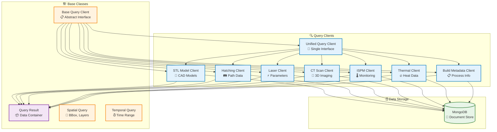

# Query Module

## Overview

The Query module provides a unified interface for accessing multi-source data from the NoSQL data warehouse. It abstracts the complexity of querying different data sources and provides a consistent API for retrieving hatching paths, laser parameters, CT scans, ISPM monitoring data, and more.

## Architecture



## Key Components

### Base Query Client

Abstract base class that defines the interface for all query clients:

- `query()` - Execute spatial/temporal queries
- `get_available_signals()` - List available signal types
- `get_bounding_box()` - Get spatial bounds

### Unified Query Client

Single interface for querying all data sources:

- Merges data from multiple sources
- Handles coordinate system transformations
- Provides unified result format

### Specialized Clients

- **STLModelClient**: Query CAD model data
- **HatchingClient**: Query hatching path data
- **LaserParameterClient**: Query laser parameter data
- **CTScanClient**: Query CT scan data
- **InSituMonitoringClient**: Query ISPM sensor data
- **ThermalClient**: Query thermal data
- **BuildMetadataClient**: Query build process metadata

## Query Workflow

```mermaid
flowchart TB
    Start([User Request]) --> CreateClient["Create Query Client<br/>🔍 Initialize"]
    
    CreateClient --> BuildQuery["Build Query<br/>📍 Spatial + ⏰ Temporal"]
    
    BuildQuery --> Execute["Execute Query<br/>🔍 Query MongoDB"]
    
    Execute --> Transform["Transform Coordinates<br/>📐 Unify Systems"]
    
    Transform --> Merge["Merge Results<br/>🔀 Combine Sources"]
    
    Merge --> Format["Format Result<br/>📦 QueryResult"]
    
    Format --> Return([Return Data])
    
    %% Error handling
    Execute -.->|Error| HandleError["Handle Error<br/>⚠️ QueryError"]
    HandleError --> Return
    
    %% Styling
    classDef step fill:#e3f2fd,stroke:#0277bd,stroke-width:2px
    classDef error fill:#ffebee,stroke:#c62828,stroke-width:2px
    classDef start fill:#c8e6c9,stroke:#2e7d32,stroke-width:3px
    classDef end fill:#fff3e0,stroke:#e65100,stroke-width:3px

    class CreateClient,BuildQuery,Execute,Transform,Merge,Format step
    class HandleError error
    class Start start
    class Return end
```

## Usage Examples

### Unified Query Client

```python
from am_qadf.query import UnifiedQueryClient
from am_qadf.query.mongodb_client import MongoDBClient

# Initialize
mongodb_client = MongoDBClient("mongodb://localhost:27017")
query_client = UnifiedQueryClient(mongodb_client)

# Query multiple sources
result = query_client.query(
    model_id="my_model",
    sources=['hatching', 'laser', 'ct'],
    spatial_bbox=((-50, -50, -50), (50, 50, 50)),
    temporal_range=(0, 1000)  # Time in seconds
)

# Access results
points = result.points  # (N, 3) array
signals = result.signals  # Dict of signal arrays
metadata = result.metadata  # Additional metadata
```

### Individual Client

```python
from am_qadf.query import HatchingClient

# Initialize hatching client
hatching_client = HatchingClient(mongo_client=mongodb_client)

# Query hatching paths
layers = hatching_client.get_layers(
    model_id="my_model",
    layer_range=(0, 100)
)

# Get all points
points = hatching_client.get_all_points(
    model_id="my_model",
    spatial_bbox=((-50, -50, -50), (50, 50, 50))
)
```

### Spatial and Temporal Queries

```python
from am_qadf.query import SpatialQuery, TemporalQuery

# Spatial query
spatial = SpatialQuery(
    bbox_min=(-50, -50, -50),
    bbox_max=(50, 50, 50),
    component_id="component_1"
)

# Temporal query
temporal = TemporalQuery(
    start_time=0,
    end_time=1000,
    layer_range=(0, 100)
)

# Execute query
result = query_client.query(
    spatial=spatial,
    temporal=temporal,
    signal_types=['laser_power', 'temperature']
)
```

## Query Types

### Spatial Queries

- **Bounding Box**: Query within 3D bounding box
- **Component**: Query specific component
- **Layer Range**: Query specific layer range

### Temporal Queries

- **Time Range**: Query within time window
- **Layer Range**: Query specific layers
- **Build Stage**: Query specific build stages

### Signal Type Queries

- **Filter by Signal**: Query specific signal types
- **All Signals**: Query all available signals

## Related

- [Voxel Domain Module](voxel-domain.md) - Uses query clients
- [Signal Mapping Module](signal-mapping.md) - Uses query results
- [Core Module](core.md) - Base classes and exceptions

---

**Parent**: [Module Documentation](README.md)

