# Signal Mapping Module

## ⭐ CRITICAL MODULE

The signal mapping module is the **core** of the AM-QADF framework, responsible for interpolating point cloud signals onto voxel grids.

## Overview

The signal mapping module provides multiple interpolation methods and execution strategies for mapping signals from point clouds to structured voxel grids.

## System Overview (Non-Technical)

```mermaid
flowchart TD
    Start([Raw Sensor Data<br/>📊 Scattered Measurements]) --> Organize["Organize Data<br/>🔧 Prepare for Processing"]
    
    Organize --> Choose{"Choose Method<br/>📋"}
    
    Choose -->|Fast & Simple| Nearest["Nearest Neighbor<br/>⚡ Quick Mapping"]
    Choose -->|Smooth Results| Linear["Linear Interpolation<br/>📊 Smooth Mapping"]
    Choose -->|Distance-Based| Distance["Distance-Weighted<br/>📏 Weighted Mapping"]
    Choose -->|Statistical| Statistical["Statistical Method<br/>📈 Advanced Mapping"]
    
    Nearest --> Map["Map to 3D Grid<br/>🧊 Fill Voxels"]
    Linear --> Map
    Distance --> Map
    Statistical --> Map
    
    Map --> Check["Check Quality<br/>✅ Verify Results"]
    
    Check --> Result([3D Grid with Signals<br/>📊 Ready for Analysis])
    
    %% Styling
    classDef input fill:#e1f5fe,stroke:#01579b,stroke-width:3px
    classDef decision fill:#fff3e0,stroke:#e65100,stroke-width:3px
    classDef method fill:#e3f2fd,stroke:#0277bd,stroke-width:2px
    classDef process fill:#c8e6c9,stroke:#2e7d32,stroke-width:2px
    classDef output fill:#f3e5f5,stroke:#7b1fa2,stroke-width:3px

    class Start input
    class Organize,Choose decision
    class Nearest,Linear,Distance,Statistical method
    class Map,Check process
    class Result output
```



## Signal Mapping Workflow

```mermaid
flowchart TB
    %% Input
    subgraph Input["📊 Input Data"]
        Points["Point Cloud<br/>📍 3D Coordinates"]
        Signals["Signals<br/>📈 Power, Temperature, etc."]
        Grid["Voxel Grid<br/>🧊 3D Structure"]
    end

    %% Interpolation Methods
    subgraph Methods["🎯 Interpolation Methods"]
        Nearest["Nearest Neighbor<br/>⚡ Fastest"]
        Linear["Linear Interpolation<br/>📊 Smooth"]
        IDW["IDW<br/>📏 Distance-Weighted"]
        KDE["KDE<br/>📈 Statistical"]
        RBF["RBF<br/>🎯 Exact Interpolation"]
    end

    %% Execution Strategies
    subgraph Execution["⚙️ Execution Strategies"]
        Sequential["Sequential<br/>🔄 Single-threaded"]
        Parallel["Parallel<br/>⚡ Multi-threaded"]
        Spark["Spark<br/>☁️ Distributed"]
    end

    %% Output
    subgraph Output["📦 Output"]
        VoxelGrid["Voxel Grid<br/>🧊 With Signals"]
        Quality["Quality Metrics<br/>✅ Completeness"]
    end

    %% Flow
    Points --> Nearest
    Points --> Linear
    Points --> IDW
    Points --> KDE
    Points --> RBF
    Signals --> Nearest
    Signals --> Linear
    Signals --> IDW
    Signals --> KDE
    Signals --> RBF
    Grid --> Nearest
    Grid --> Linear
    Grid --> IDW
    Grid --> KDE
    Grid --> RBF

    Nearest --> Sequential
    Nearest --> Parallel
    Nearest --> Spark
    Linear --> Sequential
    Linear --> Parallel
    Linear --> Spark
    IDW --> Sequential
    IDW --> Parallel
    IDW --> Spark
    KDE --> Sequential
    KDE --> Parallel
    KDE --> Spark
    RBF --> Sequential
    RBF --> Spark

    Sequential --> VoxelGrid
    Parallel --> VoxelGrid
    Spark --> VoxelGrid

    VoxelGrid --> Quality

    %% Styling
    classDef input fill:#e1f5fe,stroke:#01579b,stroke-width:2px
    classDef method fill:#f3e5f5,stroke:#4a148c,stroke-width:2px
    classDef execution fill:#fff3e0,stroke:#e65100,stroke-width:2px
    classDef output fill:#e8f5e8,stroke:#2e7d32,stroke-width:2px

    class Points,Signals,Grid input
    class Nearest,Linear,IDW,KDE,RBF method
    class Sequential,Parallel,Spark execution
    class VoxelGrid,Quality output
```



## Key Components

### Interpolation Methods (`methods/`)

- **Nearest Neighbor** (`nearest_neighbor.py`) - Fast, simple interpolation
- **Linear Interpolation** (`linear.py`) - Smooth interpolation using k-nearest neighbors
- **Inverse Distance Weighting (IDW)** (`idw.py`) - Distance-weighted interpolation
- **Gaussian Kernel Density Estimation (KDE)** (`kde.py`) - Statistical density-based interpolation using Gaussian kernels
- **Radial Basis Functions (RBF)** (`rbf.py`) - Exact interpolation at data points with smooth interpolation between

### Execution Strategies (`execution/`)

- **Sequential** (`sequential.py`) - Single-threaded execution
- **Parallel** (`parallel.py`) - Multi-threaded parallel execution
- **Spark** (`spark.py`) - Distributed execution with Apache Spark

### Utilities (`utils/`)

- **Coordinate Utils** (`coordinate_utils.py`) - Coordinate transformation helpers
- **Performance** (`_performance.py`) - Performance optimizations
- **Spark Utils** (`spark_utils.py`) - Spark-specific utilities

## Usage Example

```python
from am_qadf.signal_mapping.execution.sequential import interpolate_to_voxels
from am_qadf.voxelization.voxel_grid import VoxelGrid
import numpy as np

# Create voxel grid
grid = VoxelGrid(
    bbox_min=(0, 0, 0),
    bbox_max=(100, 100, 100),
    resolution=1.0
)

# Point cloud data
points = np.array([[10, 10, 10], [20, 20, 20], [30, 30, 30]])
signals = {'power': np.array([200, 250, 300])}

# Interpolate to voxels
result_grid = interpolate_to_voxels(
    points=points,
    signals=signals,
    voxel_grid=grid,
    method='nearest'
)

# Access interpolated signals
power_array = result_grid.get_signal_array('power')
```

## Interpolation Methods Comparison

```mermaid
graph LR
    subgraph Methods["🎯 Interpolation Methods"]
        NN["Nearest Neighbor<br/>⚡ Fastest<br/>📊 Low Accuracy<br/>📦 Large Datasets"]
        LIN["Linear<br/>⚡ Moderate Speed<br/>📊 High Accuracy<br/>📦 General Purpose"]
        IDW_M["IDW<br/>⚡ Moderate Speed<br/>📊 High Accuracy<br/>📦 Distance Matters"]
        KDE_M["KDE<br/>⚡ Slow<br/>📊 High Accuracy<br/>📦 Statistical Analysis"]
        RBF_M["RBF<br/>⚡ Slowest<br/>📊 Highest Accuracy<br/>📦 Exact Interpolation"]
    end

    subgraph Selection["📋 Selection Guide"]
        Fast["Need Speed?<br/>→ Nearest Neighbor"]
        Balanced["Need Balance?<br/>→ Linear"]
        Distance["Distance Important?<br/>→ IDW"]
        Statistical["Statistical Analysis?<br/>→ KDE"]
        Exact["Need Exact Interpolation?<br/>→ RBF"]
    end

    NN -.->|Use When| Fast
    LIN -.->|Use When| Balanced
    IDW_M -.->|Use When| Distance
    KDE_M -.->|Use When| Statistical
    RBF_M -.->|Use When| Exact

    %% Styling
    classDef method fill:#e3f2fd,stroke:#0277bd,stroke-width:2px
    classDef guide fill:#fff3e0,stroke:#e65100,stroke-width:2px

    class NN,LIN,IDW_M,KDE_M,RBF_M method
    class Fast,Balanced,Distance,Statistical,Exact guide
```



### Nearest Neighbor
- **Speed**: Fastest
- **Accuracy**: Low (step function)
- **Use Case**: Quick mapping, large datasets

### Linear Interpolation
- **Speed**: Moderate
- **Accuracy**: High (smooth)
- **Use Case**: General purpose, smooth results

### IDW (Inverse Distance Weighting)
- **Speed**: Moderate
- **Accuracy**: High (distance-weighted)
- **Use Case**: When distance matters

### Gaussian KDE (Gaussian Kernel Density Estimation)
- **Speed**: Slow
- **Accuracy**: Highest (statistical)
- **Use Case**: Statistical analysis, density estimation

### RBF (Radial Basis Functions)
- **Speed**: Slowest (O(N³) complexity)
- **Accuracy**: Highest (exact interpolation at data points)
- **Use Case**: High-accuracy requirements, exact interpolation needed
- **Note**: Use Spark backend for large datasets (N > 10,000)
- **Method Name**: `'gaussian_kde'` (not `'kde'`)

## Execution Strategies

### Sequential
```python
from am_qadf.signal_mapping.execution.sequential import interpolate_to_voxels

result = interpolate_to_voxels(
    points, signals, grid, 
    method='linear',
    use_vectorized=True  # Use vectorized implementation (default: True)
)
```

### Parallel
```python
from am_qadf.signal_mapping.execution.sequential import interpolate_to_voxels
from am_qadf.signal_mapping.execution.parallel import ParallelInterpolationExecutor

# Option 1: Use built-in parallel flag
result = interpolate_to_voxels(
    points, signals, grid,
    method='linear',
    use_parallel=True,
    max_workers=4,
    chunk_size=1000
)

# Option 2: Use ParallelInterpolationExecutor directly
executor = ParallelInterpolationExecutor(max_workers=4, chunk_size=1000)
result = executor.execute_parallel('linear', points, signals, grid)
```

### Spark
```python
from am_qadf.signal_mapping.execution.sequential import interpolate_to_voxels

result = interpolate_to_voxels(
    points, signals, grid,
    method='linear',
    use_spark=True,
    spark_session=spark_session
)
```

### Hatching Paths Interpolation
```python
from am_qadf.signal_mapping.execution.sequential import interpolate_hatching_paths

# Interpolate hatching paths (polylines) to voxel grid
result = interpolate_hatching_paths(
    paths=[path1, path2, ...],  # List of path arrays (N, 3)
    signals={'power': [power1, power2, ...]},  # Signals per path
    voxel_grid=grid,
    points_per_mm=10.0,  # Sampling density
    interpolation_method='linear'
)
```

## Performance Considerations

- **Vectorization**: All methods use NumPy vectorization
- **Parallelization**: Parallel execution for large datasets
- **Memory**: Efficient memory usage for large voxel grids
- **Scalability**: Spark execution for very large datasets

## Related

- [Voxelization Module](voxelization.md) - Voxel grid creation
- [Fusion Module](fusion.md) - Multi-source fusion
- [Performance Guide](../09-performance.md) - Performance optimization

---

**Parent**: [Module Documentation](README.md)

