# Statistical Process Control (SPC) Module

## Overview

The Statistical Process Control (SPC) module provides comprehensive statistical process control capabilities for monitoring and controlling manufacturing processes in AM-QADF. It enables control chart generation, process capability analysis, multivariate SPC monitoring, control rule violation detection, baseline calculation, and adaptive control limits. These capabilities are essential for quality control, process monitoring, anomaly detection, and continuous process improvement in additive manufacturing.

## Architecture

```mermaid
graph TB
    subgraph Client["🎛️ SPC Client"]
        SPCClient["SPC Client<br/>🔗 Main Interface"]
    end

    subgraph Charts["📊 Control Charts"]
        ChartGenerator["Control Chart Generator<br/>📈 X-bar, R, S, I, MR"]
        ChartResult["Control Chart Result<br/>📋 Chart Statistics"]
    end

    subgraph Capability["📈 Process Capability"]
        CapabilityAnalyzer["Process Capability Analyzer<br/>✅ Cp, Cpk, Pp, Ppk"]
        CapabilityResult["Capability Result<br/>📊 Indices & Rating"]
    end

    subgraph Multivariate["🔬 Multivariate SPC"]
        MultivariateAnalyzer["Multivariate SPC Analyzer<br/>📐 Hotelling T², PCA"]
        MultivariateResult["Multivariate Result<br/>📈 Multivariate Statistics"]
    end

    subgraph Rules["🎯 Control Rules"]
        RuleDetector["Control Rule Detector<br/>⚖️ Western Electric, Nelson"]
        RuleViolation["Rule Violation<br/>⚠️ Violation Details"]
    end

    subgraph Baseline["📐 Baseline Calculation"]
        BaselineCalc["Baseline Calculator<br/>📊 Baseline Statistics"]
        AdaptiveCalc["Adaptive Limits Calculator<br/>🔄 Dynamic Limits"]
        BaselineStats["Baseline Statistics<br/>📋 Process Statistics"]
    end

    subgraph Storage["💾 SPC Storage"]
        SPCStorage["SPC Storage<br/>🗄️ MongoDB Integration"]
    end

    SPCClient --> ChartGenerator
    SPCClient --> CapabilityAnalyzer
    SPCClient --> MultivariateAnalyzer
    SPCClient --> RuleDetector
    SPCClient --> BaselineCalc
    SPCClient --> AdaptiveCalc
    SPCClient --> SPCStorage

    ChartGenerator --> ChartResult
    CapabilityAnalyzer --> CapabilityResult
    MultivariateAnalyzer --> MultivariateResult
    RuleDetector --> RuleViolation
    BaselineCalc --> BaselineStats
    AdaptiveCalc --> BaselineStats

    %% Styling
    classDef client fill:#e3f2fd,stroke:#0277bd,stroke-width:2px
    classDef chart fill:#fff3e0,stroke:#f57c00,stroke-width:2px
    classDef capability fill:#e8f5e8,stroke:#2e7d32,stroke-width:2px
    classDef multivariate fill:#f3e5f5,stroke:#7b1fa2,stroke-width:2px
    classDef rules fill:#fce4ec,stroke:#c2185b,stroke-width:2px
    classDef baseline fill:#e0f2f1,stroke:#00695c,stroke-width:2px
    classDef storage fill:#f5f5f5,stroke:#424242,stroke-width:2px

    class SPCClient client
    class ChartGenerator,ChartResult chart
    class CapabilityAnalyzer,CapabilityResult capability
    class MultivariateAnalyzer,MultivariateResult multivariate
    class RuleDetector,RuleViolation rules
    class BaselineCalc,AdaptiveCalc,BaselineStats baseline
    class SPCStorage storage
```



## SPC Workflow

```mermaid
flowchart TB
    Start([Process Data]) --> EstablishBaseline["Establish Baseline<br/>📐 Calculate Statistics"]
    
    EstablishBaseline --> GenerateCharts["Generate Control Charts<br/>📊 X-bar, R, S, I, MR"]
    
    GenerateCharts --> DetectViolations["Detect Rule Violations<br/>🎯 Western Electric, Nelson"]
    
    DetectViolations --> AnalyzeCapability{"Analyze Capability?<br/>📈"}
    
    AnalyzeCapability -->|Yes| CalculateCapability["Calculate Capability<br/>✅ Cp, Cpk, Pp, Ppk"]
    AnalyzeCapability -->|No| CheckMultivariate{"Multivariate<br/>SPC?"}
    
    CalculateCapability --> CheckMultivariate
    
    CheckMultivariate -->|Yes| MultivariateSPC["Multivariate SPC<br/>🔬 Hotelling T², PCA"]
    CheckMultivariate -->|No| EvaluateProcess{"Process<br/>In Control?"}
    
    MultivariateSPC --> EvaluateProcess
    
    EvaluateProcess -->|Yes| UpdateBaseline["Update Baseline<br/>🔄 Adaptive Limits"]
    EvaluateProcess -->|No| IdentifyIssues["Identify Issues<br/>⚠️ Out-of-Control"]
    
    UpdateBaseline --> Monitor["Continue Monitoring<br/>📊 Ongoing SPC"]
    IdentifyIssues --> TakeAction["Take Corrective Action<br/>🔧 Process Improvement"]
    
    TakeAction --> Monitor
    Monitor --> GenerateCharts
    
    %% Styling
    classDef step fill:#e3f2fd,stroke:#0277bd,stroke-width:2px
    classDef decision fill:#fff3e0,stroke:#e65100,stroke-width:2px
    classDef start fill:#c8e6c9,stroke:#2e7d32,stroke-width:3px
    classDef end fill:#ffccbc,stroke:#d84315,stroke-width:3px

    class EstablishBaseline,GenerateCharts,DetectViolations,CalculateCapability,MultivariateSPC,UpdateBaseline,Monitor,IdentifyIssues,TakeAction step
    class AnalyzeCapability,CheckMultivariate,EvaluateProcess decision
    class Start start
```

## Key Components

### SPCClient

Main client interface for all SPC operations:

- **Control Charts**: Generate X-bar, R, S, Individual, and Moving Range charts
- **Process Capability**: Calculate Cp, Cpk, Pp, Ppk indices and rate capability
- **Multivariate SPC**: Perform Hotelling T² and PCA-based multivariate monitoring
- **Control Rules**: Detect Western Electric and Nelson rule violations
- **Baseline Management**: Establish and update process baselines
- **Adaptive Limits**: Dynamically update control limits based on new data
- **Storage Integration**: Save and retrieve SPC data from MongoDB

### ControlChartGenerator

Generates various types of control charts:

- **X-bar Charts**: Monitor process mean with subgrouped data
- **R Charts**: Monitor process variability (range)
- **S Charts**: Monitor process variability (standard deviation)
- **Individual Charts**: Monitor individual measurements
- **Moving Range Charts**: Monitor variability between consecutive measurements
- **Combined Charts**: X-bar & R, X-bar & S pairs

### ProcessCapabilityAnalyzer

Analyzes process capability relative to specifications:

- **Short-term Capability**: Cp, Cpk indices (within-subgroup variation)
- **Long-term Capability**: Pp, Ppk indices (overall variation)
- **One-sided Capability**: Cpu, Cpl for single specification limits
- **Capability Rating**: Classify capability (Excellent, Adequate, Marginal, Inadequate)
- **PPM Estimation**: Estimate parts per million outside specifications

### MultivariateSPCAnalyzer

Monitors multiple correlated process variables:

- **Hotelling T²**: Multivariate control chart for correlated variables
- **PCA-based SPC**: Dimensionality reduction for high-dimensional monitoring
- **Contribution Analysis**: Identify variables contributing to out-of-control conditions
- **Outlier Detection**: Detect multivariate outliers

### ControlRuleDetector

Detects control rule violations:

- **Western Electric Rules**: 8 rules for pattern detection
- **Nelson Rules**: 8 additional rules for trend detection
- **Severity Classification**: Classify violations by severity (critical, major, minor)
- **Prioritization**: Prioritize violations for investigation

### BaselineCalculator

Establishes and manages process baselines:

- **Baseline Statistics**: Calculate mean, std, median, min, max, range
- **Control Limits**: Calculate control limits for various chart types
- **Baseline Updates**: Update baselines with new data (exponential smoothing, cumulative)
- **Adaptive Limits**: Recommend and calculate adaptive control limits

### AdaptiveLimitsCalculator

Manages adaptive control limits:

- **Drift Detection**: Detect process drift or shift
- **Limit Updates**: Calculate updated control limits based on recent data
- **Update Recommendations**: Recommend when to update limits
- **Change Point Detection**: Identify process change points

### SPCStorage

Stores and retrieves SPC data from MongoDB:

- **Baseline Storage**: Save and load baseline statistics
- **Chart Storage**: Save and load control chart results
- **Capability Storage**: Save and load process capability results
- **History Queries**: Query SPC history with filters (time range, type, model)

## Features

### Control Charts

The SPC module supports all standard control chart types:

- **X-bar Charts**: For monitoring process mean with subgrouped data
- **R Charts**: For monitoring process range (variability)
- **S Charts**: For monitoring standard deviation (variability)
- **Individual Charts**: For monitoring individual measurements
- **Moving Range Charts**: For monitoring variability between measurements
- **Combined Charts**: X-bar & R or X-bar & S pairs

### Process Capability

Comprehensive process capability analysis:

- **Cp**: Process capability (within-subgroup variation)
- **Cpk**: Process capability index (accounts for centering)
- **Pp**: Process performance (overall variation)
- **Ppk**: Process performance index (accounts for centering)
- **Capability Rating**: Automatic classification (Excellent ≥ 1.67, Adequate ≥ 1.33, Marginal ≥ 1.0, Inadequate < 1.0)
- **PPM Estimation**: Estimate defective parts per million

### Multivariate SPC

Monitor multiple correlated variables simultaneously:

- **Hotelling T²**: Multivariate control chart accounting for correlations
- **PCA-based SPC**: Dimensionality reduction for high-dimensional data
- **Contribution Analysis**: Identify which variables contribute to out-of-control signals
- **Automatic Component Selection**: Auto-select PCA components based on explained variance

### Control Rules

Detect process issues through pattern recognition:

**Western Electric Rules**:
1. One point beyond 3σ control limits
2. Two of three consecutive points beyond 2σ warning limits (same side)
3. Four of five consecutive points beyond 1σ (same side)
4. Eight consecutive points on same side of center line
5. Six consecutive points increasing or decreasing
6. Fourteen consecutive points alternating up and down
7. Fifteen consecutive points within 1σ (both sides of center)
8. Eight consecutive points beyond 1σ (either side of center)

**Nelson Rules**:
1. One point beyond 3σ
2. Nine points in a row on same side of center line
3. Six points in a row steadily increasing or decreasing
4. Fourteen points in a row alternating up and down
5. Two of three points beyond 2σ (same side)
6. Four of five points beyond 1σ (same side)
7. Fifteen points in a row within 1σ (both sides)
8. Eight points in a row beyond 1σ (either side)

### Baseline Management

Establish and maintain process baselines:

- **Baseline Calculation**: Calculate from historical data (minimum 30-100 samples recommended)
- **Control Limit Calculation**: Calculate limits for all chart types using appropriate constants
- **Baseline Updates**: Update baselines with new data using:
  - Exponential smoothing (weights recent data more)
  - Cumulative updates (weights all data equally)
- **Adaptive Limits**: Dynamically update limits when process changes are detected

### Storage and History

MongoDB integration for persistent storage:

- **Baseline Storage**: Save baselines with model/signal identification
- **Chart History**: Store control chart results with timestamps
- **Capability History**: Track capability over time
- **Query Interface**: Query SPC history by time range, type, model, signal

## Integration Points

### Quality Assessment Integration

The SPC module integrates with the Quality Assessment module:

- **Quality Metrics Monitoring**: Monitor quality metrics (completeness, SNR, alignment) using SPC
- **Quality-based SPC**: Use SPC to track quality metrics over time
- **Anomaly Detection**: Map out-of-control points and rule violations to quality anomalies

### Anomaly Detection Integration

The SPC module integrates with Anomaly Detection:

- **PatternDeviationDetector**: Uses SPC control charts for anomaly detection
- **Rule Violations as Anomalies**: Control rule violations trigger anomaly alerts
- **Out-of-Control Detection**: Out-of-control points mapped to anomalies

### Visualization Integration

The SPC module integrates with Visualization:

- **Control Chart Visualization**: Generate control charts in dashboards
- **Capability Plots**: Display process capability indices and distributions
- **Rule Violation Highlighting**: Visualize rule violations on control charts
- **Baseline Visualization**: Display baseline statistics and control limits

## Usage Examples

### Basic Control Chart

```python
from am_qadf.analytics.spc import SPCClient, SPCConfig

# Create SPC client
config = SPCConfig(control_limit_sigma=3.0, subgroup_size=5)
client = SPCClient(config=config)

# Generate demo data
import numpy as np
data = np.random.normal(10.0, 1.0, (20, 5))  # 20 subgroups of size 5

# Create X-bar control chart
result = client.create_control_chart(data, chart_type='xbar')

# Check results
print(f"Center Line: {result.center_line:.3f}")
print(f"UCL: {result.upper_control_limit:.3f}")
print(f"LCL: {result.lower_control_limit:.3f}")
print(f"Out-of-control points: {result.out_of_control_points}")
```

### Process Capability Analysis

```python
from am_qadf.analytics.spc import SPCClient

client = SPCClient()

# Generate process data
data = np.random.normal(10.0, 1.0, 200)

# Analyze capability
result = client.analyze_process_capability(
    data,
    specification_limits=(6.0, 14.0),  # LSL, USL
    target_value=10.0
)

print(f"Cp: {result.cp:.3f}")
print(f"Cpk: {result.cpk:.3f}")
print(f"Capability Rating: {result.capability_rating}")
```

### Multivariate SPC

```python
from am_qadf.analytics.spc import SPCClient

client = SPCClient()

# Generate multivariate data
multivariate_data = np.random.multivariate_normal(
    mean=[0, 0, 0],
    cov=[[1, 0.7, 0.5], [0.7, 1, 0.6], [0.5, 0.6, 1]],
    size=100
)

# Create Hotelling T² chart
result = client.create_multivariate_chart(
    multivariate_data,
    method='hotelling_t2'
)

print(f"T² statistics shape: {result.hotelling_t2.shape}")
print(f"UCL: {result.ucl_t2:.3f}")
print(f"Out-of-control points: {result.out_of_control_points}")
```

### Control Rule Detection

```python
from am_qadf.analytics.spc import SPCClient

client = SPCClient()

# Create control chart first
data = np.random.normal(10.0, 1.0, 100)
chart_result = client.create_control_chart(data, chart_type='individual')

# Detect rule violations
violations = client.detect_rule_violations(
    chart_result,
    rules='both'  # Western Electric and Nelson
)

for violation in violations:
    print(f"Rule: {violation.rule_name}")
    print(f"Severity: {violation.severity}")
    print(f"Affected points: {violation.affected_points}")
    print(f"Description: {violation.description}")
```

### Baseline Establishment

```python
from am_qadf.analytics.spc import SPCClient

client = SPCClient()

# Generate baseline data
baseline_data = np.random.normal(10.0, 1.0, 100)

# Establish baseline
baseline = client.establish_baseline(baseline_data, subgroup_size=1)

print(f"Baseline Mean: {baseline.mean:.3f}")
print(f"Baseline Std: {baseline.std:.3f}")
print(f"Sample Size: {baseline.sample_size}")

# Update baseline with new data
new_data = np.random.normal(10.1, 1.0, 50)
updated_baseline = client.update_baseline_adaptive(
    baseline,
    new_data,
    method='exponential_smoothing'
)
```

### Comprehensive SPC Analysis

```python
from am_qadf.analytics.spc import SPCClient, SPCConfig

# Configure SPC
config = SPCConfig(
    control_limit_sigma=3.0,
    subgroup_size=5,
    specification_limits=(6.0, 14.0),
    target_value=10.0,
    enable_warnings=True
)

client = SPCClient(config=config)

# Generate process data
data = np.random.normal(10.0, 1.0, (25, 5))  # 25 subgroups of 5

# Comprehensive analysis
results = client.comprehensive_spc_analysis(
    data,
    specification_limits=(6.0, 14.0),
    target_value=10.0,
    chart_types=['xbar_r'],
    detect_rules='both'
)

# Access results
print(f"Baseline: {results['baseline'].mean:.3f} ± {results['baseline'].std:.3f}")
print(f"Control Charts: {len(results['control_charts'])} charts generated")
print(f"Capability Cpk: {results['capability'].cpk:.3f}")
print(f"Rule Violations: {len(results['rule_violations'])} violations detected")
```

## Configuration

### SPCConfig

Configuration dataclass for SPC operations:

```python
from am_qadf.analytics.spc import SPCConfig

config = SPCConfig(
    control_limit_sigma: float = 3.0,  # Standard deviations for control limits
    subgroup_size: int = 5,  # Subgroup size for X-bar charts
    baseline_sample_size: int = 100,  # Minimum samples for baseline
    adaptive_limits: bool = False,  # Enable adaptive control limits
    update_frequency: Optional[int] = None,  # Samples between limit updates
    specification_limits: Optional[Tuple[float, float]] = None,  # USL, LSL
    target_value: Optional[float] = None,  # Target/center value
    enable_warnings: bool = True,  # Enable warning limits (2-sigma)
    warning_sigma: float = 2.0  # Warning limit multiplier
)
```

## Best Practices

1. **Establish Baseline First**: Always establish a baseline from sufficient historical data (recommended: 30-100+ samples) before monitoring
2. **Choose Appropriate Chart Types**: 
   - Use X-bar/R or X-bar/S for subgrouped data (subgroup size ≥ 2)
   - Use Individual/Moving Range for individual measurements
3. **Monitor Capability Regularly**: Track Cpk and Ppk indices to ensure process meets specifications
4. **Investigate All Rule Violations**: All control rule violations should be investigated, even minor ones
5. **Use Adaptive Limits Carefully**: Enable adaptive limits only after understanding process stability
6. **Set Appropriate Limits**: Use 3-sigma limits for control, 2-sigma for warnings
7. **Track History**: Store SPC results in MongoDB for historical analysis and trending
8. **Combine Methods**: Use both univariate and multivariate SPC for comprehensive monitoring

## Dependencies

### Required
- `numpy` - Numerical computations
- `scipy` - Statistical functions (F-distribution for T², etc.)
- `pandas` - Data manipulation (optional but recommended)

### Optional
- `scikit-learn` - PCA for multivariate SPC (required for PCA-based SPC)
- `pymongo` - MongoDB integration for storage (required for SPCStorage)
- `matplotlib` - Visualization (for control charts in notebooks)

## Related Modules

- **[Quality Assessment](quality.md)**: Integrates SPC with quality metrics monitoring
- **[Anomaly Detection](anomaly-detection.md)**: Uses SPC for pattern-based anomaly detection
- **[Visualization](visualization.md)**: Displays SPC control charts in dashboards
- **[Analytics](analytics.md)**: Statistical analysis complementing SPC

## Further Reading

- **API Reference**: [SPC API Reference](../06-api-reference/spc-api.md)
- **Notebook**: [Notebook 25: Statistical Process Control](../../Notebook/04-notebooks/25-statistical-process-control.md)
- **Implementation Plan**: [SPC Module Implementation Plan](../../../implementation_plans/SPC_MODULE_IMPLEMENTATION.md)

---

**Related**: [Quality Assessment](quality.md) | [Anomaly Detection](anomaly-detection.md) | [Validation](validation.md)