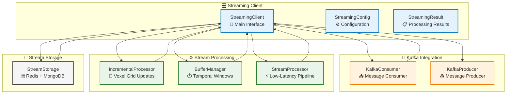

# Streaming Module

## Overview

The Streaming module provides real-time data streaming capabilities for AM-QADF, enabling live monitoring and processing of manufacturing process data. It includes Kafka integration, incremental processing, buffer management, low-latency stream processing, and stream data storage (Redis/MongoDB). These capabilities are essential for real-time process monitoring, live dashboards, and immediate response to process anomalies.

## Architecture



## Streaming Workflow

```mermaid
flowchart TB
    Start([Kafka Topic]) --> Consume["Consume Messages<br/>📥 KafkaConsumer"]
    
    Consume --> Batch["Batch Messages<br/>📦 Group by Size/Time"]
    
    Batch --> Process["Process Batch<br/>⚙️ StreamProcessor"]
    
    Process --> IncrementalUpdate["Update Voxel Grid<br/>🔄 IncrementalProcessor"]
    
    IncrementalUpdate --> Buffer["Buffer Management<br/>⏱️ Temporal Windows"]
    
    Buffer --> QualityCheck{"Quality<br/>Checkpoints?"}
    
    QualityCheck -->|Pass| Storage["Store Data<br/>💾 StreamStorage"]
    QualityCheck -->|Fail| Alert["Generate Alert<br/>⚠️ AlertSystem"]
    
    Storage --> Statistics["Update Statistics<br/>📊 Throughput, Latency"]
    
    Alert --> Statistics
    Statistics --> Monitor["Continue Streaming<br/>🔄 Real-time Loop"]
    
    Monitor --> Consume
    
    %% Styling
    classDef step fill:#e3f2fd,stroke:#0277bd,stroke-width:2px
    classDef decision fill:#fff3e0,stroke:#e65100,stroke-width:2px
    classDef start fill:#c8e6c9,stroke:#2e7d32,stroke-width:3px
    classDef end fill:#ffccbc,stroke:#d84315,stroke-width:3px

    class Consume,Batch,Process,IncrementalUpdate,Buffer,Storage,Statistics,Monitor,Alert step
    class QualityCheck decision
    class Start start
```

## Key Components

### StreamingClient

Main streaming interface that orchestrates all streaming operations:

- **Kafka Integration**: Start/stop consumers and producers
- **Batch Processing**: Process streaming data batches with registered processors
- **Processor Management**: Register custom processors for different processing stages
- **Statistics Tracking**: Monitor throughput, latency, and processing metrics
- **Error Handling**: Graceful error handling with statistics tracking

### KafkaConsumer

Kafka consumer implementation with support for multiple backends:

- **Backend Selection**: Auto-selects between `confluent-kafka` (preferred) and `kafka-python`
- **Error Handling**: Automatic reconnection and error recovery
- **Offset Management**: Manual and automatic offset commits
- **Partition Management**: Pause/resume, seek to beginning
- **Batch Processing**: Groups messages into batches for efficient processing

### KafkaProducer

Kafka producer for testing and data publishing:

- **Backend Support**: Supports both `confluent-kafka` and `kafka-python`
- **Message Publishing**: Publish messages to Kafka topics
- **Flush Control**: Manual flush for ensuring delivery
- **JSON Serialization**: Automatic JSON serialization of messages

### IncrementalProcessor

Processes streaming data incrementally to update voxel grids:

- **Voxel Grid Updates**: Incremental updates to existing voxel grids
- **Signal Batch Processing**: Process batches of signal data
- **Region Tracking**: Track updated regions for efficient visualization
- **State Management**: Reset and statistics tracking

### BufferManager

Manages temporal windows and buffers for streaming data:

- **Sliding Windows**: Get sliding windows of specified size
- **Time-based Windows**: Get all data within time duration
- **Circular Buffers**: Memory-efficient circular buffer implementation
- **Automatic Cleanup**: Remove old data based on age
- **Buffer Statistics**: Track buffer utilization and age

### StreamProcessor

Low-latency stream processing pipeline:

- **Pipeline Creation**: Create processing pipelines from stages
- **Quality Checkpoints**: Add validation checkpoints to pipeline
- **Parallel Processing**: Process multiple streams in parallel
- **Latency Measurement**: Track processing latency
- **Performance Metrics**: Monitor throughput and error rates

### StreamStorage

Store stream data in Redis (caching) and MongoDB (persistence):

- **Redis Caching**: Cache recent data with TTL
- **MongoDB Persistence**: Batch storage for long-term persistence
- **Time-series Queries**: Query stream history by time range
- **Indexing**: Create time-series indexes for efficient queries
- **Data Cleanup**: Delete old data based on age

## Usage Examples

### Basic Streaming Setup

```python
from am_qadf.streaming import StreamingClient, StreamingConfig

# Create configuration
config = StreamingConfig(
    kafka_bootstrap_servers=['localhost:9092'],
    kafka_topic='am_qadf_monitoring',
    processing_batch_size=100,
)

# Create streaming client
client = StreamingClient(config=config)

# Process streaming batches
def process_batch(data_batch):
    print(f"Processing {len(data_batch)} messages")
    # Your processing logic here
    return {'processed': len(data_batch)}

# Register processor
client.register_processor('my_processor', process_batch)

# Process a batch
batch = [{'value': 1.0}, {'value': 2.0}, {'value': 3.0}]
result = client.process_stream_batch(batch)

print(f"Processed {result.processed_count} messages in {result.processing_time_ms:.2f} ms")
```

### Kafka Consumer Setup

```python
from am_qadf.streaming import StreamingClient, StreamingConfig

config = StreamingConfig(kafka_bootstrap_servers=['localhost:9092'])
client = StreamingClient(config=config)

def message_callback(data_batch):
    """Callback for processing Kafka messages."""
    result = client.process_stream_batch(data_batch)
    print(f"Processed batch: {result.processed_count} messages")

# Start Kafka consumer
client.start_consumer(['am_qadf_monitoring'], message_callback)

# Consumer runs in background thread
# Stop when done
# client.stop_consumer()
```

### Incremental Voxel Grid Updates

```python
from am_qadf.streaming import IncrementalProcessor, StreamingClient
from am_qadf.voxelization.voxel_grid import VoxelGrid
import numpy as np

# Create voxel grid
voxel_grid = VoxelGrid(
    bbox_min=(0.0, 0.0, 0.0),
    bbox_max=(100.0, 100.0, 100.0),
    resolution=1.0
)

# Create incremental processor
processor = IncrementalProcessor(voxel_grid=voxel_grid)

# Update with streaming data
coordinates = np.array([
    [10.0, 20.0, 30.0],
    [11.0, 21.0, 31.0],
    [12.0, 22.0, 32.0],
])
new_data = np.array([1000.0, 1050.0, 1100.0])

updated_grid = processor.update_voxel_grid(new_data, coordinates)

# Get updated regions
regions = processor.get_updated_regions()
print(f"Updated regions: {regions}")
```

### Buffer Management

```python
from am_qadf.streaming import BufferManager
from datetime import datetime, timedelta
import numpy as np

# Create buffer manager
buffer = BufferManager(window_size=100, buffer_size=1000)

# Add data
for i in range(500):
    data = np.array([float(i)])
    buffer.add_data(data, datetime.now())

# Get sliding window
window, timestamps = buffer.get_sliding_window(50)
print(f"Window size: {len(window)}")

# Get time-based window (last 10 seconds)
window, timestamps = buffer.get_time_window(10.0)
print(f"Time window size: {len(window)}")

# Get buffer statistics
stats = buffer.get_buffer_statistics()
print(f"Buffer utilization: {stats['utilization_percent']:.1f}%")
```

### Stream Processing Pipeline

```python
from am_qadf.streaming import StreamProcessor, StreamingConfig

config = StreamingConfig()
processor = StreamProcessor(config=config)

# Define pipeline stages
def stage1_normalize(data):
    """Normalize data."""
    max_val = max(data) if data else 1.0
    return [x / max_val for x in data]

def stage2_filter(data):
    """Filter values > threshold."""
    return [x for x in data if x > 0.5]

def stage3_aggregate(data):
    """Aggregate results."""
    return sum(data) / len(data) if data else 0.0

# Create pipeline
pipeline = processor.create_processing_pipeline([
    stage1_normalize,
    stage2_filter,
    stage3_aggregate
])

# Process data
data = [1.0, 2.0, 3.0, 4.0, 5.0]
result = processor.process_with_pipeline(data, pipeline)
print(f"Pipeline result: {result}")

# Add quality checkpoints
processor.add_quality_checkpoint('non_empty', lambda x: len(x) > 0)
checkpoint_results = processor.validate_all_checkpoints([1, 2, 3])
print(f"Checkpoint results: {checkpoint_results}")
```

### Stream Storage

```python
from am_qadf.streaming import StreamStorage
from datetime import datetime, timedelta
import redis
import pymongo

# Create storage with Redis and MongoDB
redis_client = redis.Redis(host='localhost', port=6379, db=0)
mongo_client = pymongo.MongoClient('mongodb://localhost:27017/')

storage = StreamStorage(
    redis_client=redis_client,
    mongo_client=mongo_client,
    collection_name='stream_data'
)

# Cache recent data
storage.cache_recent_data('recent_batch', {'data': [1, 2, 3]}, ttl_seconds=3600)

# Store batch in MongoDB
batch_data = [
    {'value': 1.0, 'timestamp': datetime.now()},
    {'value': 2.0, 'timestamp': datetime.now()},
]
inserted = storage.store_batch(batch_data)
print(f"Inserted {inserted} documents")

# Query history
start_time = datetime.now() - timedelta(hours=1)
end_time = datetime.now()
history = storage.query_stream_history(start_time, end_time)
print(f"Found {len(history)} records")

# Create indexes for efficient queries
storage.create_time_series_index()
```

## Performance Targets

- **Processing Latency**: < 100ms per batch
- **Throughput**: > 1000 messages/second
- **Memory Usage**: < 500MB for buffer
- **WebSocket Update Latency**: < 50ms

## Integration Points

The Streaming module integrates with:

- **VoxelDomainClient**: Incremental voxel grid updates
- **QualityAssessmentClient**: Real-time quality assessment
- **SPCClient**: Real-time SPC monitoring
- **MonitoringClient**: Alert generation and health monitoring
- **ISPM clients** (e.g. ISPMThermalClient): Kafka-based streaming from monitoring systems

## Dependencies

- `kafka-python` or `confluent-kafka` (Kafka integration)
- `redis` (Redis caching)
- `pymongo` (MongoDB persistence)
- `websockets` (WebSocket support)

## Best Practices

1. **Batch Size**: Adjust `processing_batch_size` based on message rate and processing time
2. **Buffer Size**: Set `buffer_size` based on available memory and data retention needs
3. **Checkpoints**: Use quality checkpoints to validate data at critical stages
4. **Error Handling**: Always handle exceptions in custom processors
5. **Statistics**: Monitor statistics regularly to detect performance degradation
6. **Storage**: Use Redis for recent data (TTL-based), MongoDB for long-term storage

## Related Documentation

- [Streaming API Reference](../06-api-reference/streaming-api.md) - Complete API reference
- [Monitoring Module](monitoring.md) - Real-time monitoring capabilities
- [SPC Module](spc.md) - Statistical Process Control integration

---

**Parent**: [AM-QADF Modules](../README.md)
