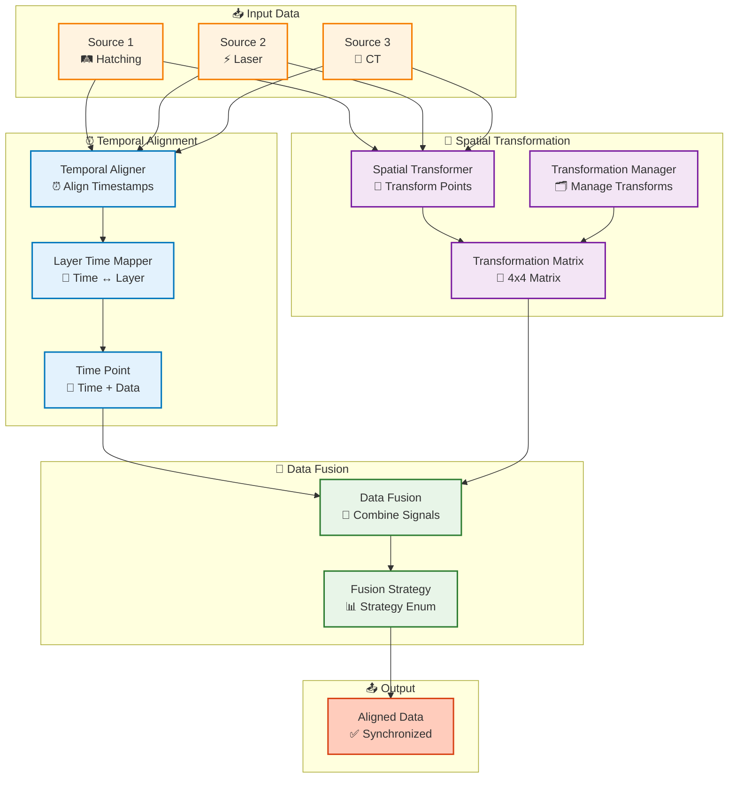
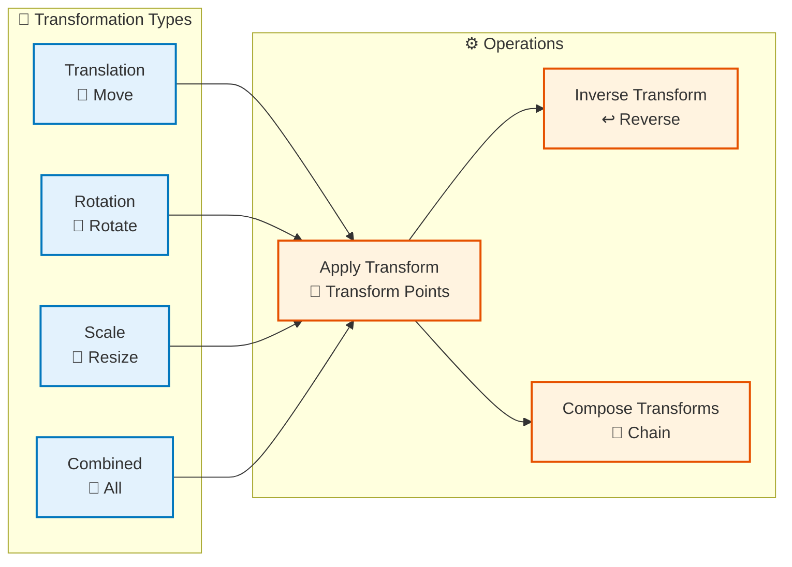

# Synchronization Module

## Overview

The Synchronization module handles temporal and spatial alignment of multi-source data, enabling accurate fusion of data from different sources with different coordinate systems and time references.

## What We Do: The Problem

Different data sources in additive manufacturing use **different coordinate systems** and **different time references**:

- **Hatching data**: Uses build platform coordinates, referenced by layer numbers
- **Laser parameters**: Uses machine coordinates, referenced by timestamps
- **CT scans**: Uses CT scanner coordinates, referenced by scan time
- **ISPM sensors**: Uses sensor coordinates, referenced by sensor timestamps

**Without alignment**, we cannot:
- Compare data from different sources at the same spatial location
- Fuse signals from multiple sources
- Create accurate quality assessments
- Map signals to a unified voxel grid

## How We Do It: The Process

### 1. Temporal Alignment ⏰
**Purpose**: Align data to a common time reference (build layers)

**Process**:
- Map timestamps from different sources to build layer numbers
- Use `LayerTimeMapper` to convert between time and layers
- Align temporal data to specific layers using interpolation

**Result**: All data sources have consistent layer-based time references

### 2. Spatial Transformation 📍
**Purpose**: Transform points from different coordinate systems to a common reference frame

**Current approach (bbox-corner correspondence)**:
- Sources are in different coordinate systems but share the **same bounding-box extent** (same physical box, different pose/scale).
- Transformation is computed from **8 bbox corners only** (no point-to-point correspondences).
- The pipeline tries **24 rotational permutations** of corner correspondence (cube symmetries) and **56 triplets** of corners per permutation; fits a similarity transform (Kabsch + Umeyama) on 3 corners and validates on all 8; the best fit (smallest max error) is selected.
- By default, bboxes are computed from **full data** (`use_full_extent_for_transform=True`); optional `bbox`/`layer_range` only filter which points are returned/saved.
- Validation uses reference corners **reordered by the best permutation** so pass/fail matches the fit; tolerance is **1% of bbox extent** (adaptive).

**Process**:
- Query points per source (full extent for bbox when filters are used)
- Compute bounding box per source; get 8 corners in fixed order
- Compute 4×4 similarity transform from bbox corner correspondence (C++: `TransformationComputer.computeTransformationFromBboxCorners`)
- Validate transform (C++: `TransformationValidator.validateWithMatrix` with best_ref_corners)
- Apply transform to all points; compute unified bounds

**Result**: All points are in the same coordinate system (typically build platform / hatching coordinates). See [SPATIAL_ALIGNMENT_DESIGN.md](../../Infrastructure/SPATIAL_ALIGNMENT_DESIGN.md) for full design.

### 3. Data Structure Preparation 🔄
**Purpose**: Organize aligned data for signal mapping and fusion

**Process**:
- Extract points and signals from each data source
- Store transformed points in a common format
- Preserve signal values (power, temperature, density, etc.) with their transformed points
- Store transformation metadata (transformation matrix, alignment mode)

**Result**: Structured aligned data ready for signal mapping

## What Results We Get: The Output

After temporal and spatial alignment, we get **aligned data** with the following structure:

```python
aligned_data = {
    'hatching': {
        'points': np.ndarray,      # (N, 3) - transformed points in common coordinate system
        'signals': {               # Signal values at each point
            'power': np.ndarray,   # (N,)
            'velocity': np.ndarray, # (N,)
            'energy': np.ndarray    # (N,)
        },
        'times': np.ndarray,       # (N,) - timestamps
        'layers': np.ndarray       # (N,) - layer indices
    },
    'laser': {
        'points': np.ndarray,      # (N, 3) - transformed points
        'signals': {
            'power': np.ndarray,
            'velocity': np.ndarray,
            'energy': np.ndarray
        },
        'times': np.ndarray,
        'layers': np.ndarray
    },
    'ct': {
        'points': np.ndarray,      # (N, 3) - transformed points
        'signals': {
            'density': np.ndarray  # (N,)
        },
        'times': np.ndarray,
        'layers': np.ndarray
    },
    'ispm': {
        'points': np.ndarray,      # (N, 3) - transformed points
        'signals': {
            'temperature': np.ndarray,        # (N,)
            'cooling_rate': np.ndarray,       # (N,)
            'temperature_gradient': np.ndarray # (N,)
        },
        'times': np.ndarray,
        'layers': np.ndarray
    }
}

# Transformation metadata
transformation_matrix = np.ndarray  # (4, 4) - transformation matrix used
alignment_metrics = {
    'alignment_error': float,      # Alignment accuracy metric
    'coverage': float,             # Data coverage metric
    # ... other metrics
}
```

### Key Characteristics of Aligned Data

1. **Unified Coordinate System**: All points are in the same coordinate system (typically build platform coordinates)
2. **Consistent Time Reference**: All data is aligned to build layers
3. **Complete Signal Information**: All signals from original data are preserved
4. **Ready for Signal Mapping**: Can be directly used to map signals to voxel grids
5. **Transformation Traceability**: Transformation matrix is stored for reference and validation

## Architecture



## Synchronization Workflow

```mermaid
flowchart TB
    Start([Multi-Source Data]) --> TemporalAlign["Temporal Alignment<br/>⏰ Align Timestamps"]
    
    TemporalAlign --> MapLayers["Map Time to Layers<br/>🔄 Layer Mapping"]
    
    MapLayers --> SpatialAlign["Spatial Alignment<br/>📍 Transform Coordinates"]
    
    SpatialAlign --> Register["Register Coordinate Systems<br/>🗂️ Register Transforms"]
    
    Register --> Transform["Transform Points<br/>🔄 Apply Transforms"]
    
    Transform --> PrepareFusion["Prepare for Fusion<br/>🔀 Align Data"]
    
    PrepareFusion --> SelectStrategy["Select Fusion Strategy<br/>📊 Choose Method"]
    
    SelectStrategy --> Fuse["Fuse Signals<br/>🔀 Combine"]
    
    Fuse --> Validate["Validate Alignment<br/>✅ Check Accuracy"]
    
    Validate --> Use([Use Aligned Data])
    
    %% Styling
    classDef step fill:#e3f2fd,stroke:#0277bd,stroke-width:2px
    classDef start fill:#c8e6c9,stroke:#2e7d32,stroke-width:3px
    classDef end fill:#ffccbc,stroke:#d84315,stroke-width:3px

    class TemporalAlign,MapLayers,SpatialAlign,Register,Transform,PrepareFusion,SelectStrategy,Fuse,Validate step
    class Start start
    class Use end
```

## Spatial Alignment API (Python)

The main entry point for querying and transforming multi-source points is:

- **`UnifiedQueryClient.query_and_transform_points(model_id, source_types, reference_source="hatching", layer_range=None, bbox=None, use_full_extent_for_transform=True, validation_tolerance=1e-6, ...)`**

Returns a dict with `transformed_points`, `signals`, `unified_bounds`, `transformations` (per-source matrix, quality, fit_errors, best_fit, correspondence_validation), `validation_results`, and `raw_results`. See [Synchronization API Reference](../06-api-reference/synchronization-api.md) for full parameters and return structure.

## Key Components

### Temporal Alignment

- **TimePoint**: Represents a point in time with associated data
- **LayerTimeMapper**: Maps between time and layer numbers
- **TemporalAligner**: Aligns timestamps from different sources

### Spatial Transformation (C++ / am_qadf_native)

- **UnifiedBoundsComputer**, **BoundingBox::corners()**: Compute bbox from points; 8 corners in fixed order
- **TransformationComputer.computeTransformationFromBboxCorners**: 24×56 fits; returns best transform, quality, optional best_ref_corners and per-fit errors
- **TransformationValidator.validateWithMatrix**: Validate using best_ref_corners; 1% adaptive tolerance; isValid true when within tolerance
- **PointTransformer**: Apply 4×4 transform to point sets

### Data Fusion

- **FusionStrategy**: Enum of fusion strategies (average, weighted, median, etc.)
- **DataFusion**: Combines signals from multiple sources

## Usage Examples

### Temporal Alignment

```python
from am_qadf.synchronization import TemporalAligner, LayerTimeMapper

# Initialize aligner
aligner = TemporalAligner()

# Create layer-time mapper
mapper = LayerTimeMapper(
    layer_times={0: 0.0, 1: 10.0, 2: 20.0, ...}  # layer -> time mapping
)

# Align timestamps
aligned_data = aligner.align(
    data_sources=[hatching_data, laser_data, ct_data],
    reference_time=0.0
)

# Map time to layer
layer = mapper.time_to_layer(time=15.0)  # Returns layer 1
time = mapper.layer_to_time(layer=2)     # Returns 20.0
```

### Spatial Transformation

```python
from am_qadf.synchronization import (
    TransformationMatrix, 
    SpatialTransformer,
    TransformationManager
)

# Create transformation matrix (rotation + translation)
transform = TransformationMatrix.translation(10, 20, 30)
rotation = TransformationMatrix.rotation('z', 45)  # 45° around Z-axis
combined = TransformationMatrix.combine([rotation, transform])

# Initialize transformer
transformer = SpatialTransformer()
transformer.register_transformation('ct_to_build', combined)

# Transform points
ct_points = np.array([[0, 0, 0], [1, 1, 1]])
build_points = transformer.transform_points(
    points=ct_points,
    transformation_name='ct_to_build'
)

# Use transformation manager
manager = TransformationManager()
manager.register_coordinate_system('build_platform', origin=(0, 0, 0))
manager.register_coordinate_system('ct_scan', origin=(10, 20, 30))

# Get transformation
transform = manager.get_transformation('ct_scan', 'build_platform')
```

### Data Fusion

```python
from am_qadf.synchronization import DataFusion, FusionStrategy

# Initialize fusion
fusion = DataFusion(
    default_strategy=FusionStrategy.WEIGHTED_AVERAGE
)

# Register source quality
fusion.register_source_quality('hatching', 0.9)
fusion.register_source_quality('laser', 0.8)
fusion.register_source_quality('ct', 0.7)

# Fuse signals
signals = {
    'hatching': hatching_signal,
    'laser': laser_signal,
    'ct': ct_signal
}

fused = fusion.fuse_signals(
    signals=signals,
    strategy=FusionStrategy.WEIGHTED_AVERAGE,
    use_quality=True
)
```

## Transformation Types



## Related

- [Signal Mapping Module](signal-mapping.md) - Uses synchronized data
- [Fusion Module](fusion.md) - Uses fusion strategies
- [Correction Module](correction.md) - Geometric correction

---

**Parent**: [Module Documentation](README.md)

