# Validation Module

## Overview

The Validation module provides comprehensive validation and benchmarking capabilities for the AM-QADF framework. It enables performance benchmarking of framework operations, comparison with Melt Pool Monitoring (MPM) systems, accuracy validation against ground truth data, and statistical significance testing. These capabilities are essential for ensuring framework reliability, performance optimization, and validation against reference systems.

## Architecture

```mermaid
graph TB
    subgraph Client["🎛️ Validation Client"]
        VClient["Validation Client<br/>🔗 Main Interface"]
    end

    subgraph Benchmarking["⏱️ Performance Benchmarking"]
        Benchmarker["Performance Benchmarker<br/>📊 Execution Metrics"]
        BenchmarkDecorator["@benchmark Decorator<br/>🔧 Method Annotation"]
    end

    subgraph MPM["🔬 MPM Comparison"]
        MPMEngine["MPM Comparison Engine<br/>📈 Framework vs MPM"]
        MPMResult["MPM Comparison Result<br/>📋 Validation Metrics"]
    end

    subgraph Accuracy["🎯 Accuracy Validation"]
        AccuracyValidator["Accuracy Validator<br/>✅ Ground Truth"]
        AccuracyResult["Accuracy Result<br/>📊 Error Metrics"]
    end

    subgraph Statistical["📊 Statistical Validation"]
        StatValidator["Statistical Validator<br/>🧪 Hypothesis Testing"]
        StatResult["Statistical Result<br/>📈 Significance Tests"]
    end

    VClient --> Benchmarker
    VClient --> MPMEngine
    VClient --> AccuracyValidator
    VClient --> StatValidator

    Benchmarker --> BenchmarkDecorator
    MPMEngine --> MPMResult
    AccuracyValidator --> AccuracyResult
    StatValidator --> StatResult

    %% Styling
    classDef client fill:#e3f2fd,stroke:#0277bd,stroke-width:2px
    classDef benchmark fill:#fff3e0,stroke:#f57c00,stroke-width:2px
    classDef mpm fill:#e8f5e8,stroke:#2e7d32,stroke-width:2px
    classDef accuracy fill:#f3e5f5,stroke:#7b1fa2,stroke-width:2px
    classDef statistical fill:#fce4ec,stroke:#c2185b,stroke-width:2px

    class VClient client
    class Benchmarker,BenchmarkDecorator benchmark
    class MPMEngine,MPMResult mpm
    class AccuracyValidator,AccuracyResult accuracy
    class StatValidator,StatResult statistical
```



## Validation Workflow

```mermaid
flowchart TB
    Start([Framework Output]) --> SelectValidation{"Select Validation Type"}
    
    SelectValidation -->|Performance| Benchmark["Performance Benchmarking<br/>⏱️ Measure Execution Time"]
    SelectValidation -->|MPM| MPMComp["MPM Comparison<br/>🔬 Compare with Reference"]
    SelectValidation -->|Accuracy| AccuracyVal["Accuracy Validation<br/>🎯 Compare with Ground Truth"]
    SelectValidation -->|Statistical| StatTest["Statistical Validation<br/>📊 Hypothesis Testing"]
    
    Benchmark --> BenchmarkMetrics["Benchmark Metrics<br/>Time, Memory, Throughput"]
    MPMComp --> MPMMetrics["MPM Metrics<br/>Correlation, Error"]
    AccuracyVal --> AccuracyMetrics["Accuracy Metrics<br/>RMSE, MAE, R²"]
    StatTest --> StatMetrics["Statistical Metrics<br/>P-value, Significance"]
    
    BenchmarkMetrics --> Aggregate["Aggregate Results<br/>📋 Validation Report"]
    MPMMetrics --> Aggregate
    AccuracyMetrics --> Aggregate
    StatMetrics --> Aggregate
    
    Aggregate --> Validate{"Validation<br/>✅ Pass/Fail?"}
    
    Validate -->|Pass| Success([✅ Validated])
    Validate -->|Fail| Failure([❌ Validation Failed])
    
    %% Styling
    classDef step fill:#e3f2fd,stroke:#0277bd,stroke-width:2px
    classDef decision fill:#fff3e0,stroke:#e65100,stroke-width:2px
    classDef start fill:#c8e6c9,stroke:#2e7d32,stroke-width:3px
    classDef end fill:#ffccbc,stroke:#d84315,stroke-width:3px
    classDef success fill:#c8e6c9,stroke:#2e7d32,stroke-width:3px

    class Benchmark,MPMComp,AccuracyVal,StatTest,BenchmarkMetrics,MPMMetrics,AccuracyMetrics,StatMetrics,Aggregate step
    class SelectValidation,Validate decision
    class Start start
    class Success success
    class Failure end
```

## Key Components

### ValidationClient

Main client interface for all validation operations:

- **Performance Benchmarking**: Measure execution time, memory usage, and throughput
- **MPM Comparison**: Compare framework outputs with Melt Pool Monitoring systems
- **Accuracy Validation**: Validate against ground truth data with error metrics
- **Statistical Validation**: Perform hypothesis testing and significance analysis
- **Comprehensive Reports**: Generate detailed validation reports

### PerformanceBenchmarker

Measures framework operation performance:

- **Execution Time**: Average, min, max execution times
- **Memory Usage**: Peak memory consumption during operations
- **Throughput**: Operations per second or elements per second
- **@benchmark Decorator**: Easy annotation for benchmarking methods
- **Multiple Runs**: Supports warmup iterations and statistical analysis

**Key Features:**
- Optional dependency on `psutil` for detailed system metrics
- Graceful degradation when optional dependencies are unavailable
- Automatic calculation of statistics (mean, std dev, min, max)

### MPMComparisonEngine

Compares framework outputs with MPM system data:

- **Metric Comparison**: Compare quality metrics between framework and MPM
- **Correlation Analysis**: Calculate correlation coefficients
- **Relative Error**: Compute relative error percentages
- **Validation Status**: Determine if metrics are within acceptable thresholds
- **Multi-Metric Analysis**: Compare multiple metrics simultaneously

**Configuration:**
- Correlation threshold (default: 0.85)
- Maximum relative error (default: 0.1 or 10%)
- Custom metric selection

### AccuracyValidator

Validates framework accuracy against ground truth:

- **Signal Mapping Validation**: Validate interpolated signals
- **Spatial Alignment Validation**: Validate coordinate transformations
- **Temporal Alignment Validation**: Validate time synchronization
- **Quality Metric Validation**: Validate quality assessment metrics

**Metrics Calculated:**
- **RMSE**: Root Mean Square Error
- **MAE**: Mean Absolute Error
- **R² Score**: Coefficient of determination
- **Max Error**: Maximum absolute error
- **Within Tolerance**: Boolean flag indicating if errors are acceptable

### StatisticalValidator

Performs statistical hypothesis testing:

- **T-test**: Compare means of two samples
- **Mann-Whitney U Test**: Non-parametric comparison
- **Correlation Test**: Test for significant correlations
- **ANOVA**: Analysis of variance for multiple groups
- **Chi-square Test**: Test for independence or goodness-of-fit
- **Normality Tests**: Test data distribution assumptions

**Configuration:**
- Significance level (α, default: 0.05)
- Alternative hypothesis (two-sided, less, greater)
- Optional multiple comparison correction

## Usage Examples

### Performance Benchmarking

```python
from am_qadf.validation import PerformanceBenchmarker, BenchmarkResult

# Initialize benchmarker
benchmarker = PerformanceBenchmarker()

# Benchmark an operation
def my_operation():
    # Your framework operation
    result = some_framework_method()
    return result

# Run benchmark
result: BenchmarkResult = benchmarker.benchmark_operation(
    operation_name="signal_mapping",
    operation_func=my_operation,
    iterations=10,
    warmup_iterations=2
)

print(f"Average time: {result.execution_time:.4f}s")
print(f"Memory usage: {result.memory_usage:.2f} MB")
print(f"Throughput: {result.throughput:.2f} ops/s")
```

### Using the @benchmark Decorator

```python
from am_qadf.validation.benchmarking import benchmark

@benchmark(num_runs=5, warmup=2)
def signal_mapping_operation(voxel_data, signal_name):
    """Signal mapping operation that will be benchmarked."""
    # Your implementation
    return mapped_signal

# When called, automatically benchmarks
result = signal_mapping_operation(voxel_data, "power")
# Benchmark results are available in result.metadata if needed
```

### MPM Comparison

```python
from am_qadf.validation import MPMComparisonEngine

# Initialize comparison engine
mpm_engine = MPMComparisonEngine(
    correlation_threshold=0.85,
    max_relative_error=0.1  # 10%
)

# Framework metrics
framework_metrics = {
    'overall_quality_score': 0.90,
    'data_quality_score': 0.85,
    'signal_quality_score': 0.92,
    'completeness': 0.90,
    'snr': 25.5
}

# MPM system metrics
mpm_metrics = {
    'overall_quality_score': 0.88,
    'data_quality_score': 0.83,
    'signal_quality_score': 0.90,
    'completeness': 0.88,
    'snr': 24.8
}

# Compare metrics
results = mpm_engine.compare_quality_metrics(
    framework_metrics=framework_metrics,
    mpm_metrics=mpm_metrics
)

# Analyze results
for metric_name, result in results.items():
    print(f"{metric_name}:")
    print(f"  Correlation: {result.correlation:.3f}")
    print(f"  Relative Error: {result.relative_error:.2f}%")
    print(f"  Valid: {'✓' if result.is_valid else '✗'}")
```

### Accuracy Validation

```python
from am_qadf.validation import AccuracyValidator

# Initialize validator
validator = AccuracyValidator(
    max_acceptable_error=0.1,  # 0.1 units
    tolerance_percent=5.0  # 5% tolerance
)

# Ground truth signal
ground_truth = np.array([...])  # Your ground truth data

# Framework output
framework_signal = np.array([...])  # Your framework output

# Validate signal mapping
result = validator.validate_signal_mapping(
    framework_signal=framework_signal,
    ground_truth=ground_truth,
    signal_name="power"
)

print(f"RMSE: {result.rmse:.6f}")
print(f"MAE: {result.mae:.6f}")
print(f"R² Score: {result.r2_score:.4f}")
print(f"Within Tolerance: {'Yes' if result.within_tolerance else 'No'}")
```

### Statistical Validation

```python
from am_qadf.validation import StatisticalValidator

# Initialize validator
validator = StatisticalValidator(significance_level=0.05)

# Baseline and improved samples
baseline = np.array([0.85, 0.86, 0.84, 0.87, ...])
improved = np.array([0.90, 0.91, 0.89, 0.92, ...])

# Perform t-test
result = validator.t_test(
    sample1=baseline,
    sample2=improved,
    alternative="greater"  # Test if improved > baseline
)

print(f"Test: {result.test_name}")
print(f"P-value: {result.p_value:.6f}")
print(f"Significant: {'Yes' if result.is_significant else 'No'}")
print(f"Conclusion: {result.conclusion}")
```

### Comprehensive Validation Workflow

```python
from am_qadf.validation import ValidationClient, ValidationConfig

# Initialize validation client
validation_client = ValidationClient()

# Configure validation
config = ValidationConfig(
    confidence_level=0.95,
    significance_level=0.05,
    max_acceptable_error=0.1,
    correlation_threshold=0.85
)

# Framework outputs
framework_output = {
    'quality_metrics': {...},
    'signal_data': {...},
    'statistical_results': {...}
}

# Reference data (MPM or ground truth)
reference_data = {
    'mpm_metrics': {...},
    'ground_truth': {...}
}

# Run comprehensive validation
results = validation_client.validate_all(
    framework_output=framework_output,
    reference_data=reference_data,
    config=config
)

# Generate validation report
report = validation_client.generate_validation_report(results)
print(report)
```

### Integration with QualityAssessmentClient

```python
from am_qadf.quality import QualityAssessmentClient
from am_qadf.validation import ValidationClient

# Initialize quality client with validation
validation_client = ValidationClient()
quality_client = QualityAssessmentClient(validation_client=validation_client)

# Perform quality assessment
quality_results = quality_client.comprehensive_assessment(
    voxel_data=grid,
    signals=['power', 'temperature']
)

# Validate quality assessment results
validation_results = quality_client.validate_quality_assessment(
    framework_results=quality_results,
    reference_data=mpm_reference_data
)

# Benchmark quality assessment
benchmark_result = quality_client.benchmark_quality_assessment(
    voxel_data=grid,
    signals=['power', 'temperature'],
    num_runs=5
)
```

## Validation Metrics Overview

```mermaid
graph LR
    subgraph Benchmark["⏱️ Benchmark Metrics"]
        ExecTime["Execution Time<br/>⏱️ Seconds"]
        Memory["Memory Usage<br/>💾 MB"]
        Throughput["Throughput<br/>📊 Ops/s"]
    end

    subgraph MPM["🔬 MPM Metrics"]
        Correlation["Correlation<br/>📈 0-1"]
        RelError["Relative Error<br/>📊 %"]
        Validity["Validity<br/>✅ Boolean"]
    end

    subgraph Accuracy["🎯 Accuracy Metrics"]
        RMSE["RMSE<br/>📏 Root Mean Square"]
        MAE["MAE<br/>📏 Mean Absolute"]
        R2["R² Score<br/>📈 0-1"]
    end

    subgraph Statistical["📊 Statistical Metrics"]
        PValue["P-value<br/>🧪 0-1"]
        TestStat["Test Statistic<br/>📊 Value"]
        Significance["Significance<br/>✅ Boolean"]
    end

    %% Styling
    classDef benchmark fill:#fff3e0,stroke:#f57c00,stroke-width:2px
    classDef mpm fill:#e8f5e8,stroke:#2e7d32,stroke-width:2px
    classDef accuracy fill:#f3e5f5,stroke:#7b1fa2,stroke-width:2px
    classDef statistical fill:#fce4ec,stroke:#c2185b,stroke-width:2px

    class ExecTime,Memory,Throughput benchmark
    class Correlation,RelError,Validity mpm
    class RMSE,MAE,R2 accuracy
    class PValue,TestStat,Significance statistical
```



## API Reference

For detailed API documentation including all classes, methods, parameters, and return types, see:

**[Validation Module API Reference](../06-api-reference/validation-api.md)**

The API reference includes comprehensive documentation for:
- `ValidationClient` and `ValidationConfig`
- `PerformanceBenchmarker` and `BenchmarkResult`
- `MPMComparisonEngine` and `MPMComparisonResult`
- `AccuracyValidator` and `AccuracyValidationResult`
- `StatisticalValidator` and `StatisticalValidationResult`
- `@benchmark` decorator

## Best Practices

### Performance Benchmarking

1. **Use Warmup Iterations**: Always include warmup iterations to account for JIT compilation and cache warming
   ```python
   result = benchmarker.benchmark_operation(
       operation_name="operation",
       operation_func=func,
       iterations=10,
       warmup_iterations=2  # Warmup recommended
   )
   ```

2. **Multiple Runs**: Use multiple runs (≥5) for reliable statistics
   ```python
   iterations=10  # At least 5-10 runs for reliable averages
   ```

3. **Benchmark in Context**: Benchmark operations in realistic conditions with representative data sizes

4. **Monitor Resource Usage**: Check memory usage to identify potential memory leaks or excessive consumption

### MPM Comparison

1. **Set Appropriate Thresholds**: Choose correlation and error thresholds based on your application requirements
   ```python
   mpm_engine = MPMComparisonEngine(
       correlation_threshold=0.85,  # Domain-specific threshold
       max_relative_error=0.1  # 10% acceptable error
   )
   ```

2. **Compare Multiple Metrics**: Don't rely on a single metric; compare multiple quality metrics for comprehensive validation

3. **Handle Missing Metrics**: Ensure both framework and MPM metrics have the same keys; handle missing values appropriately

4. **Document Thresholds**: Document why specific thresholds were chosen for reproducibility

### Accuracy Validation

1. **Use Appropriate Ground Truth**: Ensure ground truth data is accurate and representative
   ```python
   # Use high-quality ground truth data
   ground_truth = load_verified_ground_truth()
   ```

2. **Check Tolerance**: Set tolerance based on measurement precision and application requirements
   ```python
   validator = AccuracyValidator(
       max_acceptable_error=0.1,  # Based on measurement precision
       tolerance_percent=5.0  # 5% relative tolerance
   )
   ```

3. **Validate Multiple Signals**: Validate accuracy for all relevant signals, not just one

4. **Consider Spatial/Temporal Context**: Account for spatial and temporal variations in accuracy

### Statistical Validation

1. **Choose Appropriate Tests**: Select tests based on data distribution and assumptions
   ```python
   # Use t-test for normally distributed data
   # Use Mann-Whitney U for non-normal data
   if data_is_normal:
       result = validator.t_test(sample1, sample2)
   else:
       result = validator.mann_whitney_u_test(sample1, sample2)
   ```

2. **Set Significance Level**: Use standard significance levels (0.05, 0.01) unless domain-specific requirements dictate otherwise

3. **Report Effect Size**: In addition to p-values, report effect sizes and confidence intervals

4. **Multiple Comparisons**: Apply correction (e.g., Bonferroni) when performing multiple tests

5. **Check Assumptions**: Verify test assumptions (normality, independence, etc.) before interpreting results

### General Best Practices

1. **Comprehensive Validation**: Use multiple validation methods (benchmarking, MPM comparison, accuracy, statistical) for robust validation

2. **Regular Validation**: Perform validation regularly, especially after framework changes or parameter adjustments

3. **Document Results**: Keep detailed validation reports for reproducibility and tracking over time

4. **Automate Validation**: Integrate validation into CI/CD pipelines where possible

5. **Version Control**: Track validation results with framework versions for regression detection

6. **Baseline Establishment**: Establish baseline performance and accuracy metrics before optimization

## Configuration

### ValidationConfig

```python
@dataclass
class ValidationConfig:
    """Configuration for validation operations."""
    confidence_level: float = 0.95
    significance_level: float = 0.05
    max_acceptable_error: float = 0.1
    correlation_threshold: float = 0.85
    sample_size: Optional[int] = None
    random_seed: Optional[int] = None
```

### Environment Variables

The validation module respects optional dependencies:
- `psutil` (optional): For detailed memory and CPU monitoring in benchmarking
- `sklearn` (optional): For additional statistical tests and metrics
- `scipy` (optional): For advanced statistical tests

If optional dependencies are not available, the module gracefully degrades with reduced functionality.

## Error Handling

The validation module includes comprehensive error handling:

- **Missing Optional Dependencies**: Graceful degradation with informative messages
- **Invalid Inputs**: Clear error messages for invalid configuration or data
- **Statistical Test Failures**: Handles edge cases (e.g., zero variance, insufficient data)
- **Memory Errors**: Handles out-of-memory conditions during benchmarking

## Related Modules

- [Quality Module](quality.md) - Quality assessment integrated with validation
- [Analytics Module](analytics.md) - Statistical analysis uses validation for significance testing
- [Processing Module](processing.md) - Signal processing validated for accuracy
- [Signal Mapping Module](signal-mapping.md) - Signal mapping validated against ground truth
- [Synchronization Module](synchronization.md) - Alignment accuracy validated

## Testing

Comprehensive test coverage includes:

- **Unit Tests**: `tests/unit/validation/` - Individual component testing
- **Integration Tests**: `tests/integration/validation/` - Integration with other modules
- **Test Fixtures**: `tests/fixtures/validation/` - Pre-computed test data

See [Validation Test Plan](../../../implementation_plans/VALIDATION_TEST_PLAN.md) for detailed testing documentation.

## Notebooks

Interactive validation and benchmarking:

- **24_Validation_and_Benchmarking.ipynb**: Comprehensive interactive notebook with unified UI for all validation operations, including progress tracking and detailed logging

## Additional Resources

- [Benchmarking Usage Guide](../../../implementation_plans/BENCHMARKING_USAGE_GUIDE.md) - Detailed guide on using the `@benchmark` decorator
- [Validation Module Implementation Plan](../../../implementation_plans/VALIDATION_MODULE_IMPLEMENTATION.md) - Implementation details and architecture
- [Validation Test Plan](../../../implementation_plans/VALIDATION_TEST_PLAN.md) - Comprehensive test coverage documentation

---

**Parent**: [Module Documentation](README.md)
