# Visualization Module

## Overview

The Visualization module provides 3D visualization capabilities for voxel domain data, including interactive rendering, multi-resolution viewing, and Jupyter notebook widgets.

## Architecture


## Visualization Workflow

```mermaid
flowchart TB
    Start([Voxel Grid]) --> SelectSignal["Select Signal<br/>📊 Choose Signal"]
    
    SelectSignal --> ChooseView{"Choose View<br/>🎨"}
    
    ChooseView -->|3D Render| Render3D["3D Rendering<br/>🎨 PyVista"]
    ChooseView -->|Multi-Res| MultiRes["Multi-Resolution<br/>📊 LOD"]
    ChooseView -->|Widget| Widget["Interactive Widget<br/>🎛️ Jupyter"]
    
    Render3D --> Configure["Configure View<br/>⚙️ Colors, Opacity"]
    MultiRes --> Configure
    Widget --> Configure
    
    Configure --> Display["Display Visualization<br/>🖥️ Show"]
    
    Display --> Interact{"Interact?<br/>🖱️"}
    
    Interact -->|Yes| Update["Update View<br/>🔄 Change Parameters"]
    Interact -->|No| Export["Export Image<br/>📸 Save"]
    
    Update --> Configure
    Export --> Use([Use Visualization])
    
    %% Styling
    classDef step fill:#e3f2fd,stroke:#0277bd,stroke-width:2px
    classDef decision fill:#fff3e0,stroke:#e65100,stroke-width:2px
    classDef view fill:#f3e5f5,stroke:#7b1fa2,stroke-width:2px
    classDef start fill:#c8e6c9,stroke:#2e7d32,stroke-width:3px
    classDef end fill:#ffccbc,stroke:#d84315,stroke-width:3px

    class SelectSignal,Configure,Display,Update,Export step
    class ChooseView,Interact decision
    class Render3D,MultiRes,Widget view
    class Start start
    class Use end
```

## Key Components

### VoxelRenderer

3D rendering of voxel grids:

- **PyVista Integration**: Uses PyVista for 3D rendering
- **Signal Visualization**: Visualize signals with color mapping
- **Interactive Viewing**: Rotate, zoom, pan
- **Export**: Export to images or videos

### MultiResolutionViewer

Navigate multi-resolution grids:

- **Level-of-Detail**: Switch between resolution levels
- **Efficient Rendering**: Only render visible level
- **Smooth Transitions**: Smooth LOD transitions

### Widgets

Interactive widgets for Jupyter notebooks:

- **MultiResolutionWidget**: Interactive LOD control
- **AdaptiveResolutionWidget**: Adaptive resolution control
- **NotebookWidget**: General-purpose notebook widget

## Usage Examples

### Basic 3D Rendering

```python
from am_qadf.visualization import VoxelRenderer

# Initialize renderer
renderer = VoxelRenderer()

# Render voxel grid
renderer.render(
    voxel_grid=grid,
    signal_name='power',
    colormap='viridis',
    opacity=0.8
)

# Show interactive view
renderer.show()
```

### Multi-Resolution Viewing

```python
from am_qadf.visualization import MultiResolutionViewer

# Initialize viewer
viewer = MultiResolutionViewer(multi_res_grid)

# View at specific level
viewer.view_level(level=1)  # Medium resolution

# Navigate levels
viewer.zoom_in()   # Finer resolution
viewer.zoom_out()  # Coarser resolution
```

### Jupyter Widgets

```python
from am_qadf.visualization import MultiResolutionWidget

# Create widget
widget = MultiResolutionWidget(
    voxel_grid=multi_res_grid,
    signal_name='power'
)

# Display in notebook
widget.display()
```

## Visualization Types

```mermaid
graph LR
    subgraph Types["🎨 Visualization Types"]
        Volume["Volume Rendering<br/>🧊 3D Volume"]
        Surface["Surface Rendering<br/>📊 Isosurfaces"]
        Slice["Slice View<br/>📐 2D Slices"]
        Scatter["Scatter Plot<br/>📍 Point Cloud"]
    end

    subgraph Tools["🛠️ Tools"]
        PyVista["PyVista<br/>🎨 3D Rendering"]
        Matplotlib["Matplotlib<br/>📊 2D Plotting"]
        Plotly["Plotly<br/>📈 Interactive"]
    end

    Volume --> PyVista
    Surface --> PyVista
    Slice --> Matplotlib
    Scatter --> Plotly

    %% Styling
    classDef type fill:#e3f2fd,stroke:#0277bd,stroke-width:2px
    classDef tool fill:#fff3e0,stroke:#e65100,stroke-width:2px

    class Volume,Surface,Slice,Scatter type
    class PyVista,Matplotlib,Plotly tool
```



## Related

- [Voxel Domain Module](voxel-domain.md) - Main orchestrator
- [Analytics Module](analytics.md) - Visualize analysis results
- [Anomaly Detection Module](anomaly-detection.md) - Visualize detections

---

**Parent**: [Module Documentation](README.md)

