# Voxel Domain Module

## Overview

The Voxel Domain module is the main orchestrator of the AM-QADF framework. It provides a high-level interface for creating unified voxel domain representations from multi-source data, handling the complete workflow from data query to visualization.

## Architecture

```mermaid
graph TB
    subgraph Client["🎛️ Voxel Domain Client"]
        VDC["Voxel Domain Client<br/>🔗 Main Orchestrator"]
    end

    subgraph Storage["🗄️ Storage"]
        GridStorage["Voxel Grid Storage<br/>💾 MongoDB/GridFS"]
    end

    subgraph Integration["🔗 Integration"]
        Query["Query Module<br/>🔍 Data Access"]
        Voxelization["Voxelization<br/>🧊 Grid Creation"]
        SignalMapping["Signal Mapping<br/>🎯 Interpolation"]
        Synchronization["Synchronization<br/>⏰ Alignment"]
        Fusion["Fusion<br/>🔀 Multi-Source"]
        Quality["Quality<br/>✅ Assessment"]
        Analytics["Analytics<br/>📊 Analysis"]
        Visualization["Visualization<br/>🧊 Rendering"]
    end

    VDC --> Query
    VDC --> Voxelization
    VDC --> SignalMapping
    VDC --> Synchronization
    VDC --> Fusion
    VDC --> Quality
    VDC --> Analytics
    VDC --> Visualization

    VDC --> GridStorage

    Query --> VDC
    Voxelization --> VDC
    SignalMapping --> VDC
    Synchronization --> VDC
    Fusion --> VDC
    Quality --> VDC
    Analytics --> VDC
    Visualization --> VDC

    GridStorage --> VDC

    %% Styling
    classDef client fill:#e3f2fd,stroke:#0277bd,stroke-width:3px
    classDef storage fill:#e8f5e8,stroke:#2e7d32,stroke-width:2px
    classDef integration fill:#f3e5f5,stroke:#7b1fa2,stroke-width:2px

    class VDC client
    class GridStorage storage
    class Query,Voxelization,SignalMapping,Synchronization,Fusion,Quality,Analytics,Visualization integration
```



## Complete Workflow

```mermaid
flowchart TB
    Start([User Request]) --> QueryData["Query Data<br/>🔍 Unified Query"]
    
    QueryData --> CreateGrid["Create Voxel Grid<br/>🧊 Voxelization"]
    
    CreateGrid --> Transform["Transform Coordinates<br/>📐 Coordinate Systems"]
    
    Transform --> Align["Align Data<br/>⏰ Temporal/Spatial"]
    
    Align --> MapSignals["Map Signals<br/>🎯 Interpolation"]
    
    MapSignals --> Fuse["Fuse Signals<br/>🔀 Multi-Source Fusion"]
    
    Fuse --> AssessQuality["Assess Quality<br/>✅ Quality Metrics"]
    
    AssessQuality --> Store["Store Grid<br/>🗄️ MongoDB/GridFS"]
    
    Store --> Analyze{"Analyze?<br/>📊"}
    Store --> Visualize{"Visualize?<br/>🧊"}
    
    Analyze -->|Yes| RunAnalysis["Run Analysis<br/>📊 Statistical/Sensitivity"]
    Visualize -->|Yes| Render["Render 3D<br/>🎨 Visualization"]
    
    RunAnalysis --> Use([Use Results])
    Render --> Use
    
    %% Styling
    classDef step fill:#e3f2fd,stroke:#0277bd,stroke-width:2px
    classDef decision fill:#fff3e0,stroke:#e65100,stroke-width:2px
    classDef start fill:#c8e6c9,stroke:#2e7d32,stroke-width:3px
    classDef end fill:#ffccbc,stroke:#d84315,stroke-width:3px

    class QueryData,CreateGrid,Transform,Align,MapSignals,Fuse,AssessQuality,Store,RunAnalysis,Render step
    class Analyze,Visualize decision
    class Start start
    class Use end
```

## Key Components

### VoxelDomainClient

Main orchestrator client:

- **Unified Interface**: Single interface for all operations
- **Workflow Management**: Manages complete data pipeline
- **Coordinate System Handling**: Automatic coordinate transformations
- **Grid Management**: Creates and manages voxel grids

### VoxelGridStorage

Storage and retrieval:

- **MongoDB Storage**: Stores grid metadata
- **GridFS Storage**: Stores large signal arrays
- **Efficient Retrieval**: Fast grid loading
- **Versioning**: Support for grid versions

## Usage Examples

### Complete Workflow

```python
from am_qadf.voxel_domain import VoxelDomainClient
from am_qadf.query import UnifiedQueryClient
from am_qadf.query.mongodb_client import MongoDBClient

# Initialize
mongodb_client = MongoDBClient("mongodb://localhost:27017")
query_client = UnifiedQueryClient(mongodb_client)
voxel_client = VoxelDomainClient(
    unified_query_client=query_client,
    base_resolution=1.0,
    adaptive=True
)

# Map signals to voxels (complete workflow)
voxel_grid = voxel_client.map_signals_to_voxels(
    model_id="my_model",
    sources=['hatching', 'laser', 'ct', 'ispm'],
    interpolation_method='linear',
    use_parallel_sources=True
)

# Save grid
grid_id = voxel_client.save_voxel_grid(
    model_id="my_model",
    grid_name="fused_grid",
    voxel_grid=voxel_grid,
    mongo_client=mongodb_client
)

# Load grid
loaded_grid = voxel_client.load_voxel_grid(
    model_id="my_model",
    grid_name="fused_grid",
    mongo_client=mongodb_client
)
```

### Step-by-Step Workflow

```python
# 1. Create voxel grid
grid = voxel_client.create_voxel_grid(
    model_id="my_model",
    resolution=1.0,
    adaptive=True
)

# 2. Map signals from multiple sources
grid = voxel_client.map_signals_to_voxels(
    model_id="my_model",
    voxel_grid=grid,
    sources=['hatching', 'laser'],
    interpolation_method='nearest'
)

# 3. Assess quality
quality = voxel_client.assess_quality(
    model_id="my_model",
    voxel_grid=grid
)

# 4. Visualize
voxel_client.visualize(
    voxel_grid=grid,
    signal_name='power'
)
```

## Module Integration


## Related

- [All Modules](README.md) - All framework modules
- [Quick Start](../04-quick-start.md) - Quick start guide
- [Architecture](../02-architecture.md) - System architecture

---

**Parent**: [Module Documentation](README.md)

