# Voxelization Module

## Overview

The Voxelization module provides the core data structures for representing 3D spatial data as voxel grids. It supports fixed resolution grids, adaptive resolution grids, and multi-resolution hierarchies.

## System Overview (Non-Technical)

```mermaid
flowchart TD
    Start([3D Manufacturing Space<br/>📦 Physical Object]) --> Define["Define 3D Grid<br/>🔧 Divide into Small Cubes"]
    
    Define --> Choose{"Choose Grid Type<br/>📋"}
    
    Choose -->|Uniform| Uniform["Fixed Grid<br/>📊 Same Size Cubes"]
    Choose -->|Variable| Variable["Adaptive Grid<br/>📈 Different Sizes"]
    Choose -->|Multiple Levels| Multi["Multi-Level Grid<br/>📊 Multiple Resolutions"]
    
    Uniform --> Create["Create 3D Grid<br/>🧊 Cube Structure"]
    Variable --> Create
    Multi --> Create
    
    Create --> Store["Store Data<br/>💾 Save Measurements"]
    
    Store --> Use([3D Grid Ready<br/>📊 For Analysis & Mapping])
    
    %% Styling
    classDef input fill:#e1f5fe,stroke:#01579b,stroke-width:3px
    classDef decision fill:#fff3e0,stroke:#e65100,stroke-width:3px
    classDef method fill:#e3f2fd,stroke:#0277bd,stroke-width:2px
    classDef process fill:#c8e6c9,stroke:#2e7d32,stroke-width:2px
    classDef output fill:#f3e5f5,stroke:#7b1fa2,stroke-width:3px

    class Start input
    class Define,Choose decision
    class Uniform,Variable,Multi method
    class Create,Store process
    class Use output
```



## Architecture

```mermaid
graph TB
    subgraph Core["🧊 Core Voxel Grid"]
        VoxelGrid["VoxelGrid<br/>📦 Fixed Resolution"]
        VoxelData["VoxelData<br/>💾 Signal Storage"]
    end

    subgraph Advanced["⚙️ Advanced Grids"]
        Adaptive["Adaptive Resolution Grid<br/>📊 Variable Resolution"]
        MultiRes["Multi-Resolution Grid<br/>📈 Hierarchical"]
    end

    subgraph Coordinate["📐 Coordinate Systems"]
        CoordSystem["Coordinate System<br/>🌐 System Types"]
        Transformer["Coordinate Transformer<br/>🔄 Transformations"]
    end

    subgraph Resolution["📏 Resolution Maps"]
        SpatialMap["Spatial Resolution Map<br/>📍 Spatial Adaptation"]
        TemporalMap["Temporal Resolution Map<br/>⏰ Temporal Adaptation"]
    end

    VoxelGrid --> VoxelData
    Adaptive --> VoxelGrid
    MultiRes --> VoxelGrid
    
    Adaptive --> SpatialMap
    Adaptive --> TemporalMap
    
    Transformer --> CoordSystem
    VoxelGrid --> Transformer

    %% Styling
    classDef core fill:#e3f2fd,stroke:#0277bd,stroke-width:2px
    classDef advanced fill:#f3e5f5,stroke:#7b1fa2,stroke-width:2px
    classDef coordinate fill:#fff3e0,stroke:#f57c00,stroke-width:2px
    classDef resolution fill:#e8f5e8,stroke:#2e7d32,stroke-width:2px

    class VoxelGrid,VoxelData core
    class Adaptive,MultiRes advanced
    class CoordSystem,Transformer coordinate
    class SpatialMap,TemporalMap resolution
```



## Key Components

### VoxelGrid

Core voxel grid data structure:

- **Fixed Resolution**: Uniform voxel size
- **Sparse Storage**: Only stores non-empty voxels
- **Multiple Signals**: Each voxel can store multiple signal types
- **Aggregation**: Configurable aggregation (mean, max, min, sum)

### AdaptiveResolutionGrid

Voxel grid with spatially and temporally variable resolution:

- **Spatial Adaptation**: Higher resolution in regions of interest
- **Temporal Adaptation**: Resolution varies over time
- **Memory Efficient**: Optimized for large datasets

### MultiResolutionGrid

Hierarchical voxel grid with multiple resolution levels:

- **Level-of-Detail**: Select appropriate resolution level
- **Efficient Memory**: Only load required resolution levels
- **Scalable**: Supports very large datasets

### CoordinateSystemTransformer

Transforms points between coordinate systems:

- **Build Platform**: STL, hatching coordinates
- **CT Scan**: CT scan coordinate system
- **ISPM Sensor**: Sensor coordinate system

## Grid Coordinates and Spatial Reference Frame

### When Coordinates Are Set

**Coordinates are set during grid creation** - they are required parameters when initializing a `VoxelGrid` and cannot be changed afterward.

```python
grid = VoxelGrid(
    bbox_min=(0, 0, 0),      # ← Coordinates set HERE during creation
    bbox_max=(100, 100, 100), # ← Coordinates set HERE during creation
    resolution=1.0
)
```

### What Coordinates Define

The bounding box parameters (`bbox_min`, `bbox_max`) define:

1. **Spatial Extent**: The physical region in 3D space where the grid exists (world coordinates in mm)
2. **Grid Origin**: `bbox_min` serves as the origin (0, 0, 0) of the voxel grid coordinate system
3. **Voxel-to-World Mapping**: How voxel indices `(i, j, k)` map to world coordinates `(x, y, z)`

### Coordinate System Mapping

The grid uses a simple mapping between voxel indices and world coordinates:

- **World-to-Voxel**: `voxel_index = floor((world_coord - bbox_min) / resolution)`
- **Voxel-to-World**: `world_coord = bbox_min + (voxel_index + 0.5) * resolution`

Each voxel at index `(i, j, k)` has a world coordinate center at:
```
x = bbox_min[0] + (i + 0.5) * resolution
y = bbox_min[1] + (j + 0.5) * resolution
z = bbox_min[2] + (k + 0.5) * resolution
```

### Important Characteristics

- **Immutable**: Coordinates cannot be changed after grid creation
- **Spatial Reference Frame**: All data mapped to the grid must use the same coordinate system
- **Coordinate System Alignment**: Data must be aligned (see Synchronization Module) before mapping signals to ensure all sources use the same spatial reference frame

## Grid Bounds: Union Bounds

Grid creation uses **union bounds** by default: the bounding box is the union of aligned data from synchronization (e.g. from `query_and_transform_points` or unified alignment). This ensures the voxel grid covers all aligned point data. When explicit bounds are not provided, bounds can alternatively be taken from an STL geometry or from source-specific coordinates.

## Voxel Grid Creation Workflow

```mermaid
flowchart TB
    Start([Input Data]) --> DefineBBox["Define Bounding Box<br/>📍 Union Bounds (min, max)"]
    
    DefineBBox --> SetResolution["Set Resolution<br/>📏 Voxel Size"]
    
    SetResolution --> CreateGrid["Create VoxelGrid<br/>🧊 Initialize"]
    
    CreateGrid --> AddPoints["Add Points<br/>📍 World Coordinates"]
    
    AddPoints --> Convert["Convert to Voxel<br/>🔄 World → Voxel"]
    
    Convert --> Store["Store Signals<br/>💾 VoxelData"]
    
    Store --> Finalize["Finalize Grid<br/>✅ Aggregate"]
    
    Finalize --> Use([Use Grid])
    
    %% Alternative paths
    SetResolution -.->|Adaptive| CreateAdaptive["Create Adaptive Grid<br/>📊 Variable Resolution"]
    CreateAdaptive --> AddPoints
    
    SetResolution -.->|Multi-Res| CreateMultiRes["Create Multi-Res Grid<br/>📈 Hierarchical"]
    CreateMultiRes --> AddPoints
    
    %% Styling
    classDef step fill:#e3f2fd,stroke:#0277bd,stroke-width:2px
    classDef alternative fill:#fff3e0,stroke:#e65100,stroke-width:2px
    classDef start fill:#c8e6c9,stroke:#2e7d32,stroke-width:3px
    classDef end fill:#ffccbc,stroke:#d84315,stroke-width:3px

    class DefineBBox,SetResolution,CreateGrid,AddPoints,Convert,Store,Finalize step
    class CreateAdaptive,CreateMultiRes alternative
    class Start start
    class Use end
```

## Usage Examples

### Basic Voxel Grid

```python
from am_qadf.voxelization import VoxelGrid
import numpy as np

# Create voxel grid
grid = VoxelGrid(
    bbox_min=(0, 0, 0),
    bbox_max=(100, 100, 100),
    resolution=1.0,  # 1mm voxels
    aggregation='mean'
)

# Add points with signals
points = np.array([[10, 10, 10], [20, 20, 20], [30, 30, 30]])
signals = {'power': np.array([200, 250, 300])}

for i, point in enumerate(points):
    grid.add_point(
        point[0], point[1], point[2],
        signals={'power': signals['power'][i]}
    )

# Finalize grid (aggregate values)
grid.finalize()

# Access signals
power_array = grid.get_signal_array('power')
```

### Adaptive Resolution Grid

```python
from am_qadf.voxelization import AdaptiveResolutionGrid

# Create adaptive grid
adaptive_grid = AdaptiveResolutionGrid(
    bbox_min=(0, 0, 0),
    bbox_max=(100, 100, 100),
    base_resolution=1.0,
    min_resolution=0.5,  # Finer in regions of interest
    max_resolution=2.0   # Coarser elsewhere
)

# Set spatial resolution map
adaptive_grid.set_spatial_resolution_map(
    region_bbox=((40, 40, 40), (60, 60, 60)),
    resolution=0.5  # Higher resolution in this region
)
```

### Multi-Resolution Grid

```python
from am_qadf.voxelization import MultiResolutionGrid

# Create multi-resolution grid
multi_grid = MultiResolutionGrid(
    bbox_min=(0, 0, 0),
    bbox_max=(100, 100, 100),
    base_resolution=1.0,
    num_levels=3,  # 3 resolution levels
    level_ratio=2.0  # Each level is 2x coarser
)

# Get grid at specific level
coarse_grid = multi_grid.get_grid(level=0)  # Coarsest
fine_grid = multi_grid.get_grid(level=2)     # Finest
```

### Coordinate Transformation

```python
from am_qadf.voxelization import CoordinateSystemTransformer

# Initialize transformer
transformer = CoordinateSystemTransformer()

# Transform points from CT to build coordinates
ct_points = np.array([[10, 20, 30], [15, 25, 35]])
build_points = transformer.transform_points(
    points=ct_points,
    from_system={'type': 'ct_scan', 'origin': (0, 0, 0)},
    to_system={'type': 'build_platform', 'origin': (0, 0, 0)}
)
```

## Grid Types Comparison

```mermaid
graph LR
    subgraph Types["📊 Grid Types"]
        Fixed["Fixed Resolution<br/>⚡ Simple<br/>📦 Fixed Memory"]
        Adaptive["Adaptive Resolution<br/>⚡⚡ Moderate<br/>📦 Variable Memory"]
        MultiRes["Multi-Resolution<br/>⚡⚡⚡ Complex<br/>📦 Hierarchical Memory"]
    end

    subgraph UseCase["📋 Use Cases"]
        Simple["Simple Data<br/>→ Fixed"]
        Variable["Variable Density<br/>→ Adaptive"]
        Large["Very Large Data<br/>→ Multi-Res"]
    end

    Fixed -.->|When| Simple
    Adaptive -.->|When| Variable
    MultiRes -.->|When| Large

    %% Styling
    classDef type fill:#e3f2fd,stroke:#0277bd,stroke-width:2px
    classDef usecase fill:#fff3e0,stroke:#e65100,stroke-width:2px

    class Fixed,Adaptive,MultiRes type
    class Simple,Variable,Large usecase
```



## Grid Creation and Stored Metadata

Grid creation (uniform, OpenVDB workflow) is triggered via the API (`POST /api/voxelization/create-grid`) or programmatically. When a grid is created with **union bounds** and **auto-save** enabled, the following is persisted.

### Where Grid Creation Is Documented

- **Implementation plan**: `docs/Implementation_plan/Voxelization_OpenVDB_NEW.md` — OpenVDB workflow (query → transform → union bounds → voxelize).
- **API**: `docs/AM_QADF/06-api-reference/voxelization-api.md` — create-grid and related endpoints (when present).
- **Frontend**: Voxelization UI under Grid Builder — model, resolution, “Use union bounds”, Create Grid.

### Complete Metadata Saved to the Database

When a grid is saved (e.g. auto-save after creation), one document is written to the **`voxel_grids`** collection and the binary VDB is stored in **GridFS**. All of the following fields are stored.

#### 1. Voxel grids collection document (top-level)

| Field | Type | Description |
|-------|------|-------------|
| `_id` | ObjectId | Document ID (used as `grid_id`). |
| `model_id` | string | Model UUID (e.g. build/part identifier). |
| `model_name` | string | Human-readable model name (e.g. STL filename). |
| `grid_name` | string | Grid name (e.g. `uniform_grid_YYYYMMDD_HHMMSS`). |
| `description` | string | Optional description. |
| `tags` | array of string | Optional tags. |
| `metadata` | object | See [Metadata (from grid)](#2-metadata-from-grid) below. |
| `signal_references` | object | `{ "_openvdb_file": "<GridFS file_id>" }` — reference to the VDB blob in GridFS. |
| `voxel_data_reference` | null | Not used in OpenVDB path; all data is in the `.vdb` file. |
| `available_signals` | array of string | e.g. `['velocity', 'power', 'path', 'energy', 'occupancy']`. |
| `local_vdb_hatching_path` | string or null | **Local filesystem path** to the VDB file for hatching/signals (e.g. `AM-QADF/output/vdb_grids/hatching/<model>_uniform_resolution_<val>.vdb`). Large file; stored locally; path is stored for reference. |
| `local_vdb_stl_geometry_path` | string or null | **Local filesystem path** to the VDB file for STL geometry/occupancy (e.g. `AM-QADF/output/vdb_grids/stl_geometry/<model>_uniform_resolution_<val>.vdb`). |
| `created_at` | datetime | UTC creation time. |
| `updated_at` | datetime | UTC last update time. |

#### 2. Metadata (from grid)

Nested under `metadata`; derived from the grid object at save time:

| Field | Type | Description |
|-------|------|-------------|
| `bbox_min` | [float, float, float] | Grid extent minimum (x, y, z) in mm. |
| `bbox_max` | [float, float, float] | Grid extent maximum (x, y, z) in mm. |
| `resolution` | float | Voxel size in mm. |
| `dims` | [int, int, int] | Grid dimensions (nx, ny, nz). |
| `aggregation` | string | Aggregation method (e.g. `mean`). |
| `grid_type` | string | Grid class name (e.g. `VoxelGrid`). |
| `configuration_metadata` | object | See [Configuration metadata](#3-configuration-metadata) below. |

#### 3. Configuration metadata

Nested under `metadata.configuration_metadata`; comes from the create-grid request and runtime results:

| Field | Type | Description |
|-------|------|-------------|
| `grid_type` | string | Requested type: `uniform`, `adaptive`, or `multi_resolution`. |
| `voxel_size` | float or null | Voxel size in mm (uniform). |
| `min_voxel_size` | float or null | Min voxel size (adaptive/multi). |
| `max_voxel_size` | float or null | Max voxel size (adaptive/multi). |
| `resolution_levels` | int or null | Number of levels (multi_resolution). |
| `coordinate_system` | string | e.g. `machine`. |
| `aggregation` | string | e.g. `mean`. |
| `bbox_min` | tuple or null | Request bbox min (null when using union bounds). |
| `bbox_max` | tuple or null | Request bbox max (null when using union bounds). |
| `dimensions` | (int, int, int) | Actual grid dimensions (nx, ny, nz). |
| `voxel_count` | int | Total voxel count. |
| `memory_usage_mb` | float | Estimated memory in MB. |

#### 4. GridFS (VDB binary)

The full voxel grid is also stored as one **OpenVDB (`.vdb`) file** in GridFS:

- **Filename**: `{grid_id}.vdb`
- **Content**: Single `.vdb` file containing all signals (occupancy, energy, path, power, velocity, etc.).
- **GridFS file metadata**:
  - `grid_id`: Same as document `_id`.
  - `data_type`: `"voxel_grid"`.
  - `format`: `"openvdb"`.
  - `num_signals`: Number of grids in the file.
  - `signals`: List of signal names.

The document’s `signal_references._openvdb_file` holds the GridFS file ID for this blob. Large VDBs are stored **locally** under the project (`output/vdb_grids/...`); the paths are stored in `local_vdb_hatching_path` and `local_vdb_stl_geometry_path` so clients can use the local files when available.

## Related

- [Signal Mapping Module](signal-mapping.md) - Uses voxel grids
- [Query Module](query.md) - Provides data for voxelization
- [Fusion Module](fusion.md) - Fuses multiple voxel grids

---

**Parent**: [Module Documentation](README.md)

