# Voxelization Module

## Overview

The Voxelization module provides the core data structures for representing 3D spatial data as voxel grids. It supports fixed resolution grids, adaptive resolution grids, and multi-resolution hierarchies.

## System Overview (Non-Technical)


## Architecture

```mermaid
graph TB
    subgraph Core["🧊 Core Voxel Grid"]
        VoxelGrid["VoxelGrid<br/>📦 Fixed Resolution"]
        VoxelData["VoxelData<br/>💾 Signal Storage"]
    end

    subgraph Advanced["⚙️ Advanced Grids"]
        Adaptive["Adaptive Resolution Grid<br/>📊 Variable Resolution"]
        MultiRes["Multi-Resolution Grid<br/>📈 Hierarchical"]
    end

    subgraph Coordinate["📐 Coordinate Systems"]
        CoordSystem["Coordinate System<br/>🌐 System Types"]
        Transformer["Coordinate Transformer<br/>🔄 Transformations"]
    end

    subgraph Resolution["📏 Resolution Maps"]
        SpatialMap["Spatial Resolution Map<br/>📍 Spatial Adaptation"]
        TemporalMap["Temporal Resolution Map<br/>⏰ Temporal Adaptation"]
    end

    VoxelGrid --> VoxelData
    Adaptive --> VoxelGrid
    MultiRes --> VoxelGrid
    
    Adaptive --> SpatialMap
    Adaptive --> TemporalMap
    
    Transformer --> CoordSystem
    VoxelGrid --> Transformer

    %% Styling
    classDef core fill:#e3f2fd,stroke:#0277bd,stroke-width:2px
    classDef advanced fill:#f3e5f5,stroke:#7b1fa2,stroke-width:2px
    classDef coordinate fill:#fff3e0,stroke:#f57c00,stroke-width:2px
    classDef resolution fill:#e8f5e8,stroke:#2e7d32,stroke-width:2px

    class VoxelGrid,VoxelData core
    class Adaptive,MultiRes advanced
    class CoordSystem,Transformer coordinate
    class SpatialMap,TemporalMap resolution
```



## Key Components

### VoxelGrid

Core voxel grid data structure:

- **Fixed Resolution**: Uniform voxel size
- **Sparse Storage**: Only stores non-empty voxels
- **Multiple Signals**: Each voxel can store multiple signal types
- **Aggregation**: Configurable aggregation (mean, max, min, sum)

### AdaptiveResolutionGrid

Voxel grid with spatially and temporally variable resolution:

- **Spatial Adaptation**: Higher resolution in regions of interest
- **Temporal Adaptation**: Resolution varies over time
- **Memory Efficient**: Optimized for large datasets

### MultiResolutionGrid

Hierarchical voxel grid with multiple resolution levels:

- **Level-of-Detail**: Select appropriate resolution level
- **Efficient Memory**: Only load required resolution levels
- **Scalable**: Supports very large datasets

### CoordinateSystemTransformer

Transforms points between coordinate systems:

- **Build Platform**: STL, hatching coordinates
- **CT Scan**: CT scan coordinate system
- **ISPM Sensor**: Sensor coordinate system

## Voxel Grid Creation Workflow

```mermaid
flowchart TB
    Start([Input Data]) --> DefineBBox["Define Bounding Box<br/>📍 (min, max)"]
    
    DefineBBox --> SetResolution["Set Resolution<br/>📏 Voxel Size"]
    
    SetResolution --> CreateGrid["Create VoxelGrid<br/>🧊 Initialize"]
    
    CreateGrid --> AddPoints["Add Points<br/>📍 World Coordinates"]
    
    AddPoints --> Convert["Convert to Voxel<br/>🔄 World → Voxel"]
    
    Convert --> Store["Store Signals<br/>💾 VoxelData"]
    
    Store --> Finalize["Finalize Grid<br/>✅ Aggregate"]
    
    Finalize --> Use([Use Grid])
    
    %% Alternative paths
    SetResolution -.->|Adaptive| CreateAdaptive["Create Adaptive Grid<br/>📊 Variable Resolution"]
    CreateAdaptive --> AddPoints
    
    SetResolution -.->|Multi-Res| CreateMultiRes["Create Multi-Res Grid<br/>📈 Hierarchical"]
    CreateMultiRes --> AddPoints
    
    %% Styling
    classDef step fill:#e3f2fd,stroke:#0277bd,stroke-width:2px
    classDef alternative fill:#fff3e0,stroke:#e65100,stroke-width:2px
    classDef start fill:#c8e6c9,stroke:#2e7d32,stroke-width:3px
    classDef end fill:#ffccbc,stroke:#d84315,stroke-width:3px

    class DefineBBox,SetResolution,CreateGrid,AddPoints,Convert,Store,Finalize step
    class CreateAdaptive,CreateMultiRes alternative
    class Start start
    class Use end
```

## Usage Examples

### Basic Voxel Grid

```python
from am_qadf.voxelization import VoxelGrid
import numpy as np

# Create voxel grid
grid = VoxelGrid(
    bbox_min=(0, 0, 0),
    bbox_max=(100, 100, 100),
    resolution=1.0,  # 1mm voxels
    aggregation='mean'
)

# Add points with signals
points = np.array([[10, 10, 10], [20, 20, 20], [30, 30, 30]])
signals = {'power': np.array([200, 250, 300])}

for i, point in enumerate(points):
    grid.add_point(
        point[0], point[1], point[2],
        signals={'power': signals['power'][i]}
    )

# Finalize grid (aggregate values)
grid.finalize()

# Access signals
power_array = grid.get_signal_array('power')
```

### Adaptive Resolution Grid

```python
from am_qadf.voxelization import AdaptiveResolutionGrid

# Create adaptive grid
adaptive_grid = AdaptiveResolutionGrid(
    bbox_min=(0, 0, 0),
    bbox_max=(100, 100, 100),
    base_resolution=1.0,
    min_resolution=0.5,  # Finer in regions of interest
    max_resolution=2.0   # Coarser elsewhere
)

# Set spatial resolution map
adaptive_grid.set_spatial_resolution_map(
    region_bbox=((40, 40, 40), (60, 60, 60)),
    resolution=0.5  # Higher resolution in this region
)
```

### Multi-Resolution Grid

```python
from am_qadf.voxelization import MultiResolutionGrid

# Create multi-resolution grid
multi_grid = MultiResolutionGrid(
    bbox_min=(0, 0, 0),
    bbox_max=(100, 100, 100),
    base_resolution=1.0,
    num_levels=3,  # 3 resolution levels
    level_ratio=2.0  # Each level is 2x coarser
)

# Get grid at specific level
coarse_grid = multi_grid.get_grid(level=0)  # Coarsest
fine_grid = multi_grid.get_grid(level=2)     # Finest
```

### Coordinate Transformation

```python
from am_qadf.voxelization import CoordinateSystemTransformer

# Initialize transformer
transformer = CoordinateSystemTransformer()

# Transform points from CT to build coordinates
ct_points = np.array([[10, 20, 30], [15, 25, 35]])
build_points = transformer.transform_points(
    points=ct_points,
    from_system={'type': 'ct_scan', 'origin': (0, 0, 0)},
    to_system={'type': 'build_platform', 'origin': (0, 0, 0)}
)
```

## Grid Types Comparison

```mermaid
graph LR
    subgraph Types["📊 Grid Types"]
        Fixed["Fixed Resolution<br/>⚡ Simple<br/>📦 Fixed Memory"]
        Adaptive["Adaptive Resolution<br/>⚡⚡ Moderate<br/>📦 Variable Memory"]
        MultiRes["Multi-Resolution<br/>⚡⚡⚡ Complex<br/>📦 Hierarchical Memory"]
    end

    subgraph UseCase["📋 Use Cases"]
        Simple["Simple Data<br/>→ Fixed"]
        Variable["Variable Density<br/>→ Adaptive"]
        Large["Very Large Data<br/>→ Multi-Res"]
    end

    Fixed -.->|When| Simple
    Adaptive -.->|When| Variable
    MultiRes -.->|When| Large

    %% Styling
    classDef type fill:#e3f2fd,stroke:#0277bd,stroke-width:2px
    classDef usecase fill:#fff3e0,stroke:#e65100,stroke-width:2px

    class Fixed,Adaptive,MultiRes type
    class Simple,Variable,Large usecase
```



## Related

- [Signal Mapping Module](signal-mapping.md) - Uses voxel grids
- [Query Module](query.md) - Provides data for voxelization
- [Fusion Module](fusion.md) - Fuses multiple voxel grids

---

**Parent**: [Module Documentation](README.md)

