# Performance Guide

## Performance Considerations

### Signal Mapping Performance

```mermaid
graph TB
    subgraph DataSize["📊 Dataset Size"]
        Small["< 10K points<br/>⚡ Sequential"]
        Medium["10K - 100K points<br/>⚡ Parallel"]
        Large["100K - 1M points<br/>⚡ Parallel + Optimized"]
        VeryLarge["> 1M points<br/>☁️ Spark"]
    end

    subgraph Methods["🎯 Interpolation Methods"]
        NN_Perf["Nearest Neighbor<br/>⚡⚡⚡ Fastest"]
        Linear_Perf["Linear<br/>⚡⚡ Moderate"]
        IDW_Perf["IDW<br/>⚡⚡ Moderate"]
        KDE_Perf["KDE<br/>⚡ Slowest"]
    end

    subgraph Execution["⚙️ Execution Strategy"]
        Seq["Sequential<br/>🔄 Single-threaded"]
        Par["Parallel<br/>⚡ Multi-threaded"]
        Spark_Exec["Spark<br/>☁️ Distributed"]
    end

    Small --> Seq
    Medium --> Par
    Large --> Par
    VeryLarge --> Spark_Exec

    Seq --> NN_Perf
    Seq --> Linear_Perf
    Par --> NN_Perf
    Par --> Linear_Perf
    Par --> IDW_Perf
    Spark_Exec --> NN_Perf
    Spark_Exec --> Linear_Perf
    Spark_Exec --> IDW_Perf
    Spark_Exec --> KDE_Perf

    %% Styling
    classDef size fill:#e1f5fe,stroke:#01579b,stroke-width:2px
    classDef method fill:#f3e5f5,stroke:#4a148c,stroke-width:2px
    classDef execution fill:#fff3e0,stroke:#e65100,stroke-width:2px

    class Small,Medium,Large,VeryLarge size
    class NN_Perf,Linear_Perf,IDW_Perf,KDE_Perf method
    class Seq,Par,Spark_Exec execution
```

- **Method Selection**: Nearest neighbor is fastest, KDE is slowest
- **Parallelization**: Use parallel execution for large datasets
- **Vectorization**: All methods use NumPy vectorization

### Memory Management

```mermaid
flowchart LR
    subgraph Memory["💾 Memory Management"]
        Standard["Standard Grid<br/>📦 Fixed Resolution"]
        Adaptive["Adaptive Grid<br/>📦 Variable Resolution"]
        MultiRes["Multi-Resolution<br/>📦 Hierarchical"]
        Streaming["Streaming<br/>📦 Chunk Processing"]
    end

    subgraph UseCase["📋 Use Case"]
        SmallMem["Small Memory<br/>→ Standard"]
        MediumMem["Medium Memory<br/>→ Adaptive"]
        LargeMem["Large Memory<br/>→ Multi-Res"]
        VeryLargeMem["Very Large<br/>→ Streaming"]
    end

    Standard -.->|When| SmallMem
    Adaptive -.->|When| MediumMem
    MultiRes -.->|When| LargeMem
    Streaming -.->|When| VeryLargeMem

    %% Styling
    classDef memory fill:#e8f5e8,stroke:#2e7d32,stroke-width:2px
    classDef usecase fill:#fff3e0,stroke:#e65100,stroke-width:2px

    class Standard,Adaptive,MultiRes,Streaming memory
    class SmallMem,MediumMem,LargeMem,VeryLargeMem usecase
```

- **Large Voxel Grids**: Use adaptive or multi-resolution grids
- **Streaming**: Process data in chunks for very large datasets
- **Spark**: Use Spark execution for distributed processing

## Optimization Tips

1. **Choose Right Interpolation Method**: Nearest for speed, Linear for balance, KDE for accuracy
2. **Use Parallel Execution**: For datasets > 100K points
3. **Use Spark**: For datasets > 1M points
4. **Optimize Resolution**: Higher resolution = more memory, better accuracy

## Benchmarking

See [Performance Tests](../../Tests/04-test-categories/performance-tests.md) for benchmark results.

## Related

- [Signal Mapping Module](05-modules/signal-mapping.md) - Interpolation methods
- [Performance Tests](../../Tests/04-test-categories/performance-tests.md) - Test benchmarks

---

**Parent**: [Framework Documentation](README.md)

