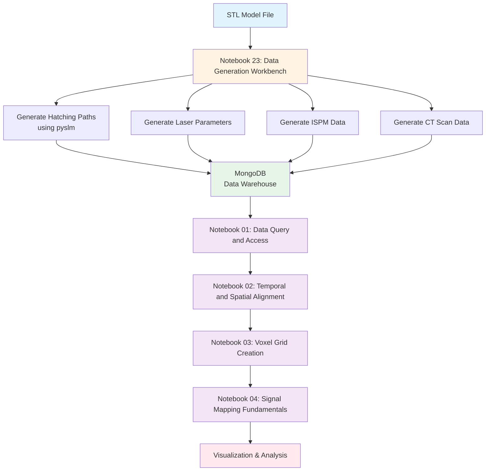
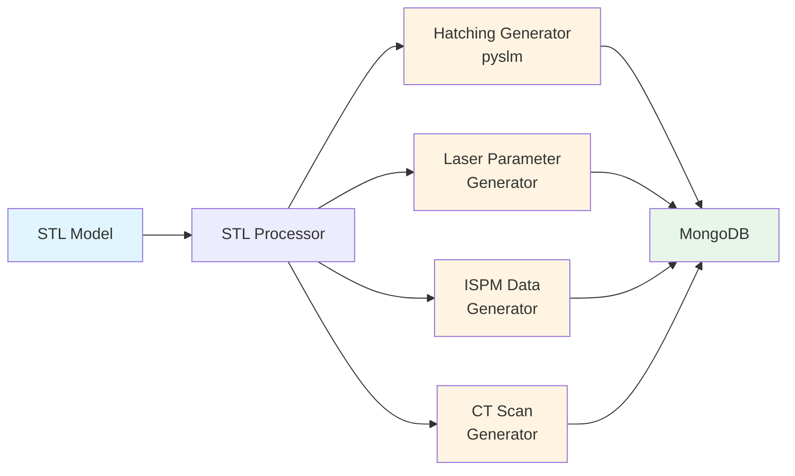

# AM-QADF Workflow Overview

## Purpose

This document provides a high-level overview of the AM-QADF (Additive Manufacturing Quality Assessment Data Framework) workflow, from data generation to visualization and analysis.

---

## Complete Workflow

---

## Data Generation Process (Notebook 23)

### Input: STL Model File

The workflow starts with a 3D STL (Stereolithography) model file that represents the part to be manufactured.

### Process: Data Generation Workbench

**Notebook 23** generates synthetic data for all data sources using the STL model as input:

### Data Sources Generated

1. **Hatching Paths** (using pyslm)
   - Layer-by-layer scan paths
   - Each layer contains:
     - `model_id`: Unique identifier
     - `layer_index`: Layer number
     - `layer_height`: Layer thickness (mm)
     - `z_position`: Z-coordinate of layer (mm)
     - `hatches`: Array of hatch paths, each containing:
       - `points`: Array of [x, y, z] coordinates along the path
       - `start_point`: [x, y, z] start coordinate
       - `end_point`: [x, y, z] end coordinate
       - `laser_power`: Power setting (W)
       - `scan_speed`: Scan speed (mm/s)
       - `energy_density`: Energy density (J/mm²)
       - `laser_beam_width`: Beam width (mm)
       - `hatch_spacing`: Spacing between hatches (mm)
       - `overlap_percentage`: Overlap percentage
       - `hatch_type`: Type (e.g., "line")
       - `scan_order`: Order of scanning
     - `contours`: Contour paths (if any)
     - `processing_time`: Timestamp
   - `coordinate_system`: Build platform coordinate system
     - Origin, rotation, scale factor
     - Bounding box

2. **Laser Parameters**
   - Laser power (W)
   - Scan speed (mm/s)
   - Energy density (J/mm²)
   - Hatch spacing (mm)
   - Exposure time (s)
   - Region type (contour/hatch/support)

3. **ISPM (In-Situ Process Monitoring) Data**
   - Melt pool temperature (K)
   - Melt pool size (width, length, depth)
   - Peak temperature (K)
   - Cooling rate (K/s)
   - Temperature gradient (K/mm)
   - Process events

4. **CT Scan Data**
   - Voxel grid density (g/cm³)
   - Porosity maps
   - Defect locations
   - Spatial coordinates

---

## Data Model Structure

### 1. Hatching Data Model

**Source**: Generated from STL using pyslm library

**Structure**:
- `model_id`: Unique identifier for the part
- `layer_index`: Layer number (0, 1, 2, ...)
- `layer_height`: Layer thickness (mm)
- `z_position`: Z-coordinate of the layer (mm)
- `hatches`: Array of hatch paths, each containing:
  - `points`: Array of [x, y, z] coordinates along the path
  - `start_point`: [x, y, z] start coordinate
  - `end_point`: [x, y, z] end coordinate
  - `laser_power`: Power setting (W)
  - `scan_speed`: Scan speed (mm/s)
  - `energy_density`: Energy density (J/mm²)
  - `laser_beam_width`: Beam width (mm)
  - `hatch_spacing`: Spacing between hatches (mm)
  - `overlap_percentage`: Overlap percentage
  - `hatch_type`: Type (e.g., "line")
  - `scan_order`: Order of scanning
- `contours`: Array of contour paths (if any)
- `processing_time`: Timestamp
- `coordinate_system`: Build platform coordinate system
  - Origin (x, y, z)
  - Rotation (x_deg, y_deg, z_deg)
  - Scale factor
  - Bounding box

**Storage**: MongoDB collection `hatching_layers`

---

### 2. Laser Parameters Data Model

**Source**: Generated based on hatching paths and process parameters

**Structure**:
- `model_id`: Unique identifier for the part
- `layer_index`: Layer number
- `point_id`: Unique point identifier
- `spatial_coordinates`: [x, y, z] in mm
- `laser_power`: Power in Watts (W)
- `scan_speed`: Speed in mm/s
- `hatch_spacing`: Spacing between hatch lines (mm)
- `energy_density`: Energy per unit area (J/mm²)
- `exposure_time`: Time per point (s)
- `timestamp`: Measurement timestamp
- `region_type`: "contour", "hatch", or "support"

**Storage**: MongoDB collection `laser_parameters`

---

### 3. ISPM Data Model

**Source**: Generated in-situ process monitoring data

**Structure**:
- `model_id`: Unique identifier for the part
- `layer_index`: Layer number
- `timestamp`: Measurement timestamp
- `spatial_coordinates`: [x, y, z] in mm
- `melt_pool_temperature`: Temperature in Kelvin (K)
- `melt_pool_size`: Object with width, length, depth (mm)
- `peak_temperature`: Maximum temperature (K)
- `cooling_rate`: Rate of temperature decrease (K/s)
- `temperature_gradient`: Spatial temperature gradient (K/mm)
- `process_event`: Event type (e.g., "layer_start", "hatch_complete")
- `coordinate_system`: ISPM sensor coordinate system

**Storage**: MongoDB collection `ispm_monitoring_data` or `ispm_data`

---

### 4. CT Scan Data Model

**Source**: Generated computed tomography scan data

**Structure**:
- `model_id`: Unique identifier for the part
- `spatial_coordinates`: [x, y, z] in mm
- `density`: Material density (g/cm³)
- `porosity`: Porosity value (0-1)
- `defect_locations`: Array of defect coordinates
- `voxel_grid`: 3D grid structure
  - Dimensions: [nx, ny, nz]
  - Resolution: Voxel size (mm)
  - Bounding box: Min/max coordinates

**Storage**: MongoDB collection `ct_scans`

---

## Processing Workflow (Notebooks 01-04)

### Notebook 01: Data Query and Access

**Purpose**: Query and retrieve data from MongoDB data warehouse

**Process**:
1. Connect to MongoDB
2. Select model ID
3. Choose data sources (Hatching, Laser, ISPM, CT)
4. Apply spatial filters (bounding box)
5. Apply temporal filters (layer range or time range)
6. Execute query and retrieve data

**Output**: Point cloud data with signals from selected sources

---

### Notebook 02: Temporal and Spatial Alignment

**Purpose**: Align data from different sources in time and space

**Process**:
1. Load data from multiple sources
2. Extract coordinate system information
3. Transform coordinates to common reference frame
4. Align temporal data (layer-to-time mapping)
5. Synchronize data points

**Output**: Aligned point clouds ready for voxelization

---

### Notebook 03: Voxel Grid Creation

**Purpose**: Create 3D voxel grid structure

**Process**:
1. Define bounding box from aligned data
2. Set voxel resolution
3. Create voxel grid structure
4. Initialize empty grid

**Output**: Empty voxel grid ready for signal mapping

---

### Notebook 04: Signal Mapping Fundamentals

**Purpose**: Map point cloud signals to voxel grid

**Process**:
1. Load aligned point cloud data
2. Select voxel grid
3. Choose interpolation method:
   - Nearest neighbor
   - Linear interpolation
   - IDW (Inverse Distance Weighting)
   - Gaussian KDE
   - RBF (Radial Basis Function)
4. Map all signals to voxel grid
5. Visualize mapped signals:
   - 2D slices
   - 3D volume rendering
   - Special visualizations for CT (grayscale) and ISPM (thermal)

**Output**: Voxel grid with mapped signals stored in MongoDB

---

## Summary

1. **Data Generation (Notebook 23)**: Generate synthetic data from STL model using pyslm for hatching
2. **Data Storage**: Store all data in MongoDB collections
3. **Data Query (Notebook 01)**: Retrieve data from warehouse with filters
4. **Alignment (Notebook 02)**: Align data in time and space
5. **Voxelization (Notebook 03)**: Create 3D grid structure
6. **Signal Mapping (Notebook 04)**: Map point cloud signals to voxel grid
7. **Visualization**: View and analyze mapped signals

This workflow enables comprehensive analysis of additive manufacturing process data by combining multiple data sources into a unified voxel-based representation.
