# Frontend Client Overview

## What is the AM-QADF Frontend Client?

The **AM-QADF Frontend Client** is a modern web-based user interface for the AM-QADF framework. It provides a browser-based alternative to Jupyter notebooks, designed for production deployment and non-technical users.

## Frontend Overview (Non-Technical)

```mermaid
flowchart TD
    User["👤 User<br/>Browser"] --> Frontend["Frontend Client<br/>🌐 Web Interface"]
    
    Frontend --> Dashboard["📊 Dashboard<br/>Overview & Metrics"]
    Frontend --> Query["🔍 Data Query<br/>Visual Query Builder"]
    Frontend --> Workflow["⚙️ Workflow Builder<br/>Pipeline Configuration"]
    Frontend --> Visualize["📈 Visualization<br/>3D & 2D Views"]
    Frontend --> Quality["✅ Quality Dashboard<br/>Metrics & Alerts"]
    Frontend --> Analytics["📊 Analytics<br/>Statistical Analysis"]
    
    Frontend --> API["REST API<br/>🔌 HTTP/WebSocket"]
    
    API --> Backend["AM-QADF Backend<br/>🐍 Python Framework"]
    
    Backend --> Data["📦 Data Warehouse<br/>MongoDB"]
    
    %% Styling
    classDef user fill:#e1f5fe,stroke:#01579b,stroke-width:3px
    classDef frontend fill:#e3f2fd,stroke:#0277bd,stroke-width:2px
    classDef feature fill:#f3e5f5,stroke:#7b1fa2,stroke-width:2px
    classDef backend fill:#c8e6c9,stroke:#2e7d32,stroke-width:2px
    classDef data fill:#fff3e0,stroke:#e65100,stroke-width:2px

    class User user
    class Frontend frontend
    class Dashboard,Query,Workflow,Visualize,Quality,Analytics feature
    class API,Backend backend
    class Data data
```

## Key Capabilities

### 1. Dashboard
- **Overview**: System status, data sources, processing status
- **Metrics**: Key performance indicators and statistics
- **Quick Actions**: Fast access to common operations
- **Alerts**: Real-time notifications and warnings

### 2. Data Query Interface
- **Visual Query Builder**: Intuitive interface for building queries
- **Model Selection**: Browse and select models
- **Filters**: Spatial, temporal, and signal type filters
- **Preview**: Real-time query result preview
- **Export**: Download query results

### 3. Workflow Builder
- **Visual Designer**: Drag-and-drop workflow creation
- **Pipeline Configuration**: Configure processing pipelines
- **Save & Reuse**: Save workflows for later use
- **Execution Monitoring**: Track workflow progress

### 4. Visualization Panel
- **3D Voxel Visualization**: Interactive 3D rendering (Three.js)
- **2D Slice Views**: Cross-sectional views
- **Charts & Plots**: Statistical charts (Plotly.js)
- **Export**: Save visualizations as images

### 5. Quality Assessment Dashboard
- **Real-time Metrics**: Live quality metrics
- **Quality Charts**: Trends and historical data
- **Alerts**: Quality threshold violations
- **Reports**: Quality assessment reports

### 6. Analytics Interface
- **Statistical Analysis**: Descriptive statistics, correlations
- **Sensitivity Analysis**: Parameter sensitivity plots
- **Anomaly Detection**: Anomaly visualization and results
- **SPC Control Charts**: Statistical process control charts

## Frontend Architecture

## Technology Stack

### Frontend Framework
- **Backend**: FastAPI (Python web framework)
- **Templates**: Jinja2 (server-side templating)
- **Frontend**: HTML5, CSS3, JavaScript (ES6+)
- **UI Framework**: Bootstrap 5.1.3
- **Icons**: Font Awesome 6.0
- **Fonts**: Google Fonts (Roboto)

### Visualization Libraries
- **2D Charts**: Plotly.js (matches notebook plots)
- **3D Rendering**: Three.js (for 3D voxel visualization)
- **Interactive Widgets**: Custom JavaScript components

### Backend Communication
- **REST API**: FastAPI backend (same server)
- **Static Files**: FastAPI StaticFiles middleware
- **Templates**: Jinja2 template engine
- **WebSocket**: Real-time updates (future)
- **Authentication**: JWT tokens

## Use Cases

### Production Deployment
- ✅ Industrial manufacturing environments
- ✅ Multi-user scenarios
- ✅ Non-technical operators
- ✅ Mobile/tablet access
- ✅ Enterprise integration

### When to Use Frontend vs Notebooks

| Use Case | Frontend | Notebooks |
|----------|----------|-----------|
| Production Deployment | ✅ Excellent | ⚠️ Complex |
| Non-technical Users | ✅ Excellent | ❌ Difficult |
| Multi-user Scenarios | ✅ Excellent | ⚠️ Requires JupyterHub |
| Mobile Access | ✅ Excellent | ❌ Limited |
| Enterprise Integration | ✅ Excellent | ⚠️ Complex |
| Research & Development | ⚠️ Good | ✅ Excellent |
| Code Experimentation | ❌ No | ✅ Excellent |
| Interactive Learning | ⚠️ Good | ✅ Excellent |

## Benefits

1. **Accessibility**: Just open browser, no installation required
2. **User-Friendly**: Intuitive interface for non-technical users
3. **Production-Ready**: Easier deployment, scaling, monitoring
4. **Multi-User**: Built-in authentication, authorization, session management
5. **Enterprise Integration**: Easier to integrate with existing systems
6. **Mobile-Friendly**: Responsive design for tablets/mobile devices
7. **Better UX**: Professional, polished interface for production use

## Relationship to Notebooks

The frontend client **complements** the existing Jupyter notebooks:

- **Notebooks**: Best for R&D, learning, code experimentation
- **Frontend**: Best for production, non-technical users, multi-user scenarios

Both interfaces use the same AM-QADF backend framework, ensuring consistency and code reuse.

---

**Next**: [Architecture](02-architecture.md) | [Installation](03-installation.md)
