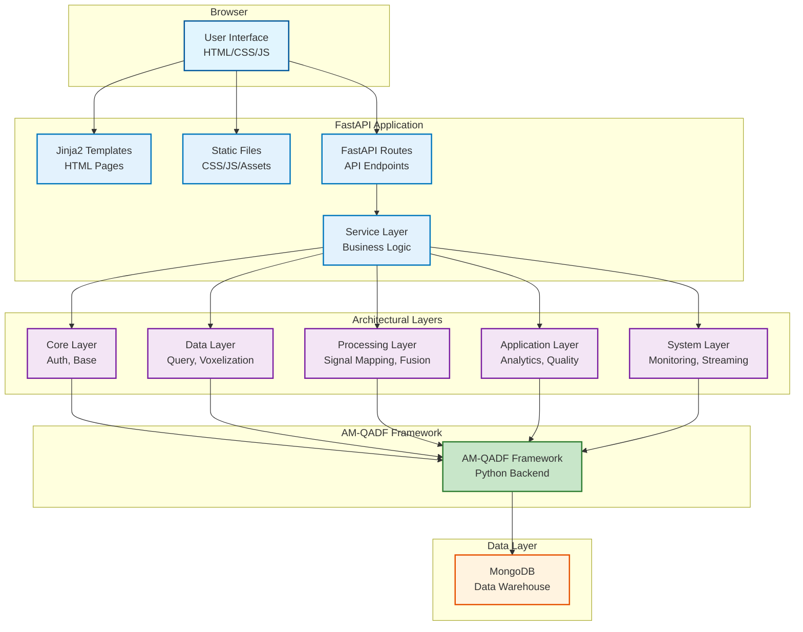
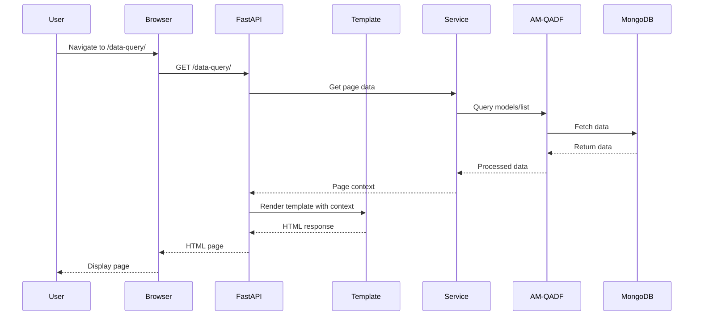
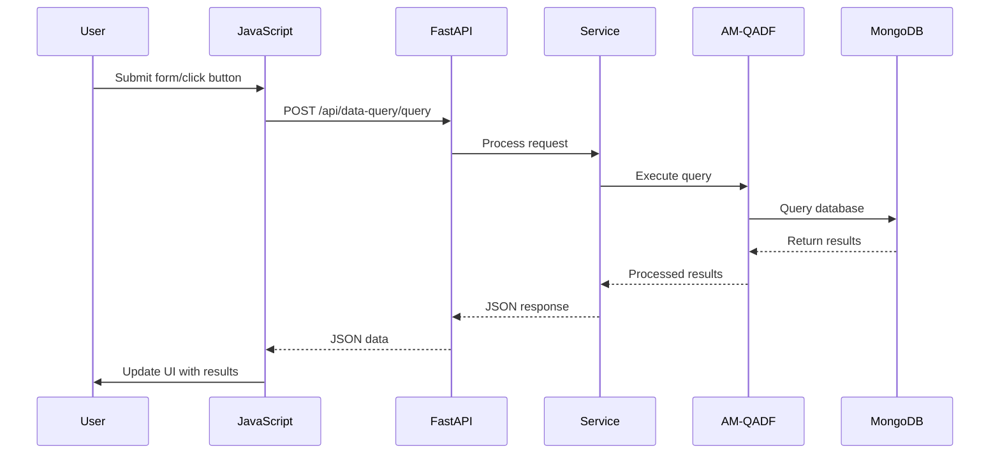
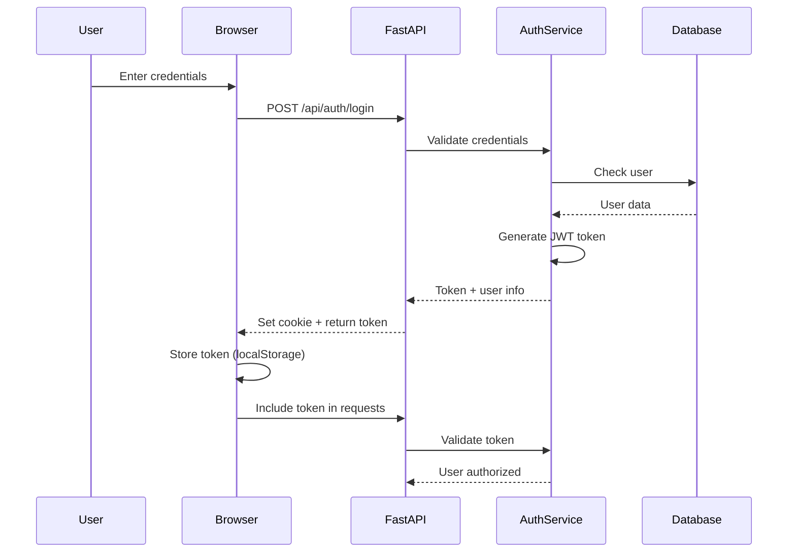

# Frontend Architecture

## System Architecture

The AM-QADF Frontend Client follows a server-side rendered architecture with FastAPI serving HTML templates and static assets.



## Architecture Layers

### 1. Presentation Layer (Templates & Static)

**Templates**: Jinja2 HTML templates
- Base template (`base.html`) with navigation and layout
- Module-specific templates (data_query, visualization, etc.)
- Reusable template blocks and includes
- Template inheritance for consistent UI

**Static Files**: CSS and JavaScript
- Base CSS (reset, variables, typography, layout)
- Module-specific CSS files
- Theme CSS (light, dark, auto)
- JavaScript modules for interactivity
- Third-party libraries (Bootstrap, Plotly.js, Three.js)

**Pages**: Application views
- Homepage (`index.html`)
- Data query page
- Visualization pages (2D and 3D)
- Quality assessment page
- Analytics pages
- Authentication pages

### 2. FastAPI Application Layer

**Routes**: FastAPI route handlers
- HTML route handlers (serve templates)
- API route handlers (JSON responses)
- Static file serving
- Error handling and exception handlers

**Services**: Business logic layer
- Connection services (MongoDB, AM-QADF framework)
- Business logic services (query, processing, analytics)
- Model services (data models and validation)
- Utility services (caching, pagination, monitoring)

### 3. Architectural Layers (Module Organization)

**Core Layer**: Base functionality
- Authentication routes and services
- Base utilities and shared code

**Data Layer**: Data access and voxelization
- Data query services and routes
- Voxelization services and routes
- Model services and connection management

**Processing Layer**: Data processing
- Signal mapping services
- Synchronization services
- Correction services
- Fusion services
- Processing pipeline services

**Application Layer**: Analytics and quality
- Analytics services (statistical, sensitivity, SPC)
- Quality assessment services
- Validation services
- Visualization services
- Anomaly detection services

**System Layer**: System-level features
- Monitoring services
- Streaming services
- Workflow management services

### 4. Communication Layer

**FastAPI Routes**: REST API endpoints
- `/api/*` endpoints for all modules
- JSON request/response handling
- Error handling and validation
- CORS middleware configuration

**Template Rendering**: Server-side rendering
- Jinja2 template rendering
- Context data passing
- Template inheritance and includes

**WebSocket**: Real-time updates (future)
- WebSocket endpoints for live data
- Connection management
- Event broadcasting

### 5. Authentication Layer

**Authentication**: User management
- Login/logout routes and templates
- JWT token management
- Session management
- Role-based access control (RBAC)
- Password reset functionality

## Template Architecture

### Template Hierarchy

```
base.html (Base Template)
├── Navigation (Navbar)
├── Main Content Block
│   ├── index.html (Homepage)
│   ├── data_query/index.html
│   ├── voxelization/index.html
│   ├── signal_mapping/index.html
│   ├── visualization/index.html
│   ├── analytics/index.html
│   └── ... (Module-specific templates)
└── Footer

Template Inheritance:
- All templates extend base.html
- Use  for content sections
- Use  for reusable components
```

### Template Structure

1. **Base Template** (`base.html`):
   - HTML structure and meta tags
   - Navigation bar
   - CSS/JS includes
   - Footer
   - Template blocks for content

2. **Page Templates**: Module-specific pages
   - Extend `base.html`
   - Define page-specific content
   - Include module-specific CSS/JS

3. **Reusable Components**: Template includes
   - Form components
   - Data tables
   - Charts and visualizations
   - Modal dialogs

### Static File Organization

```
static/
├── css/
│   ├── base/          # Base styles (reset, variables, typography)
│   ├── modules/       # Module-specific styles
│   └── themes/        # Theme styles (light, dark, auto)
├── js/
│   ├── base/          # Base JavaScript utilities
│   ├── modules/        # Module-specific JavaScript
│   └── lib/           # Third-party libraries
└── assets/            # Images, fonts, etc.
```

## Data Flow

### Page Request Flow



### API Request Flow



## State Management

### Server-Side State

State is managed on the server through:
- **Session Storage**: User sessions, authentication tokens
- **Database**: Persistent data (queries, grids, workflows)
- **Cache**: In-memory caching for frequently accessed data

### Client-Side State

Minimal client-side state management using JavaScript:

```javascript
// Simple state object for page-specific data
const pageState = {
  // Form data
  formData: {},
  
  // UI state
  ui: {
    loading: false,
    error: null,
    activeTab: 'query'
  },
  
  // Cached data (localStorage)
  cache: {
    models: [],
    lastFetch: null
  }
};

// Simple state update functions
function updateState(key, value) {
  pageState[key] = value;
  updateUI();
}

function updateUI() {
  // Update DOM based on state
  if (pageState.ui.loading) {
    showLoader();
  } else {
    hideLoader();
  }
}
```

### Data Persistence

- **localStorage**: Client-side caching (models list, preferences)
- **Session Storage**: Temporary data (current query, filters)
- **Cookies**: Authentication tokens, user preferences

## API Integration

### JavaScript API Client

Simple fetch-based API client:

```javascript
// Base API client utility
const API = {
  baseURL: '/api',
  
  async request(method, endpoint, data = null) {
    const options = {
      method: method,
      headers: {
        'Content-Type': 'application/json',
      }
    };
    
    // Add authentication token if available
    const token = localStorage.getItem('auth_token');
    if (token) {
      options.headers['Authorization'] = `Bearer ${token}`;
    }
    
    if (data) {
      options.body = JSON.stringify(data);
    }
    
    try {
      const response = await fetch(`${this.baseURL}${endpoint}`, options);
      const result = await response.json();
      
      if (!response.ok) {
        throw new Error(result.error?.message || 'API request failed');
      }
      
      return result;
    } catch (error) {
      console.error('API request failed:', error);
      throw error;
    }
  },
  
  get(endpoint) {
    return this.request('GET', endpoint);
  },
  
  post(endpoint, data) {
    return this.request('POST', endpoint, data);
  },
  
  put(endpoint, data) {
    return this.request('PUT', endpoint, data);
  },
  
  delete(endpoint) {
    return this.request('DELETE', endpoint);
  }
};
```

### API Endpoints

All endpoints are served by FastAPI routes:

- `/api/data-query/*` - Data querying endpoints
- `/api/voxelization/*` - Voxel grid operations
- `/api/visualization/*` - Visualization data
- `/api/analytics/*` - Analytics operations
- `/api/quality/*` - Quality assessment
- `/api/workflow/*` - Workflow management
- `/api/auth/*` - Authentication

## Security

### Authentication Flow



### Authorization

- **Server-Side Validation**: FastAPI validates tokens on each request
- **Template-Level Guards**: Conditionally render content based on user role
- **API-Level Guards**: Backend validates permissions before processing
- **JWT Tokens**: Stored in localStorage or cookies

## Performance Considerations

### Server-Side Optimization

1. **Template Caching**: Jinja2 templates are cached (disable auto-reload in production)
2. **Response Caching**: Cache frequently accessed data
3. **Database Optimization**: Use indexes, pagination, projections
4. **Connection Pooling**: Optimize MongoDB connections
5. **Async Operations**: Use async/await for I/O operations

### Client-Side Optimization

1. **Static File Caching**: Set appropriate cache headers
2. **Minification**: Minify JavaScript and CSS files
3. **Compression**: Enable Gzip/Brotli compression
4. **CDN**: Serve static assets from CDN (Bootstrap, Font Awesome)
5. **Lazy Loading**: Load JavaScript modules on demand
6. **Debouncing**: Debounce user input (search, filters)
7. **Pagination**: Paginate large datasets

### Static Assets

- **Bootstrap**: Loaded from CDN (no bundling needed)
- **Font Awesome**: Loaded from CDN
- **Plotly.js**: Loaded from CDN or static files
- **Three.js**: Loaded from CDN or static files
- **Custom JS/CSS**: Organized by module, loaded as needed

## Testing Strategy

### Testing Layers

1. **Unit Tests**: Test Python functions and services
   - Use pytest for Python code
   - Test service layer functions
   - Test utility functions

2. **Integration Tests**: Test API endpoints
   - Test FastAPI routes
   - Test database interactions
   - Test service integrations

3. **E2E Tests**: Test complete user workflows
   - Use Selenium or Playwright
   - Test browser interactions
   - Test form submissions and navigation

4. **Template Tests**: Test template rendering
   - Test template inheritance
   - Test context data passing
   - Test conditional rendering

### Testing Tools

- **Python Testing**: pytest, pytest-asyncio
- **API Testing**: FastAPI TestClient, httpx
- **E2E Testing**: Selenium, Playwright
- **JavaScript Testing**: Jest (if needed for complex JS)

---

**Next**: [Installation](03-installation.md) | [Quick Start](04-quick-start.md)
