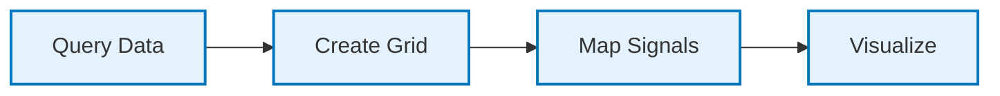
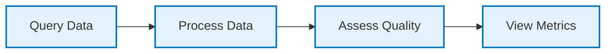

# Quick Start Guide

## Getting Started in 5 Minutes

This guide will help you get the AM-QADF Frontend Client up and running quickly.

## Prerequisites Check

Before starting, ensure you have:

- ✅ Python 3.8+ installed
- ✅ MongoDB running and accessible
- ✅ AM-QADF framework dependencies installed

## Step 1: Install Dependencies

```bash
# Navigate to project root
cd AM-QADF

# Install Python dependencies
pip install -r requirements.txt
```

## Step 2: Configure Environment

Create or update `.env` file in project root:

```env
# MongoDB Configuration
MONGODB_CONNECTION_STRING=mongodb://localhost:27017
MONGODB_DATABASE=am_qadf_data

# FastAPI Configuration
API_HOST=0.0.0.0
API_PORT=8000
RELOAD=true
```

## Step 3: Start the Server

```bash
# Start FastAPI server
python main.py
```

You should see:
```
INFO:     Started server process
INFO:     Waiting for application startup.
INFO:     Application startup complete.
INFO:     Uvicorn running on http://0.0.0.0:8000
```

## Step 4: Open in Browser

Open your browser and navigate to:
```
http://localhost:8000
```

You should see the AM-QADF homepage!

## Basic Usage

### 1. Access the Dashboard

Navigate to the homepage to see:
- Framework overview
- Module navigation
- Quick access to key features

### 2. Query Data

1. Click on **Data Query** in the navigation
2. Select a model from the dropdown
3. Configure query parameters (spatial, temporal, signals)
4. Click **Execute Query**
5. View results in the results table

### 3. Create Voxel Grid

1. Navigate to **Voxelization**
2. Select a model
3. Configure grid parameters (resolution, bounding box)
4. Click **Create Grid**
5. View grid visualization

### 4. Visualize Data

1. Navigate to **Visualization**
2. Select visualization type (2D or 3D)
3. Choose data to visualize
4. Configure visualization settings
5. View interactive visualization

## Common Workflows

### Workflow 1: Query and Visualize



1. **Query Data**: Use Data Query module to retrieve data
2. **Create Grid**: Use Voxelization to create voxel grid
3. **Map Signals**: Use Signal Mapping to map signals to grid
4. **Visualize**: Use Visualization to view results

### Workflow 2: Quality Assessment



1. **Query Data**: Retrieve data for analysis
2. **Process Data**: Apply processing (correction, fusion)
3. **Assess Quality**: Run quality assessment
4. **View Metrics**: Review quality metrics and reports

## Next Steps

After getting started:

1. **[Architecture](02-architecture.md)** - Understand the system design
2. **[Modules](05-modules/README.md)** - Explore individual modules
3. **[API Reference](06-api-reference/README.md)** - Learn about API endpoints
4. **[Configuration](08-configuration.md)** - Configure the application

## Troubleshooting

### Server won't start

- Check if port 8000 is already in use
- Verify Python version: `python --version`
- Check MongoDB is running: `mongosh --eval "db.adminCommand('ping')"`

### Can't connect to MongoDB

- Verify MongoDB connection string in `.env`
- Check MongoDB is running and accessible
- Test connection: `mongosh "mongodb://localhost:27017"`

### Templates not loading

- Verify `client/templates/` directory exists
- Check browser console for errors
- Clear browser cache

### Static files not loading

- Verify `client/static/` directory exists
- Check FastAPI StaticFiles mount in `app.py`
- Check browser network tab for 404 errors

## Getting Help

- Check [Troubleshooting](10-troubleshooting.md) for common issues
- Review [Architecture](02-architecture.md) for system design
- Explore [Modules](05-modules/README.md) for module-specific help

---

**Next**: [Architecture](02-architecture.md) | [Modules](05-modules/README.md)
