# Frontend Modules Documentation

This directory contains detailed documentation for each module in the AM-QADF Frontend Client.

## Module Organization

The frontend client is organized into architectural layers, matching the backend AM-QADF framework structure:

### Core Layer
- **[Authentication](authentication.md)** - User authentication and authorization

### Data Layer
- **[Data Query](data-query.md)** - Data querying interface and services
- **[Voxelization](voxelization.md)** - Voxel grid creation and management

### Processing Layer
- **[Signal Mapping](signal-mapping.md)** - Signal mapping to voxel grids
- **[Synchronization](synchronization.md)** - Temporal and spatial alignment
- **[Correction](correction.md)** - Geometric distortion correction
- **[Processing](processing.md)** - Signal processing pipelines
- **[Grid Transformation](grid-transformation.md)** - Grid-level transformation (after signal mapping, before fusion)
- **[Fusion](fusion.md)** - Multi-source data fusion

### Application Layer
- **[Analytics](analytics.md)** - Statistical analysis, sensitivity analysis, SPC
- **[Quality Assessment](quality.md)** - Quality metrics and assessment
- **[Validation](validation.md)** - Validation and benchmarking
- **[Visualization](visualization.md)** - 2D and 3D visualization
- **[Anomaly Detection](anomaly-detection.md)** - Anomaly detection interface
- **[Voxel Domain](voxel-domain.md)** - Voxel domain orchestration

### System Layer
- **[Monitoring](monitoring.md)** - System and process monitoring
- **[Streaming](streaming.md)** - Real-time data streaming
- **[Workflow](workflow.md)** - Workflow management

## Module Structure

Each module typically contains:

1. **Routes** (`routes.py`): FastAPI route handlers
   - HTML routes (serve templates)
   - API routes (JSON responses)

2. **Services** (`services/`): Business logic
   - Connection services (MongoDB, AM-QADF framework)
   - Business logic services
   - Model services (data models and validation)

3. **Templates** (`templates/[module]/`): HTML templates
   - Module-specific pages
   - Reusable components

4. **Static Files** (`static/css/modules/[module]/`, `static/js/[module]/`):
   - Module-specific CSS
   - Module-specific JavaScript

## Module Dependencies

```mermaid
graph TB
    Core["🔐 Core<br/>Authentication"]
    
    Core --> DataLayer["📊 Data Layer<br/>Query, Voxelization"]
    
    DataLayer --> ProcessingLayer["⚙️ Processing Layer<br/>Signal Mapping, Fusion"]
    
    ProcessingLayer --> ApplicationLayer["📈 Application Layer<br/>Analytics, Quality"]
    
    ApplicationLayer --> SystemLayer["🔧 System Layer<br/>Monitoring, Streaming"]
    
    %% Styling
    classDef core fill:#fff3e0,stroke:#f57c00,stroke-width:3px
    classDef data fill:#e1f5fe,stroke:#01579b,stroke-width:2px
    classDef processing fill:#f3e5f5,stroke:#4a148c,stroke-width:2px
    classDef application fill:#e8f5e8,stroke:#2e7d32,stroke-width:2px
    classDef system fill:#fce4ec,stroke:#880e4f,stroke-width:2px

    class Core core
    class DataLayer data
    class ProcessingLayer processing
    class ApplicationLayer application
    class SystemLayer system
```

## Quick Reference

| Module | Purpose | Key Components |
|--------|---------|----------------|
| **Authentication** | User management | Login, registration, JWT tokens |
| **Data Query** | Data access | Query builder, model selection, filters |
| **Voxelization** | Grid creation | Grid creation, storage, visualization |
| **Signal Mapping** | Signal interpolation | Mapping methods, execution |
| **Synchronization** | Data alignment | Temporal, spatial alignment |
| **Correction** | Distortion correction | Geometric correction, calibration |
| **Fusion** | Data fusion | Multi-source fusion strategies |
| **Processing** | Signal processing | Noise reduction, pipelines |
| **Analytics** | Analysis | Statistical, sensitivity, SPC analysis |
| **Quality** | Quality assessment | Metrics, completeness, signal quality |
| **Validation** | Validation | Benchmarking, accuracy validation |
| **Visualization** | Data rendering | 2D charts, 3D visualization |
| **Anomaly Detection** | Anomaly detection | Detection algorithms, visualization |
| **Voxel Domain** | Orchestration | Workflow orchestration, domain management |
| **Monitoring** | System monitoring | Health monitoring, alerts |
| **Streaming** | Real-time data | Kafka integration, streaming processing |
| **Workflow** | Workflow management | Pipeline configuration, execution |
| **Signal Mapping** | Signal interpolation | Map signals to voxel grids |
| **Synchronization** | Data alignment | Temporal, spatial alignment |
| **Correction** | Distortion correction | Geometric correction, calibration |
| **Fusion** | Data fusion | Multi-source fusion strategies |
| **Processing** | Signal processing | Noise reduction, pipelines |

## Navigation

Select a module above to view its detailed documentation.

---

**Parent**: [Frontend Documentation](../README.md)
