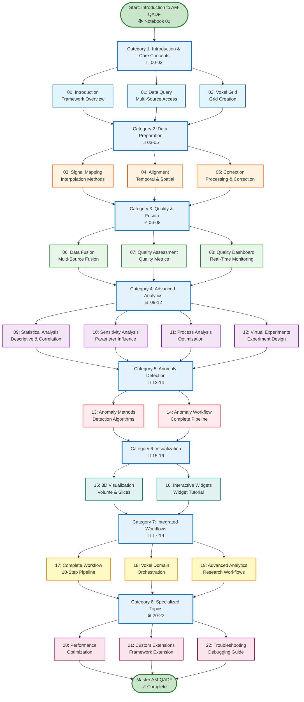

# AM-QADF Interactive Notebooks Documentation

**Version**: 1.0  
**Last Updated**: 2024  
**Status**: 📚 Documentation

## Overview

This directory contains comprehensive, modular documentation for the AM-QADF Interactive Notebooks collection. The notebooks provide interactive, widget-based interfaces for exploring and learning the AM-QADF framework capabilities without writing code.

## Notebook Learning Path



## Documentation Structure

```
docs/Notebook/
├── README.md                    # This file - navigation guide
├── 00-INDEX.md                  # Complete documentation index
├── 01-overview.md               # Notebooks overview and goals
├── 02-structure.md              # Notebook structure and organization
├── 03-getting-started.md        # How to use the notebooks
├── 04-notebooks/                # Individual notebook documentation
│   ├── README.md
│   ├── 00-introduction.md
│   ├── 01-data-query.md
│   ├── 02-voxel-grid.md
│   ├── 03-signal-mapping.md
│   ├── 04-alignment.md
│   ├── 05-correction.md
│   ├── 06-fusion.md
│   ├── 07-quality.md
│   ├── 08-quality-dashboard.md
│   ├── 09-statistical.md
│   ├── 10-sensitivity.md
│   ├── 11-process-analysis.md
│   ├── 12-virtual-experiments.md
│   ├── 13-anomaly-methods.md
│   ├── 14-anomaly-workflow.md
│   ├── 15-visualization.md
│   ├── 16-interactive-widgets.md
│   ├── 17-complete-workflow.md
│   ├── 18-voxel-domain.md
│   ├── 19-advanced-analytics.md
│   ├── 20-performance.md
│   ├── 21-custom-extensions.md
│   └── 22-troubleshooting.md
├── 05-widgets/                  # Widget documentation
│   ├── README.md
│   ├── widget-specifications.md
│   ├── widget-patterns.md
│   └── widget-examples.md
├── 06-examples/                 # Usage examples
│   ├── README.md
│   └── [example workflows]
├── 07-troubleshooting.md        # Notebook-specific issues
└── 08-best-practices.md         # Best practices for using notebooks
```

## Quick Navigation

### Getting Started
- **[Overview](01-overview.md)** - Start here for notebooks introduction
- **[Getting Started](03-getting-started.md)** - How to use the notebooks
- **[Structure](02-structure.md)** - Understand notebook organization

### Notebook Documentation
- **[All Notebooks](04-notebooks/README.md)** - Complete list of notebooks
  - [00: Introduction](04-notebooks/00-introduction.md) - Framework introduction
  - [01: Data Query](04-notebooks/01-data-query.md) - Data querying and access
  - [02: Voxel Grid](04-notebooks/02-voxel-grid.md) - Voxel grid creation
  - [03: Signal Mapping](04-notebooks/03-signal-mapping.md) - Signal mapping fundamentals
  - [04: Alignment](04-notebooks/04-alignment.md) - Temporal and spatial alignment
  - [05: Correction](04-notebooks/05-correction.md) - Data correction and processing
  - [06: Fusion](04-notebooks/06-fusion.md) - Multi-source data fusion
  - [07: Quality Assessment](04-notebooks/07-quality.md) - Quality assessment
  - [08: Quality Dashboard](04-notebooks/08-quality-dashboard.md) - Quality dashboards
  - [09: Statistical Analysis](04-notebooks/09-statistical.md) - Statistical analysis
  - [10: Sensitivity Analysis](04-notebooks/10-sensitivity.md) - Sensitivity analysis
  - [11: Process Analysis](04-notebooks/11-process-analysis.md) - Process analysis and optimization
  - [12: Virtual Experiments](04-notebooks/12-virtual-experiments.md) - Virtual experiments
  - [13: Anomaly Methods](04-notebooks/13-anomaly-methods.md) - Anomaly detection methods
  - [14: Anomaly Workflow](04-notebooks/14-anomaly-workflow.md) - Anomaly detection workflows
  - [15: Visualization](04-notebooks/15-visualization.md) - 3D visualization
  - [16: Interactive Widgets](04-notebooks/16-interactive-widgets.md) - Widget tutorial
  - [17: Complete Workflow](04-notebooks/17-complete-workflow.md) - End-to-end workflow
  - [18: Voxel Domain](04-notebooks/18-voxel-domain.md) - Voxel domain orchestration
  - [19: Advanced Analytics](04-notebooks/19-advanced-analytics.md) - Advanced analytics workflows
  - [20: Performance](04-notebooks/20-performance.md) - Performance optimization
  - [21: Custom Extensions](04-notebooks/21-custom-extensions.md) - Custom extensions
  - [22: Troubleshooting](04-notebooks/22-troubleshooting.md) - Troubleshooting and debugging

### Widget Documentation
- **[Widgets](05-widgets/README.md)** - Widget system documentation
  - [Specifications](05-widgets/widget-specifications.md) - Widget specifications
  - [Patterns](05-widgets/widget-patterns.md) - Widget patterns and best practices
  - [Examples](05-widgets/widget-examples.md) - Widget examples

### Reference
- **[Examples](06-examples/)** - Usage examples and workflows
- **[Troubleshooting](07-troubleshooting.md)** - Common notebook issues
- **[Best Practices](08-best-practices.md)** - Best practices for using notebooks

## Notebooks Overview

The AM-QADF Interactive Notebooks collection provides:

- **23 Interactive Notebooks** covering all framework capabilities
- **Widget-Based Interfaces** for no-code exploration
- **Progressive Learning Path** from basics to advanced topics
- **Real-Time Updates** with interactive visualizations
- **Comprehensive Coverage** of all framework modules

### Notebook Categories

The notebooks are organized into 8 logical categories that follow a progressive learning path:

1. **Introduction & Core Concepts (00-02)**: Framework introduction, data querying, and voxel grid creation
2. **Data Preparation & Enhancement (03-05)**: Signal mapping, alignment, and data correction
3. **Quality & Fusion (06-08)**: Data fusion, quality assessment, and monitoring dashboards
4. **Advanced Analytics (09-12)**: Statistical analysis, sensitivity analysis, process optimization, and virtual experiments
5. **Anomaly Detection (13-14)**: Anomaly detection methods and complete workflows
6. **Visualization & Interaction (15-16)**: 3D visualization and interactive widget tutorials
7. **Integrated Workflows (17-19)**: Complete end-to-end workflows and orchestration
8. **Specialized Topics (20-22)**: Performance optimization, custom extensions, and troubleshooting

## Key Features

- ✅ **Interactive Widgets**: All notebooks use ipywidgets for user interaction
- ✅ **No-Code Interfaces**: Explore framework without writing code
- ✅ **Real-Time Updates**: Visualizations update immediately when parameters change
- ✅ **Progressive Learning**: Organized from basic to advanced concepts
- ✅ **Comprehensive Coverage**: All framework modules are covered
- ✅ **Visual Learning**: Interactive visualizations enhance understanding

## Related Documentation

- **[Framework Documentation](../AM_QADF/README.md)** - AM-QADF framework documentation
- **[Testing Documentation](../Tests/README.md)** - Testing guide
- **[Notebook Plan](../../notebooks/NOTEBOOK_PLAN.md)** - Original notebook plan

---

**Last Updated**: 2024

