# Third-Party Dependencies

This directory contains external dependencies for the AM-QADF project.

## How Third-Party Libraries Assist AM-QADF

AM-QADF uses a high-performance C++-based architecture for handling large industrial datasets. The third-party libraries in this directory form the foundation of the C++ native extensions (`am_qadf_native`), providing critical performance and functionality.

```mermaid
flowchart LR
    %% Data Sources
    subgraph Sources["📊 Data Sources"]
        STL["STL Files<br/>📐 Geometry"]
        Hatching["Hatching Paths<br/>🛤️ Path Coordinates"]
        Laser["Laser Parameters<br/>⚡ Power & Speed"]
        CT["CT Scans<br/>🔬 DICOM"]
        ISPM["In-Situ Monitoring<br/>🌡️ ISPM Sensors"]
        Thermal["Thermal Data<br/>🔥 Heat Distribution"]
        MongoDB["MongoDB<br/>🗄️ Database"]
    end

    %% Python API Layer (Wrapper/Interface)
    PythonAPI["🐍 Python API<br/>(Wrapper/Interface)"]

    %% C++ Native Extensions
    subgraph Native["⚡ <b>C++ Native (am_qadf_native)</b>"]
        NativeQuery["Query Engine<br/>Reads CT/DICOM<br/>Queries MongoDB"]
        NativeSync["Synchronization<br/>Temporal/Spatial<br/>Alignment"]
        NativeCorrection["Correction<br/>Geometric Distortion<br/>Noise Reduction"]
        NativeVoxel["Voxelization<br/>Per-Source Grids<br/>STL Geometry + Bounds"]
        NativeTransform["Coordinate Transform<br/>Uniform Reference System<br/>Build Platform Coords"]
        NativeSignal["Signal Mapping<br/>Per-Source Signals<br/>RBF/IDW/KDE"]
        NativeProcessing["Signal Processing<br/>FFT/Filters<br/>Noise Reduction"]
        NativeFusion["Data Fusion<br/>Multi-Source Fusion<br/>Weighted/Quality-Based"]
        NativeIO["I/O<br/>Read/Write VDB<br/>Export Formats"]
        NativeViz["Visualization<br/>ParaView Export<br/>.vdb Format"]
    end

    %% Third-Party Libraries
    subgraph ThirdParty["📚 Third-Party Libraries"]
        OpenVDB["OpenVDB<br/>🌳 Sparse 3D Grids<br/>Memory Efficient"]
        ITK["ITK<br/>🔬 DICOM Reader<br/>Image Processing"]
        Eigen["Eigen<br/>📐 Matrix Math<br/>Linear Algebra"]
        KFR["KFR<br/>🎵 FFT Operations<br/>Signal Filters"]
        MongoCXX["mongo-cxx-driver<br/>🗄️ Database Access<br/>High Performance"]
        TBB["TBB<br/>⚡ Multi-threading<br/>Parallel Execution"]
        ParaView["ParaView<br/>🎨 3D Visualization<br/>VDB Viewer"]
    end

    %% Data Flow: Sources → Query → Voxelization/Signal Mapping
    STL --> PythonAPI
    Hatching --> PythonAPI
    Laser --> PythonAPI
    CT --> PythonAPI
    ISPM --> PythonAPI
    Thermal --> PythonAPI
    MongoDB --> PythonAPI

    %% Python API is just wrapper - immediately calls C++ Native (where real work happens)
    PythonAPI -->|"API Calls"| NativeQuery
    PythonAPI -->|"API Calls"| NativeSync
    PythonAPI -->|"API Calls"| NativeCorrection
    PythonAPI -->|"API Calls"| NativeVoxel
    PythonAPI -->|"API Calls"| NativeTransform
    PythonAPI -->|"API Calls"| NativeSignal
    PythonAPI -->|"API Calls"| NativeProcessing
    PythonAPI -->|"API Calls"| NativeFusion
    PythonAPI -->|"API Calls"| NativeIO
    PythonAPI -->|"API Calls"| NativeViz

    %% Data Flow: Query → Synchronization → Correction → Voxelization → Signal Mapping → Processing → Fusion → Visualization
    %% Synchronization: Temporal and spatial alignment
    NativeQuery -->|"Queried Data<br/>Multi-Source"| NativeSync
    NativeSync -->|"Aligned Data<br/>Common Reference"| NativeCorrection
    NativeSync -->|"Matrix Ops"| Eigen
    
    %% Correction: Geometric distortion and noise reduction
    NativeCorrection -->|"Corrected Data<br/>Accurate Coordinates"| NativeVoxel
    NativeCorrection -->|"Matrix Ops"| Eigen
    
    %% Voxelization: Create separate grids per source (STL provides geometry, queried data provides bounds)
    NativeQuery -->|"Queried Data<br/>Per-Source Bounds"| NativeVoxel
    
    %% Coordinate Transformation: Transform per-source grids to uniform reference system (build_platform)
    NativeVoxel -->|"Per-Source Grids<br/>Different Coord Systems"| NativeTransform
    NativeTransform -->|"Transformed Grids<br/>Uniform Reference System"| NativeSignal
    NativeTransform -->|"Transform Matrix Ops"| Eigen
    
    %% Native uses Third-Party
    NativeQuery -->|"Read DICOM<br/>Segmentation"| ITK
    NativeQuery -->|"Query DB"| MongoCXX
    NativeVoxel -->|"STL Geometry<br/>Occupancy Grid"| OpenVDB
    NativeVoxel -->|"Per-Source Grids<br/>Sparse Structure"| OpenVDB
    NativeVoxel -->|"Parallel"| TBB
    NativeSignal -->|"Grid Storage"| OpenVDB
    NativeSignal -->|"RBF Math"| Eigen
    NativeSignal -->|"Parallel"| TBB
    NativeSignal -->|"CT Data<br/>After ITK"| ITK
    NativeProcessing -->|"FFT"| KFR
    NativeProcessing -->|"Matrix Ops"| Eigen
    NativeFusion -->|"Grid Storage"| OpenVDB
    NativeFusion -->|"Matrix Ops"| Eigen
    NativeFusion -->|"Parallel"| TBB
    NativeIO -->|"VDB Format"| OpenVDB
    NativeIO -->|"DICOM Export"| ITK
    NativeViz -->|"VDB Export"| OpenVDB
    NativeViz -->|"Launch Viewer"| ParaView

    %% Third-Party Dependencies
    OpenVDB -.->|"Requires"| TBB

    %% Per-Source Processing: Each source gets its own grid
    %% Hatching: Voxelized WITH signals (power/velocity/energy from ground truth) - signals included during voxelization, no separate mapping needed
    NativeQuery -->|"Hatching Paths<br/>with Signals"| NativeVoxel
    NativeVoxel -->|"Hatching Grid<br/>with Power/Velocity/Energy"| NativeTransform
    
    %% Other sources: Need signal mapping (signals from queried data, mapped to grid separately)
    NativeQuery -->|"Laser Data"| NativeVoxel
    NativeVoxel -->|"Laser Grid"| NativeTransform
    NativeQuery -->|"Laser Signals<br/>(Power/Speed)"| NativeSignal
    
    NativeQuery -->|"CT Data"| NativeVoxel
    NativeVoxel -->|"CT Grid"| NativeTransform
    NativeQuery -->|"CT Signals<br/>(Density)"| NativeSignal
    
    NativeQuery -->|"ISPM Data"| NativeVoxel
    NativeVoxel -->|"ISPM Grid"| NativeTransform
    NativeQuery -->|"ISPM Signals<br/>(Temperature/Sensors)"| NativeSignal
    
    NativeQuery -->|"Thermal Data"| NativeVoxel
    NativeVoxel -->|"Thermal Grid"| NativeTransform
    NativeQuery -->|"Thermal Signals<br/>(Heat Distribution)"| NativeSignal
    
    %% After transformation to uniform reference system, grids go to signal mapping or directly to fusion
    NativeTransform -->|"Transformed Hatching Grid<br/>Uniform Coords"| NativeFusion
    NativeTransform -->|"Transformed Grids<br/>Uniform Coords"| NativeSignal
    
    %% Fusion: Combine all per-source grids into unified representation (all in uniform reference system)
    NativeSignal -->|"Per-Source Grids<br/>with Signals<br/>Uniform Coords"| NativeFusion
    NativeFusion -->|"Fused Grid<br/>Multi-Modal"| NativeProcessing
    
    %% Visualization: Export to ParaView
    NativeFusion -->|"Fused Grid"| NativeViz
    NativeProcessing -->|"Processed Grid"| NativeViz

    %% Results flow back to Python API (Python is just wrapper/interface)
    NativeSync -.->|"Return Results"| PythonAPI
    NativeCorrection -.->|"Return Results"| PythonAPI
    NativeVoxel -.->|"Return Results"| PythonAPI
    NativeTransform -.->|"Return Results"| PythonAPI
    NativeSignal -.->|"Return Results"| PythonAPI
    NativeProcessing -.->|"Return Results"| PythonAPI
    NativeFusion -.->|"Return Results"| PythonAPI
    NativeQuery -.->|"Return Results"| PythonAPI
    NativeIO -.->|"Return Results"| PythonAPI
    NativeViz -.->|"Return Results"| PythonAPI

    %% Styling
    classDef python fill:#3776ab,stroke:#ffd343,stroke-width:2px,color:#fff,stroke-dasharray: 5 5
    classDef native fill:#00599c,stroke:#44b78b,stroke-width:2px,color:#fff
    classDef thirdparty fill:#f9a825,stroke:#e65100,stroke-width:3px,color:#000
    classDef sources fill:#e3f2fd,stroke:#0277bd,stroke-width:2px

    class PythonAPI python
    class NativeQuery,NativeSync,NativeCorrection,NativeVoxel,NativeTransform,NativeSignal,NativeProcessing,NativeFusion,NativeIO,NativeViz native
    class OpenVDB,ITK,Eigen,KFR,MongoCXX,TBB,ParaView thirdparty
    class STL,Hatching,Laser,CT,ISPM,Thermal,MongoDB sources
```



### Library Roles in AM-QADF

| Library | Role | Used In | Key Benefit |
|---------|------|---------|-------------|
| **OpenVDB** | Sparse volumetric data structures | Voxelization, Signal Mapping, Fusion, Storage | Efficient memory usage for large 3D grids, fast spatial queries |
| **ITK** | Medical image processing | CT Scan reading (DICOM), Image registration | Industry-standard DICOM support, robust image processing |
| **Eigen** | Matrix operations & linear algebra | RBF interpolation, Coordinate transforms, Synchronization, Correction, Grid Transformation | High-performance matrix math, essential for interpolation, transformations, and uniform reference system conversion |
| **KFR** | Signal processing (FFT, filters) | Signal processing, Noise reduction | Fast FFT operations, frequency domain analysis |
| **mongo-cxx-driver** | MongoDB C++ driver | Database queries, Data warehouse access | Native C++ database access, high-performance queries |
| **TBB** | Parallel processing | Required by OpenVDB, Parallel operations | Multi-threading, scalable performance on multi-core systems |
| **ParaView** | 3D visualization | Visualization, VDB file viewing | Professional 3D visualization, slice views, isosurfaces, interactive exploration |

## Structure

```
third_party/
├── openvdb/          # OpenVDB source (git submodule or cloned)
│   ├── build/        # Build directory (gitignored)
│   └── install/      # Installed headers/libs (gitignored)
├── ITK/              # ITK source (if building from source)
│   ├── build/        # Build directory (gitignored)
│   └── install/      # Installed headers/libs (gitignored)
├── mongo-cxx-driver/ # MongoDB C++ driver (mongocxx)
│   ├── build/        # Build directory (gitignored)
│   └── install/      # Installed headers/libs (gitignored)
├── eigen/            # Eigen (header-only, no build needed)
└── kfr/              # KFR (header-only, no build needed)
```

## Installation

See `docs/Infrastructure/INSTALL_DEPENDENCIES_WSL.md` for installation instructions.

### Quick Install (WSL)

**Complete Installation:**

```bash
# 1. Install OpenVDB (build from source)
bash scripts/install_openvdb_official.sh
# Or follow: docs/Infrastructure/INSTALL_DEPENDENCIES_WSL.md

# 2. Install ITK (build from source, takes 1-2 hours)
# See: docs/Infrastructure/INSTALL_DEPENDENCIES_WSL.md
# Note: Disable NrrdIO module if you encounter build issues

# 3. Install signal processing libraries (header-only, no build needed)
cd third_party
git clone https://gitlab.com/libeigen/eigen.git
git clone https://github.com/kfrlib/kfr.git

# 4. Install MongoDB C++ driver (mongocxx) - build from source
# See: docs/Infrastructure/INSTALL_DEPENDENCIES_WSL.md
# Prerequisites: sudo apt-get install -y libmongoc-dev libbson-dev
cd third_party
git clone https://github.com/mongodb/mongo-cxx-driver.git
cd mongo-cxx-driver && git checkout releases/stable
mkdir build && cd build
cmake .. \
    -DCMAKE_BUILD_TYPE=Release \
    -DCMAKE_INSTALL_PREFIX=/mnt/c/Users/kanha/Independent_Research/AM-QADF/third_party/mongo-cxx-driver/install \
    -DCMAKE_C_COMPILER=/usr/bin/gcc \
    -DCMAKE_CXX_COMPILER=/usr/bin/g++ \
    -DBSONCXX_POLY_USE_BOOST=1 \
    -DCMAKE_CXX_STANDARD=17
cmake --build . --config Release -j $(nproc)
cmake --install . --config Release

# 5. Set environment variables
export OpenVDB_ROOT=/mnt/c/Users/kanha/Independent_Research/AM-QADF/third_party/openvdb/install
export ITK_DIR=/mnt/c/Users/kanha/Independent_Research/AM-QADF/third_party/ITK/build
export EIGEN3_ROOT=/mnt/c/Users/kanha/Independent_Research/AM-QADF/third_party/eigen
export KFR_ROOT=/mnt/c/Users/kanha/Independent_Research/AM-QADF/third_party/kfr
export CMAKE_PREFIX_PATH=$CMAKE_PREFIX_PATH:$OpenVDB_ROOT:$EIGEN3_ROOT:/mnt/c/Users/kanha/Independent_Research/AM-QADF/third_party/mongo-cxx-driver/install
```

**Alternative: Use Conda (Easier, Pre-built)**

```bash
# Install via conda (faster, no build needed)
conda install -c conda-forge openvdb itk eigen -y

# Set environment variables
export CMAKE_PREFIX_PATH=$CONDA_PREFIX
export OpenVDB_ROOT=$CONDA_PREFIX
export ITK_DIR=$(find $CONDA_PREFIX/lib/cmake -name "ITK-*" -type d | head -1)
export EIGEN3_ROOT=$CONDA_PREFIX

# Still need KFR (header-only, clone manually)
cd third_party
git clone https://github.com/kfrlib/kfr.git
export KFR_ROOT=/mnt/c/Users/kanha/Independent_Research/AM-QADF/third_party/kfr
```

## Git Submodules (Optional)

To track specific versions, you can add dependencies as git submodules:

```bash
# Add OpenVDB as submodule
git submodule add https://github.com/AcademySoftwareFoundation/openvdb.git third_party/openvdb

# Initialize and update submodules
git submodule update --init --recursive
```

## Dependencies Summary

| Library | Type | Build Needed? | Purpose |
|---------|------|---------------|---------|
| **OpenVDB** | Compiled | ✅ Yes | Sparse volumetric data structures |
| **ITK** | Compiled | ✅ Yes | Medical image processing (CT scans) |
| **Eigen** | Header-only | ❌ No | Matrix operations (Savitzky-Golay, RBF) |
| **KFR** | Header-only | ❌ No | FFT and signal processing filters |

## Notes

- **Build directories** (`build/`) and **install directories** (`install/`) are gitignored
- **Header-only libraries** (Eigen, KFR) don't need building - just clone
- **Compiled libraries** (OpenVDB, ITK) must be built before use
- Source directories can be tracked as git submodules for version control
- For production, consider using system-wide installations or conda packages

## Environment Variables

After installation, set these in your `~/.bashrc`:

```bash
# OpenVDB
export OpenVDB_ROOT=/mnt/c/Users/kanha/Independent_Research/AM-QADF/third_party/openvdb/install

# ITK
export ITK_DIR=/mnt/c/Users/kanha/Independent_Research/AM-QADF/third_party/ITK/build

# Eigen (header-only)
export EIGEN3_ROOT=/mnt/c/Users/kanha/Independent_Research/AM-QADF/third_party/eigen

# KFR (header-only)
export KFR_ROOT=/mnt/c/Users/kanha/Independent_Research/AM-QADF/third_party/kfr

# MongoDB C++ driver (mongocxx)
export CMAKE_PREFIX_PATH=$CMAKE_PREFIX_PATH:/mnt/c/Users/kanha/Independent_Research/AM-QADF/third_party/mongo-cxx-driver/install

# CMake prefix path (combines all)
export CMAKE_PREFIX_PATH=$CMAKE_PREFIX_PATH:$OpenVDB_ROOT:$EIGEN3_ROOT:/mnt/c/Users/kanha/Independent_Research/AM-QADF/third_party/mongo-cxx-driver/install
```
